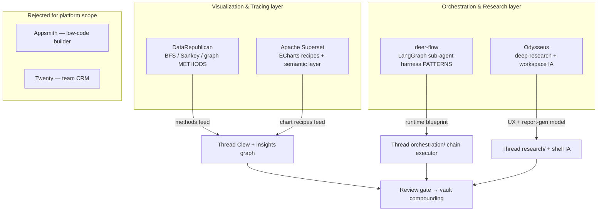

# External Tooling Assessment — Inspiration & Reuse for Ariadne's Thread

> **Purpose:** Evaluate six external sources against Ariadne's Thread platform intent (`docs/PLAN.md`) and decide, for each, whether to **adopt directly**, **mine for inspiration**, or **reject**. Then assess how they **stack** against each other and the current codebase.
>
> **Scope reminder (from PLAN non-negotiables):** Solo operator. PostgreSQL-only execution truth + Obsidian vault synthesis. Grok/xAI primary reasoning, Ollama admin offload. FastAPI + HTMX + Jinja shell skinned with `theseus.css`. ECharts client-side viz. Review-gated everywhere. One command: `python app.py` on `:9622`. **Not** an enterprise multi-user CRM, **not** "local-first AI", **not** a generic BI portal.
>
> **Author:** Platform research pass · **Date:** 2026-06-19

---

## TL;DR verdict table

| Source                  | Type                           | Verdict                                  | Where it lands                                         | Confidence |
| ----------------------- | ------------------------------ | ---------------------------------------- | ------------------------------------------------------ | ---------- |
| **DataRepublican**      | Methods (graph/flow tracing)   | **Adopt methods, not product**           | Clew + Insights graph/BFS (Phase 17b/17c)              | High       |
| **Apache Superset**     | Embeddable BI engine           | **Inspiration; selectively embed later** | Insights heavy analytics, saved-lens semantics         | Medium     |
| **ByteDance deer-flow** | Agent harness (LangGraph)      | **Inspiration; pattern-mine hard**       | Orchestration runtime, research chains, sub-agents     | High       |
| **Appsmith**            | Low-code internal-tool builder | **Reject as platform; mine 1 idea**      | — (binding/expression model only, optional)            | High       |
| **Twenty**              | Open-source CRM                | **Reject; mine identity model only**     | Opportunity object model sanity-check                  | High       |
| **Odysseus**            | Self-hosted AI workspace       | **Inspiration; closest sibling**         | Workspace IA, deep-research UX, single-launcher parity | High       |

**One-line thesis:** Only **DataRepublican** and **deer-flow** map onto the _core_ of what Thread is trying to be (follow-the-money tracing + agentic capture composition). **Superset** and **Odysseus** are useful _reference architectures_ for two specific surfaces (heavy analytics, and the AI-workspace shell). **Appsmith** and **Twenty** are the two I'd push back on hardest — they solve problems Thread deliberately does not have.

---

## Current platform state (grounding for every assessment below)

What already exists in the repo today (so we don't recommend rebuilding what's done):

| Capability                                                                                     | Status                                                | Files                                                                          |
| ---------------------------------------------------------------------------------------------- | ----------------------------------------------------- | ------------------------------------------------------------------------------ |
| Clew tracing — `spend_trend`, `money_flow` (Sankey), `teaming` (Sankey), `recipient_landscape` | ✅ Built, **static** ECharts client render on `/clew` | `backend/src/thread/clew/analyze.py`, `clew/charts.py`                         |
| Facet queries (any combo, `ILIKE` substring, **no NAICS default**)                             | ✅ Built                                              | `backend/src/thread/intel/facet_query.py`                                      |
| Data Insights — live HTMX explore + drill-down + Watch                                         | ✅ Built (page exists; heavy analytics pending)       | `services/insights_explore.py`, `insights_drilldown.py`, `insights_display.py` |
| USAspending PG intel (prime + subaward tables, portfolio signals)                              | ✅ Built                                              | `intel/pg_queries.py`, `api/intel_routes.py`                                   |
| LLM router (Grok primary, Ollama offload)                                                      | ✅ Built                                              | `llm/router.py`                                                                |
| Web research module (provider registry: SearXNG → Crawl4AI → SerpAPI…)                         | ✅ Built (scaffolded)                                 | `research/`                                                                    |
| MCP manifests + federal tools                                                                  | 🟡 Partial                                            | `mcp/`, `tools/mcps/`                                                          |
| Orchestration (LangGraph) — tracing bootstrap only                                             | 🟡 Placeholder                                        | `orchestration/`                                                               |
| Vault bootstrap (Obsidian, idempotent)                                                         | ✅ Built                                              | `bootstrap/vault.py`                                                           |
| Shell: FastAPI + HTMX + Jinja, `theseus.css`, ECharts                                          | ✅ Built                                              | `ui/`                                                                          |

**Key implication:** Thread already has a _working but static_ follow-the-money engine. The gap is **interactivity** (BFS expansion, click-to-expand, force-directed canvas) and **heavy analytics depth** — which is exactly where DataRepublican and Superset are relevant, respectively.

---

## 1. DataRepublican — `datarepublican.com`

**What it is:** A civic-transparency site that "connects the dots between government grants, charities, and NGOs… to expose where the money flows." It is a _methods showcase_ sitting on top of IRS 990 filings + USAspending grants, with open tooling at `github.com/twinforces` / `github.com/DataRepublican`. It is **not** a product you can install for govcon; the domain (charities/NGOs/990s) is orthogonal to federal contracting capture.

### Crawl of every tracing/visualization surface

| Surface                         | URL                               | The _method_ that makes it work                                                                                                                                                                                                                                                                                                      | Interaction model                                                                                                                                                                                                         |
| ------------------------------- | --------------------------------- | ------------------------------------------------------------------------------------------------------------------------------------------------------------------------------------------------------------------------------------------------------------------------------------------------------------------------------------ | ------------------------------------------------------------------------------------------------------------------------------------------------------------------------------------------------------------------------- |
| **Charity graph** ("expose")    | `/expose`                         | Filter orgs by user-specified **EINs + keywords** → pick **BFS root** from largest `receipt_amt` EIN → BFS expand until subgraph ≥5 nodes (else hop to next-largest unvisited and BFS again) → always include all user EINs + direct edges → node labels highlight **taxpayer funds received** (`govt_amt`), summed for the subgraph | Auto-zoom to money origin; **search bar** to find nodes; **click an edge / grant amount → zoom to source+destination**; **click-drag canvas**; scroll zoom; **download SVG**. Color buckets: 🚨 >$10M, $1M–$10M, low/none |
| **Charity explorer** ("browse") | `/browse`                         | Loads the **entire** NGO ecosystem client-side (~913K orgs, ~1.3M reverse-mapped private-foundation grants); **US Govt shown as the ultimate root NGO**                                                                                                                                                                              | **Exploratory** Sankey/graph — pick from preset starting points, click a node to **reveal hidden flows**, focus/remove nodes, trace back to the US government source. "Download once, then loads in seconds"              |
| **People relations**            | `/relations`                      | Token-inclusive name search → click a name → **load that person's relationship graph** (people ↔ known associates)                                                                                                                                                                                                                   | Search → click → graph; hover to trace connections                                                                                                                                                                        |
| **Principal officer search**    | `/officers`                       | Keyword search over 990 filings (EIN/org/officer), AND-token, exact-or-prefix; **cross-link from an officer straight into a pre-built `expose` graph** via `?custom_graph=` encoded edge list (`src,tgt,amount;…`)                                                                                                                   | Tabular results; each row deep-links into the graph with the money path pre-encoded                                                                                                                                       |
| **Bulk NGO officer search**     | `/officers/bulk`                  | Cross-reference **many names at once** to find overlapping orgs / shared affiliations                                                                                                                                                                                                                                                | Bulk paste → overlap table                                                                                                                                                                                                |
| **Federal grant search**        | `/award_search`                   | Search USAspending grants by **EIN / UEI / keyword**, AND-logic, exact-or-prefix, top-100 cap; "map funds to connected orgs" + cross-reference taxpayer funding                                                                                                                                                                      | Search → results → pivot into graph                                                                                                                                                                                       |
| **Nonprofit financials**        | `/nonprofit`, `/nonprofit/assets` | % of revenue that is **taxpayer-funded**; assets/expense breakdown                                                                                                                                                                                                                                                                   | Tabular drill                                                                                                                                                                                                             |

### The transferable methods (this is the gold)

1. **Seed → BFS subgraph expansion** with a deterministic root-selection rule and a minimum-node threshold. This is the single most valuable idea — it turns "top-N rows" into an _explorable network_.
2. **The US Government as the ultimate root node.** For govcon this maps cleanly: agency/sub-agency → prime → sub → sub-sub. The "follow the money downstream from the funder" framing is directly reusable.
3. **Click-an-edge-to-zoom / click-a-node-to-expand** progressive disclosure. Thread's Clew is currently _static_ (render top-N, hover/zoom only). DR's interaction model is the upgrade path.
4. **Deep-link the graph via an encoded edge list** (`?custom_graph=src,tgt,amount;…`). This is a brilliant, cheap pattern: a search row (officer / award / recipient) can hand the graph view a fully pre-computed path with no server round-trip. Thread can do the same — a Clew result row or Insights row can encode a path into the `/clew` graph URL.
5. **Taxpayer-$ on the node, color-bucketed by magnitude.** For Thread: obligated $ / award value on nodes, bucketed (e.g. hot recompete ≤6mo, large ceiling, expiring).
6. **Download-once, explore-client-side.** DR ships the whole graph to the browser once. Thread should _not_ copy this at NGO scale (64M+ intel rows), but the principle — _push a bounded subgraph to ECharts and let the client do traversal_ — is right for a focused capture subgraph.

### What to explicitly NOT copy (pushback)

- **The domain.** Charities / 990s / officer salaries / DEI awards / ActBlue-WinRed donation-fraud detection / voter-turnout — none of this is govcon capture. PLAN already says this: adopt the _methods_, not the NGO/990 charity product surface.
- **Client-side load of the entire dataset.** Works for ~900K NGOs; would be catastrophic for Thread's 64M-row USAspending migration. Thread must keep server-side facet/BFS and ship only the resulting subgraph.
- **DR's `pdfparser`.** PLAN already mandates **MinerU 3.3** instead.
- **The Jekyll/static-site delivery.** Thread is a live FastAPI app.

### Verdict: **Adopt the methods; this is the most important source on the list.**

DataRepublican is the _reference design_ for Thread's Clew + Insights "connect the dots" lane. The PLAN already enumerates the parity gap (17b-interact, 17c-graph). Concretely, the next Clew slices should be:

- **17b-interact:** Click a Sankey node → narrow the facet → re-run server-side → re-render (progressive disclosure). Cheap, builds on existing `clew/analyze.py` + `charts.py`.
- **17c-graph:** Seed (recipient / agency / UEI) → server-side BFS over prime+subaward edges (`intel_relationships` + `edges.jsonl`) → ship bounded subgraph → ECharts **force-directed** canvas with click-to-expand and edge-zoom. $ on nodes, magnitude color buckets.
- **Deep-link pattern:** add `?path=src,tgt,value;…` (or a hashed token) so any Clew/Insights row can open the graph pre-loaded — the single cheapest DR idea to steal.

---

## 2. Apache Superset — `github.com/apache/superset`

**What it is:** A mature (73K★), enterprise-grade **data exploration + visualization platform**. Python/Flask backend + React/TypeScript frontend, **Apache ECharts**-based viz, a no-code chart builder, a web SQL editor (SQL Lab), a lightweight semantic layer (custom dimensions/metrics), caching, RBAC, an embedded SDK, and an extensions framework. Connects to any SQLAlchemy-speaking datastore.

### Where it genuinely maps to Thread

- **Same viz engine.** Superset standardized on Apache ECharts — _exactly_ what Thread's `clew/charts.py` already uses. Any Superset chart pattern (mixed time-series, geospatial via deck.gl, Sankey) is directly translatable to Thread's stack with zero new dependency.
- **Same database.** Superset is SQLAlchemy + PostgreSQL-friendly; Thread's intel lives in PG behind SQLAlchemy async sessions. Superset could literally point at Thread's `intel_usaspending_*` tables.
- **The "Data Insights" page is unbuilt.** PLAN's Phase 17 Insights (heavy market analytics, saved lenses) is precisely the job Superset is best-in-class at: no-code slice-and-dice, saved charts, dashboards.
- **Semantic layer + saved lenses.** Superset's "dataset-centric" model (define metrics/dimensions once, reuse across charts) is a clean mental model for Thread's `.thread/insight_queries.json` saved-lens bookmarks — but more formalized.
- **Embedded SDK.** Superset can embed dashboards into a host app via iframe + guest tokens. PLAN explicitly allows "client-heavy surfaces as embedded islands."

### Where I push back

- **It's a whole platform, not a library.** Standing up Superset means running Flask + Celery workers + Redis + a metadata DB + its own RBAC/auth — a second full web app beside Thread. That violates the "one command, single Python process at steady state" non-negotiable. For a **solo operator**, the operational tax (separate auth, separate deploy, separate upgrade cadence) is heavy.
- **Multi-tenant BI assumptions.** Roles, workspaces, sharing, alerting — all overhead a single operator doesn't need.
- **Review-gate impedance mismatch.** Thread's doctrine is _every analytic output is a `candidate` until promoted at `/review`_. Superset has no concept of provenance-to-vault or review gating; its outputs are dashboards, not reviewable knowledge artifacts.
- **It pulls UI ownership away from `theseus.css`.** Embedding Superset means embedding Superset's look, not Thread's ink/neon shell (unless heavily themed — Superset does support AntD v5 theming, but that's real work).

### Verdict: **Inspiration now; selectively embed _charts_ (not the platform) later — if ever.**

The honest read: Thread already has the right viz primitive (ECharts) and the right DB (PG/SQLAlchemy). Superset's value is **chart recipes + semantic-layer thinking + the embedded-dashboard escape hatch**, not running the whole engine.

- **Adopt now (free):** Mine Superset's ECharts chart configs (mixed time-series, Sankey, treemap, geospatial) as references for building Thread's Insights charts natively. Borrow the **dataset-centric semantic-layer mental model** to formalize saved lenses (define metric/dimension once).
- **Consider later (only if Insights gets genuinely heavy):** Embed a small number of Superset dashboards as iframe islands for deep ad-hoc analytics the operator wants to slice-and-dice without you hand-coding every chart. Gate this behind a real need — don't pre-provision a second platform on spec.
- **Reject:** Superset as the _primary_ Insights surface or as a replacement for the HTMX explore that already exists.

---

## 3. ByteDance deer-flow — `github.com/bytedance/deer-flow`

**What it is:** A 71K★ open-source **"super agent harness"** built on **LangGraph + LangChain**. A lead agent plans and spawns **sub-agents** (isolated context, scoped tools, run in parallel, converge into one output), with a **filesystem + sandbox**, **long-term memory**, **progressively-loaded Skills** (`SKILL.md` modules activated via `/skill-name`), **MCP server** support, and **LangSmith/Langfuse tracing**. Model-agnostic (any OpenAI-compatible API). Started as a Deep Research framework; rewrote into a general agent runtime.

### Why this is the most architecturally relevant repo for Thread's _orchestration_ lane

Thread's PLAN has a deferred LangGraph runtime ("route-first capture orchestration ships _before_ LangGraph runtime adoption"). deer-flow is the reference implementation of exactly the runtime Thread is deferring — and it independently arrived at several patterns Thread already committed to:

| deer-flow pattern                                                                                            | Thread's existing/planned equivalent                                                               | Takeaway                                                                                                                                        |
| ------------------------------------------------------------------------------------------------------------ | -------------------------------------------------------------------------------------------------- | ----------------------------------------------------------------------------------------------------------------------------------------------- |
| **Progressively-loaded Skills** (`SKILL.md`, only loaded when the task needs them, `/skill-name` activation) | Thread's `skills/` runtime + skill cards + inline run panel (12l)                                  | **Strong validation.** Thread's skill model mirrors deer-flow's almost exactly. Adopt their _progressive-load_ discipline to keep context lean. |
| **Sub-agents with isolated context**, parallel fan-out → converge                                            | Thread's "named retrieval chains" (`award_key` → incumbent → SAM UEI → web → vault → packet field) | deer-flow shows how to _execute_ those chains as orchestrated sub-agents. This is the missing runtime.                                          |
| **LangGraph/LangChain core**                                                                                 | Thread's `orchestration/` (LangGraph placeholder, tracing bootstrap done)                          | deer-flow is the build-it-out reference. Same `LANGSMITH_*` tracing Thread already configured.                                                  |
| **MCP server + Python-function tools, swappable**                                                            | Thread's MCP manifests + federal tools                                                             | Same composition philosophy.                                                                                                                    |
| **Aggressive context engineering** (summarize completed sub-tasks, offload intermediates to filesystem)      | Thread's vault as the offload/synthesis store                                                      | deer-flow's "offload to filesystem" ≈ Thread's "compound to vault."                                                                             |
| **Long-term memory** (persistent profile/preferences, dedup at apply time)                                   | Thread's vault compounding doctrine                                                                | Same "use → knowledge compounds → smarter next time" loop.                                                                                      |

### Where I push back

- **Don't adopt deer-flow wholesale.** It's a heavy harness (recommends 8 vCPU / 16 GB for a server tier; single-Gateway-worker run-state constraints; sandbox containers). Thread is a solo, single-process app. Importing the whole harness contradicts the "one command, single Python process" non-negotiable.
- **IM channels (Telegram/Slack/Feishu/WeChat/DingTalk), podcast/video/image skills** — irrelevant to govcon capture. Skip entirely.
- **Sandbox shell execution** — a security surface Thread doesn't need and PLAN never asked for. deer-flow itself warns it's designed for local-trusted deployment only.
- **The autonomy bias.** deer-flow leans toward "agents do almost anything." Thread's doctrine is the opposite: **bounded research, review-gated, human approves** — orchestration serves _composition_, not autonomous busywork (PLAN command-&-control doctrine).

### Verdict: **Pattern-mine hard; do not import. The single best blueprint for Thread's deferred orchestration runtime.**

When Thread is ready to build the chain executor in `orchestration/`, deer-flow is the reference for _how_ to structure it on LangGraph:

- **Adopt the patterns:** lead-agent-plans-then-spawns-sub-agents; isolated sub-agent context; parallel fan-out → converge; progressive skill loading; summarize-and-offload context engineering; LangSmith/Langfuse tracing wiring (Thread already has the env).
- **Map directly to Thread's "named retrieval chains":** a recompete signal → spawn sub-agent to resolve incumbent → sub-agent to pull SAM UEI → sub-agent to web-research → converge into candidate packet fields. Each sub-agent output stays `candidate` until `/review`.
- **Keep Thread's guardrails:** every orchestrated output is review-gated; no sandbox shell; no IM channels; Grok-primary reasoning with Ollama offload (deer-flow's model-agnostic OpenAI-compatible interface makes this trivial).

---

## 4. Appsmith — `github.com/appsmithorg/appsmith`

**What it is:** A 40K★ open-source **low-code platform** for building admin panels, internal tools, CRUD dashboards, and customer-360 apps by drag-dropping widgets and binding them to 25+ databases / any API, with a JS expression/binding layer. Java (Spring) + React/TypeScript. Now also pushing "Appsmith Agents" (agentic AI over private data).

### Honest assessment

Appsmith solves a problem Thread does not have. Thread is **not** a generic internal-tool builder for non-technical teams to assemble CRUD screens. Thread is a _purpose-built, opinionated, server-owned_ capture platform where "domain rules live in Python `services/`, never in the client" (PLAN non-negotiable #11). Appsmith's entire value proposition — _put UI assembly in the hands of a drag-drop builder with client-side bindings_ — is the exact inversion of Thread's "server-owned truth, thin client" doctrine.

- **Wrong abstraction layer.** Appsmith would have Thread's logic live in widget bindings and JS expressions in a visual editor. Thread deliberately keeps logic in `services/` and renders via HTMX/Jinja.
- **Wrong audience.** Appsmith targets teams who need many ad-hoc internal tools. Thread is one operator with one deeply-specialized workflow.
- **Heavy stack.** Java/Spring + Mongo/Postgres + a full app-builder runtime — another whole platform beside Thread.

### The one idea worth noting (and even this is marginal)

Appsmith's **reactive binding model** (a widget references `{{ query.data }}` and re-renders when data changes) is a clean way to think about data-bound UI. But HTMX already gives Thread server-driven reactivity (swap a fragment when data changes) without a client-side reactive runtime. So even this idea is already covered.

### Verdict: **Reject.** It contradicts Thread's server-owned, opinionated, thin-client doctrine. No meaningful part to harvest. If you ever needed a quick throwaway internal admin tool _outside_ Thread, Appsmith could host it — but that's not this platform.

---

## 5. Twenty — `github.com/twentyhq/twenty`

**What it is:** A 50K★ open-source **CRM** ("the open alternative to Salesforce, designed for AI"). TypeScript/NestJS + GraphQL + PostgreSQL + React. Lets technical teams define custom **objects, fields, views, workflows, and AI agents as code** (`defineObject({...})`), version them, and ship them to a workspace. Strong data-model-as-code story.

### Honest assessment

PLAN is emphatic and repeated on this point: Thread is **"not multi-user CRM, not post-award,"** **"solo operator model: one user,"** and the GovDash inspiration section explicitly lists "team assignees / SharePoint / post-award" and "2M-opportunity freemium search engine" and "per-team custom field CRM builder" as **anti-patterns to skip**. Twenty is, definitionally, a team CRM. Adopting it would import exactly the scope PLAN spent paragraphs rejecting.

- **Wrong shape.** CRM = accounts, contacts, deals, pipelines, assignees, activities across a _team_. Thread = one operator developing capture on one opportunity record through MS gates. The opportunity is not a "deal" in a sales pipeline; it's a Living Briefing Packet with review gates and provenance.
- **Pipeline/Kanban is explicitly deferred.** PLAN lists "optional phase-band board (deferred)" — and even that is a maybe, not a CRM.
- **Stack divergence.** NestJS/GraphQL/React vs Thread's FastAPI/HTMX/Jinja. No reuse path.

### The one genuinely useful idea

Twenty's **"data model as code"** (`defineObject` with typed fields) is a tidy pattern, and Thread _does_ have an analogous need: the **Living Briefing Packet field catalog** (`packet_field_catalog.py`, 141 fields, `route_kind` per field) is essentially "the opportunity object defined as code." Worth a _sanity-check cross-read_: does Thread's packet/opportunity field model cover the fields a mature CRM considers essential (close date, value, stage, next action)? PLAN already tracks `days_to_due`, `pending_review`, milestone gate, phase band — so this is mostly confirmation, not a gap.

### Verdict: **Reject as a platform.** Mine exactly one thing: cross-read Twenty's object/field model as a _checklist_ against Thread's packet field catalog to confirm no essential opportunity attribute is missing. Do **not** import CRM concepts, pipelines, or the stack.

---

## 6. Odysseus — `github.com/pewdiepie-archdaemon/odysseus`

**What it is:** A 74K★ **self-hosted AI workspace** (AGPL-3.0). Python (50%) + JavaScript (39%), FastAPI `app.py` launcher, Docker-compose, **SearXNG** bundled for web search, runs on `:7000`. Features: **Chat + Agents** (local/API models, tools, MCP, files, shell, skills, memory); **Cookbook** (hardware-aware model recommendations); **Deep Research** (multi-step web research → source reading → report generation); **Compare** (blind side-by-side model testing + synthesis); **Documents** (AI-edit writing editor); Email/Notes/Tasks/Calendar; image gallery; themes; 2FA.

### Why this is Thread's closest _structural_ sibling

Strip away the personal-productivity features (email, calendar, notes) and Odysseus is architecturally what Thread is: **a single-launcher, self-hosted, Python-first AI workspace with bundled SearXNG, MCP support, a skills runtime, and multi-step deep research.** It independently validates several of Thread's core choices:

| Odysseus                                                                             | Thread                                                                                  | Signal                                                                                                       |
| ------------------------------------------------------------------------------------ | --------------------------------------------------------------------------------------- | ------------------------------------------------------------------------------------------------------------ |
| `app.py` single launcher, Docker-compose, runs on a fixed port                       | `python app.py` on `:9622`, Docker-compose                                              | **Strong validation** of the single-command philosophy                                                       |
| **SearXNG bundled** for web search                                                   | SearXNG as priority-1 research provider (`docker/searxng/settings.yml` already in repo) | Same choice; Odysseus is a reference for wiring/config                                                       |
| **Deep Research** = multi-step web research → source reading → **report generation** | `research/` module: discovery → crawl → Grok interpretation → candidate findings        | Odysseus's report-generation UX is a model for Thread's research-run output                                  |
| **Agents + tools + MCP + skills + memory**                                           | LLM router + MCP + skills + vault                                                       | Same component inventory                                                                                     |
| **Compare** (blind side-by-side model synthesis)                                     | Thread's Grok-primary / Ollama-offload routing                                          | Worth noting as a possible future "which model wrote this packet field better" affordance — but low priority |
| Self-hosted, auth, "keep private data out of Git," don't expose model ports          | Thread's `.env` secrets, gitignored vault                                               | Same security posture                                                                                        |

### Where I push back

- **Scope sprawl.** Email, calendar, notes, tasks, image editor, gallery — Odysseus is a _personal_ AI workspace. Thread is a _capture_ workspace. Importing the productivity surfaces would dilute the command-&-control focus PLAN insists on.
- **AGPL-3.0.** Copyleft. Even _reading for inspiration_ is fine, but **do not vendor Odysseus code** into Thread without accepting AGPL obligations. Patterns/architecture are free; code is not.
- **It's general, not govcon.** No USAspending, no SAM, no capture/proposal model. The domain depth is entirely Thread's to build.

### Verdict: **Inspiration — the best "is our shell shape right?" reference.**

- **Adopt as validation:** Odysseus confirms the single-launcher + SearXNG + MCP + skills + deep-research architecture is sound and shippable. Use its **Deep Research → report-generation** flow as a concrete UX model for Thread's research-run output (discovery → sources → synthesized, citation-backed candidate report → `/review`).
- **Mine the IA, not the features:** how Odysseus organizes a multi-tool AI workspace into a coherent left-nav shell is a useful cross-reference for Thread's Command / Identify / Filament / Tools / Win / System lanes.
- **Reject:** productivity features (email/calendar/notes), and any code vendoring (AGPL).

---

## How they stack — complementarity & layering

The six sources are **not competitors for the same slot.** They map onto **four distinct layers** of Thread, and the genuinely valuable insight is how two pairs _stack_:

### Stack 1 — Visualization: **DataRepublican (methods) + Superset (engine patterns) → Thread Clew/Insights**

This is the stack you flagged in the request, and it's real:

- **DataRepublican supplies the _interaction grammar_:** seed → BFS subgraph → click-to-expand → edge-zoom → $-on-nodes → deep-linkable encoded paths. This is _what the user does_.
- **Superset supplies the _charting craft_:** battle-tested ECharts configs (Sankey, mixed time-series, treemap, geospatial), the semantic-layer "define metric once, reuse everywhere" model, and the saved-dashboard discipline. This is _how the charts are built well_.
- **They are complementary, not redundant:** DR is weak on heavy tabular analytics and rich chart variety (it's graph-centric); Superset is weak on bespoke graph-BFS traversal (it's dashboard-centric). Thread's Insights wants **both** — DR's traversal for "connect the dots," Superset-grade charts for "market deep-dive analytics."
- **Thread already has the substrate:** ECharts (`clew/charts.py`), PG/SQLAlchemy intel, facet queries, static Sankeys. The work is _interactivity_ (DR) + _analytic depth/breadth_ (Superset patterns), not a rebuild.

**Net:** DR is the primary inspiration for the **graph/flow ("Clew") side** of Insights; Superset is the inspiration for the **analytics-dashboard side**. They sit side by side on the same `/insights` + `/clew` surfaces.

### Stack 2 — Orchestration/Research: **deer-flow (runtime) + Odysseus (UX) → Thread orchestration + research**

- **deer-flow supplies the _engine blueprint_:** LangGraph lead-agent → sub-agent fan-out → converge; progressive skill loading; context offload. This is _how chains execute_.
- **Odysseus supplies the _operator-facing shape_:** what a "Deep Research" run looks like end-to-end (multi-step → source reading → report) in a single-launcher self-hosted app. This is _what the operator sees_.
- **Complementary:** deer-flow is backend-heavy (the harness); Odysseus is UX/shell-heavy (the workspace). Thread needs the deer-flow execution model wired to an Odysseus-style research-report UX, both feeding the **review gate**.

### The through-line: everything converges on the review gate + vault

Whatever Thread borrows — a DR-style BFS graph, a Superset-grade chart, a deer-flow sub-agent chain, an Odysseus research report — the output **must land as `candidate` + provenance and promote only via `/review`**, then compound into the vault. None of the six sources has this doctrine; it's Thread's differentiator and the non-negotiable wrapper around every borrowed pattern.

### Where the rejected two would have _conflicted_

- **Appsmith** would have pulled logic into client-side bindings → conflicts with server-owned truth.
- **Twenty** would have pulled the data model toward team-CRM pipelines → conflicts with solo-operator + Living-Briefing-Packet-as-the-record.

Rejecting them keeps the architecture coherent. Adding either would fork Thread's identity.

---

## Concrete, prioritized recommendations

Ordered by value-to-effort for the current state of the platform:

1. **[High value / low effort] DR deep-link pattern for Clew/Insights.** Add an encoded-path query param (`?path=src,tgt,value;…`) so any Clew result row or Insights row opens the graph pre-loaded. Builds directly on existing `clew/charts.py`. _(Maps to PLAN 17b.)_
2. **[High value / medium effort] DR-style interactive Clew (17b-interact).** Click a Sankey node → narrow facet → re-run server-side → re-render. Progressive disclosure on top of the existing static Sankeys.
3. **[High value / higher effort] DR-style BFS graph (17c-graph).** Seed → server-side BFS over prime+subaward edges → bounded subgraph → ECharts force-directed canvas, $-on-nodes, magnitude buckets, click-to-expand. The headline "connect the dots" capability.
4. **[Medium value / low effort now] Mine Superset ECharts recipes** for Thread's unbuilt Insights charts (mixed time-series, treemap, geospatial). Reference only — no Superset install.
5. **[Medium value / deferred] deer-flow as the orchestration blueprint** when `orchestration/` graduates from placeholder to chain executor. Sub-agent fan-out for named retrieval chains, all review-gated.
6. **[Low value / reference] Odysseus deep-research UX** as the model for Thread's research-run report output; validate single-launcher/SearXNG/MCP/skills choices.
7. **[Trivial] Twenty object-model cross-read** as a one-time checklist against `packet_field_catalog.py`.
8. **[Optional / only on real need] Superset embedded dashboards** as iframe islands — and only if Insights analytics become too heavy to hand-code.
9. **[Do not pursue] Appsmith, and Twenty-as-CRM.**

---

## Appendix — verdict rationale in one line each

- **DataRepublican:** Right _methods_, wrong _domain_ — adopt the graph/BFS/flow grammar, ignore the charities.
- **Superset:** Right _engine_, wrong _footprint_ — borrow ECharts recipes + semantic-layer thinking, don't run a second platform.
- **deer-flow:** Right _runtime patterns_, wrong _autonomy posture_ — pattern-mine the LangGraph harness, keep review-gated bounds.
- **Appsmith:** Right _for a problem Thread doesn't have_ — server-owned truth makes a low-code client-binding builder an anti-fit.
- **Twenty:** Right _for teams_, wrong _for a solo operator_ — the packet/opportunity record is not a CRM deal.
- **Odysseus:** Right _shell shape_, wrong _scope_ — validates the single-launcher AI-workspace, but Thread stays capture-focused (and AGPL means patterns only).
