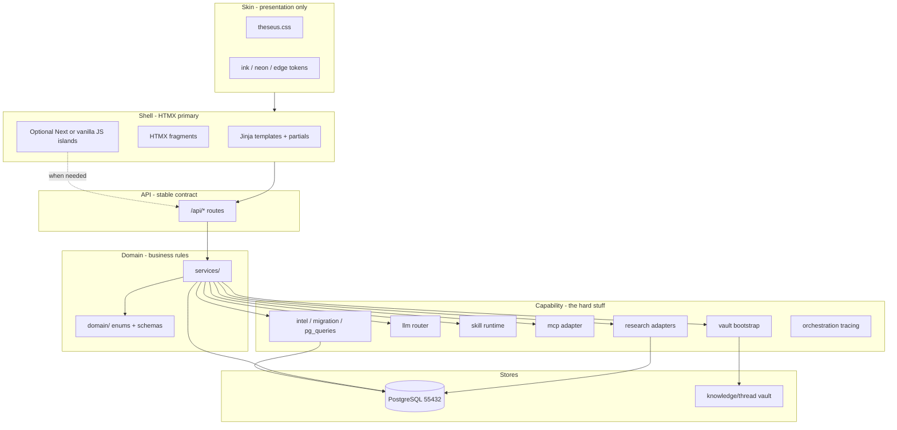
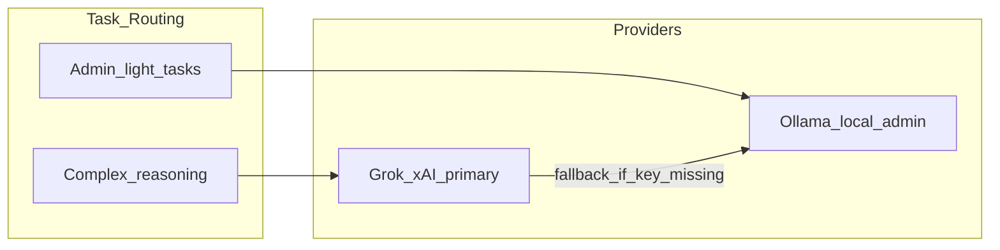
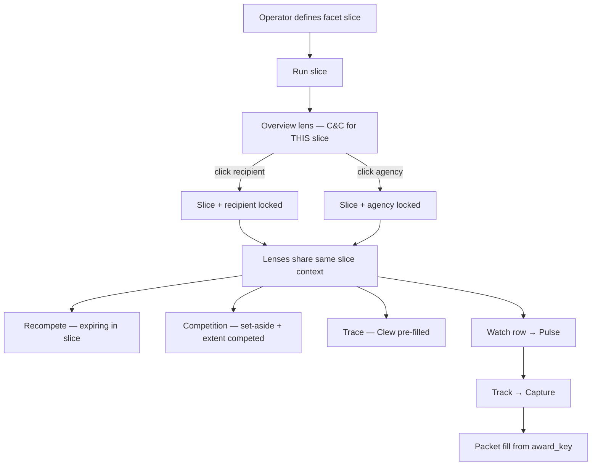
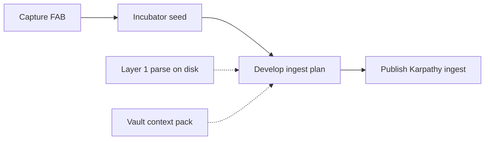

# Ariadne's Thread — Foundation Plan (v4)

> **Ariadne's Thread** — Global opportunity command center in `ariadne-capform`.  
> Single `python app.py` launcher · PostgreSQL-only · Grok/xAI primary reasoning ·  
> Web research (SearXNG/Crawl4AI first) · Review-gated everywhere · Theseus visual language.

**Last updated:** 2026-06-22 (MVP reprioritize — Data Insights command surface; defer Incubator 21b+ / intel ETL polish)

---

## Current status (scaffold checkpoint)

We completed **Phase 0 scaffold** and diverted briefly into env alignment, git, and orchestration config placeholders. The table below tracks plan vs repo.

| Area | Status | Notes |
|------|--------|-------|
| Monorepo scaffold | ✅ Done | `backend/`, `frontend/`, `skills/`, `docs/reference/` |
| `python app.py` launcher | ✅ Done | Postgres, vault bootstrap, HTMX on `:9622`; Next retired (`--legacy-frontend` only) |
| `.env` / `config.py` | ✅ Done | Full categorized config including research, MCP, orchestration |
| Docker Compose | ✅ Done | Postgres **16** image on `:55432` (matches volume; PG18 needs pg_upgrade) + `research` profile |
| Reference corpus | ✅ Done | Briefing packet, call plan, risk register, Shipley, USAspending |
| Workflow DB models | 🟡 Partial | Opportunities, packet, actions, review, **`operator_tasks` (Phase 16 ✅)** |
| Alembic migrations | ✅ Done | Workflow tables via Alembic; intel tables via bulk migration script |
| Intel migration (bulk zip→PG) | ✅ Complete | 64.2M prime + 1.5M sub · indexes built · `scripts/run-intel-migration.ps1 --status` |
| `pg_queries` intel layer | ✅ Done | Core queries + Clew analyze + portfolio intel signals |
| LLM router (Grok + Ollama) | ✅ Done | Reasoning → xAI; admin → Ollama |
| Web research module | ✅ MVP | SearXNG/Crawl4AI adapters + `/api/research/*` |
| Skill runtime + MCP | ✅ MVP | 8 MCP manifests + skills run UX on `/tools/skills` |
| Frontend command center | 🟡 Product gap | Shell + Pulse + Filament ✅ — **Data Insights analytics page incomplete** (17e) |
| Theseus visual language | ✅ Done | `frontend/styles/theseus.css` synced from proj-theseus |
| Orchestration (LangGraph) | 🟡 Placeholder | Env + tracing bootstrap; runtime deferred |
| Git | ✅ Done | Repo pushed; commit early/often |

**Resume here:** Foundation + intel bulk load ✅. **MVP focus:** close **Lane 1 identification loop** — Data Insights command surface (17e) → Watch → Track → packet fill. **Defer:** Incubator 21b–21d, intel ETL polish beyond views, Clew interact/FH hierarchy, education/DOX.

---

## Product identity

- **Name:** Ariadne's Thread (short: **Thread**)
- **Python package:** `thread` in [`backend/src/thread/`](../backend/src/thread/)
- **Workspace:** `ariadne-capform`
- **Ports:** API `9622` · LangGraph Studio `9623` · UI `3000` · Postgres `55432`
- **Philosophy:** Global opportunity command center; Shipley-aligned capture; human-in-the-loop everywhere; **knowledge compounds platform-wide** (vault + PG + review gate — not one screen); focused modules

### Three product lanes (operator summary)

Thread exists to help you do three jobs end-to-end — tailored solo-operator, review-gated, not enterprise team CRM:

| Lane | What you need | Thread surfaces (build toward) |
|------|----------------|--------------------------------|
| **1. Opportunity identification** | Find and qualify pursuits before you invest capture | **Data Insights** (live explore), **Watchlist** on Pulse (potential + research → vault), Track → Capture |
| **2. Capture development** | MS-gated strategy, intel, customer engagement, gate decisions | **Capture home** (`/capture`), Living Briefing Packet workspace (`/capture/{id}`), Actions, Research, vault, Clew (`clew_intel`), MinerU ingest |
| **3. Winning proposals** | pWin artifacts: eval mapping, win themes, PTW, outline, compliant narrative | Activation band produce lane, Theseus solicitation merge, skills + Grok synthesis → handoff to humans |

Lanes overlap on one **opportunity record** — identification feeds capture; capture feeds proposal produce. Review gate sits across all three.

**Inspiration repos (patterns only — no code dependency):**

| Repo | Adopt | Do **not** copy |
|------|-------|-----------------|
| [ariadne-thread](https://github.com/BdM-15/ariadne-thread) | Living Briefing Packet, review gates, vault, research provider registry | Next.js as long-term shell |
| [capture-insights](https://github.com/BdM-15/capture-insights) | USAspending intel, Karpathy vault, skill runtime | Vite/React UI stack |
| [proj-theseus](https://github.com/BdM-15/proj-theseus) | **Skin only:** `theseus.css`, shell UX patterns; MCP manifest pattern | Graph/RAG/LightRAG plumbing |
| [1102 MCP tools](https://github.com/1102tools/federal-contracting-mcps) | Deterministic federal data | — |
| [DataRepublican](https://github.com/DataRepublican/datarepublican) · [datarepublican.com](https://datarepublican.com) | Connect-the-dots / follow-the-money **methods** (graphs, flows, cross-entity tracing) via **Clew** (`clew_intel`) + Insights drill-down; `?path=` deep-link pattern (**17b.1**) | NGO/990 charity product surface, Jekyll app, client-side full-graph load, DR pdfparser (use **MinerU 3.3**) |
| [deer-flow](https://github.com/bytedance/deer-flow) | LangGraph sub-agent harness **patterns** — progressive `SKILL.md` load, fan-out → converge, context offload to filesystem/vault | Full harness import, sandbox shell, IM channels (Telegram/Slack), autonomous busywork |
| [Odysseus](https://github.com/pewdiepie-archdaemon/odysseus) | Single-launcher shell validation; **Deep Research → report** UX model for `research/` runs → candidate → `/review` | Email/calendar/notes/tasks productivity sprawl; **AGPL code vendoring** (patterns only) |
| [Apache Superset](https://github.com/apache/superset) | ECharts chart **recipes** (Sankey, mixed time-series, treemap); semantic-layer thinking for saved lenses | Second platform install, RBAC/multi-tenant BI, Superset as primary Insights surface |

**Rejected (2026-06-19 external tooling pass — see [`EXTERNAL_TOOLING_ASSESSMENT.md`](EXTERNAL_TOOLING_ASSESSMENT.md)):**

| Repo | Why reject |
|------|------------|
| [Appsmith](https://github.com/appsmithorg/appsmith) | Low-code client bindings — conflicts server-owned truth (#11) |
| [Twenty](https://github.com/twentyhq/twenty) | Team CRM — conflicts solo-operator + Living Briefing Packet model; **one-time** `packet_field_catalog.py` cross-read only |

---

## Non-negotiables

1. **Cloud-primary reasoning, self-hosted data** — Grok/xAI for capture/proposal/synthesis; Ollama for **admin offload only**. Execution data in PostgreSQL + Obsidian vault. Not “local-first AI.”
2. **Review-gated everywhere** — Intake → Candidate → Trusted; nothing auto-promotes.
3. **Full provenance** — evidence links, citations, MCP refs, web URLs, award_key lineage.
4. **Phase separation** — Phase 0–3 evergreen intel vs Phase 4–6 solicitation activation.
5. **Living Milestone Decision Briefing Packet** — slide-deck-shaped MS artifact; data elements from dictionary; `route_kind` drives fill (deterministic vs Grok/skills); living across MS gates and lifecycle; eventual approver export.
6. **Two-store knowledge + compounding doctrine** — Obsidian vault (synthesis) vs PostgreSQL (execution truth). Every lane writes candidate → review → trusted; trusted synthesis appends to vault and feeds later analysis (see **Knowledge compounding**).
7. **PostgreSQL only** — single DB for workflow AND intel (DuckDB = one-time migration source only).
8. **Theseus visual language** — ink/neon dark theme from proj-theseus (presentation layer only).
9. **One command to run** — `python app.py` from root `.venv` (single Python process at steady state).
10. **Web research enrichment** — bounded, approval-gated; free/local providers first.
11. **Server-owned truth** — UI renders and commands; domain rules live in Python `services/`, never in the client.
12. **Command & control ≠ metrics dump** — Dashboard is for **visibility + efficient action** under limited time and resources; deep analytics belong on **Data Insights**, not vanity counters on `/`.
13. **No default search dimension** — NAICS, agency, sub-agency, recipient/incumbent, PSC are **peer facets**. Operator defines explicit queries; platform never silently filters on `default_naics` or baked-in presets.

---

## Command & control doctrine (solo operator)

**Command Center (`/`) is not a BI dashboard.** It answers: *What needs my attention right now? What can I do in one click?* GovDash-style widgets are **action surfaces**, not report pages.

| Principle | Do | Don't |
|-----------|-----|-------|
| **Attention over volume** | Gate reviews, hot signals, pursuits by phase, migration health when blocking | Row counts, charts, or tables that only prove data exists |
| **Action over display** | Every widget links to a queue, workspace tab, or pre-filled tool run | Full-width metric cards with no next step |
| **Thin home, deep elsewhere** | Pulse = morning briefing; Insights = trends; **Capture** = packet work | Duplicate radar, analytics, or inbox on both `/` and `/pulse` |
| **AI as copilot** | Grok/skills draft, summarize, chain lookups; human approves via review gate | Auto-promote LLM output; bury actions behind chat-only UX |
| **Tool-fed UI** | Widgets/regions declare which capability feeds them (MCP, skill, PG intel, research) | Hand-rolled placeholders that look live but aren't wired |

**Widget acceptance test:** Can the operator **act** (review, track, open opp, run research, open lens) in ≤2 clicks without reading a paragraph? If not, it doesn't belong on Command Center.

**LLM/supporting role:** Thread should make capture **easier**, not busier — bounded research, suggested fills on `route_kind`, chained retrieval so the operator passes names/keys once and the platform gathers context. Orchestration (LangGraph / skill chains) serves **composition**, not autonomous busywork.

---

## Federal data composition (sources + chaining)

Thread uses **multiple federal data layers** with distinct jobs. Do not collapse them into one “intel number” on the dashboard.

| Source | Role | Primary surfaces | Notes |
|--------|------|------------------|-------|
| **USAspending (PG intel)** | Historical — trends, analytics, incumbent context, recompete radar, saved lenses | **Data Insights** `/insights`, Pulse radar, Insights drill-down | Migrated prime/subaward tables; not live SAM |
| **USAspending MCP** | On-demand queries, snapshots, supplemental pulls | Skills, workspace research, Insights actions | Same domain, different access pattern than PG analytics |
| **SAM.gov MCP** | Entity/opportunity detail — UEI, certs, solicitations | Pulse SAM strip (12i), competitive workspace, chain steps | Live supplement to historical spend |
| **eCFR / FPDS / other 1102 MCPs** | Deterministic reg/award lookups | Tools lane, skill chains, packet `route_kind` | Vendored under `tools/mcps/` |
| **Web research** | Enrichment after structured IDs/names exist | Research tab, capture_research | SearXNG/Crawl4AI first; review-gated |

### Retrieval chains (outputs → inputs)

Tool and MCP outputs are **composable**. One retrieval's `candidate` result becomes the next step's input — with full provenance for review.

**Example chain (target pattern):**

```
Recompete signal (USAspending PG / radar)
  → incumbent awardee name
    → SAM MCP (entity, UEI, business facts)
      → web research (positioning, news, customer context)
        → review gate → packet field / vault mirror
```

Same pattern for: `award_key` → prime award detail → facet query → Pulse alert. Skills and future orchestration should **encode these chains** as named recipes, not one-off UI hacks.

**Implementation rule:** New dashboard/Pulse regions must document **feed capability** (which MCP/skill/query) and support **drill-down into chain** (e.g. signal row → open workspace Research with context pre-filled). Phase 12 widgets are scaffolding until wired; wire them before adding more counters.

### Insight facet queries (no NAICS-default)

USAspending PG intel supports **multi-facet search** — any combination the operator needs:

| Facet | Example use |
|-------|-------------|
| `agency` | Customer / funding org spend and expiring awards |
| `sub_agency` | Component-level (e.g. Army CIO, DISA) |
| `recipient` | Incumbent or competitor market position |
| `naics_codes` | Industry slice when relevant — not the default dimension |
| `psc_codes` | Product/service line drill-down |

- **Storage:** `.thread/insight_queries.json` + `.thread/sam_queries.json` — **saved bookmarks only** (reopen analysis). `.thread/watchlist.json` — explicit potential on Pulse.
- **Deprecated:** `active_insight_query.json` / `active_sam_query.json` remote-controlling Pulse — removed. Insights does not push feeds to Pulse.
- **Operator presets yes; platform presets no** — you save named facet queries you create; Thread ships with **zero** hardcoded search presets.
- **No `default_naics` fallback** for explore, Pulse, or `/api/intel/expiring`.
- **Data Insights (`/insights`)** — **live HTMX explore** (no save required); **Watch** promotes rows to Pulse watchlist; saved lenses = bookmarks.
- **Anti-pattern:** NAICS-only presets, single-code defaults, Activate→Pulse coupling, or implying NAICS is the primary search key.

---

## Identification funnel (Insights → Watchlist → Opportunity)

Thread identification is **explicit promotion**, not passive dashboard feeds.

```
Data Insights — live explore (USAspending PG + SAM MCP)
    → Watch (operator choice) → .thread/watchlist.json
        → Pulse · Potential / Watchlist
            → Research (agency / awardee stubs → vault entities/)
            → Track → Capture workspace (Living Briefing Packet)
```

| Stage | Surface | State | Action |
|-------|---------|-------|--------|
| **Explore** | `/insights` | Ephemeral query results | Run facets live; saved lenses reopen only |
| **Watch** | Insights row action | `watchlist.json` entry | Deduped by `award_key` or `notice_id` |
| **Potential** | `/pulse#potential-watchlist` | Untracked but intentional | Research → vault; Track → opp (`pursuing`) |
| **Track** | Pulse forms | Opportunity record | `entry_reason` + provenance; lifecycle → `pursuing` |
| **Capture** | `/capture` + `/capture/{id}` | Post-identify pursuits | Living Briefing Packet, MS gates, research chains |

**Pulse is not fed by active lenses.** Morning briefing shows **watchlist + inbox + digest + capture pursuit snapshot** — not “whatever query was last activated.” Packet work lives on **Capture**, not as step 4 of the identify funnel.

---

## Knowledge compounding — platform doctrine (holistic, not one screen)

**This is Ariadne’s core intent across the whole platform** — not a feature of Pulse, Insights, or Knowledge alone. Thread is built so that **the more you use it, the smarter the corpus gets** for analysis, comparison, chains, and specialized model training.

**Core loop:** use → information becomes knowledge → knowledge compounds → better analysis, fill, and retrieval on the *next* pursuit.

| Layer | Store | Role |
|-------|-------|------|
| **Raw** | PostgreSQL intel, MCP snapshots, MinerU parses, research runs | Immutable execution truth |
| **Wiki** | Obsidian vault (`entities/`, `global/domain_intel/`, `pursuits/`, `training/`) | Synthesis, wikilinks, append-never-erase |
| **Schema** | `foundation/capture-llm-wiki.md` | Contract for how LLM maintains Layer 2 |

### Ingress surfaces (many doors, one vault brain)

Compounding is **distributed** — any lane can add candidate knowledge; review gate promotes to trusted; trusted appends to vault and PG-backed search.

| Lane | Example ingress | Compounds into |
|------|-----------------|----------------|
| **Identify** | Insights explore, Pulse watchlist Research | `entities/agencies/`, `entities/competitors/` |
| **Capture** | Workspace Research, packet `route_kind` fills, Actions | `pursuits/{opp}/`, packet trusted fields |
| **Intel** | MCP/skills (`clew_intel`, USAspending, SAM) | Evidence + vault mirrors with provenance |
| **Ingest** | MinerU PDF/doc upload (Phase 19) | Parsed chunks + wiki drafts |
| **Produce** | Studio / Theseus artifacts (Phase 21) | Reusable insights, win-theme corpora |
| **Operate** | Review Queue approve | Candidate → trusted everywhere |

**Watchlist Research on Pulse is one ingress** — convenient for identification triage. It does **not** define or limit compounding; workspace research, skill chains, MinerU, and packet promotion are equally first-class.

### What compounding enables (roadmap)

- Richer **bid-fit** via `domain_intel` cross-links and wikilinks between agency offices and awardees
- **Named retrieval chains** — `award_key` → incumbent → SAM UEI → web → vault note → packet field
- **Training export** under `training/` — e.g. company-specific SLM corpus (1B trained on Amentum-only for black-hat / specialized tasks)
- **PG18 + pgvector** — embed vault notes + MinerU chunks for hybrid search across collected data
- **Unified federal search** — USAspending PG + SAM MCP + complementary MCPs (Phase 17c+)

Karpathy/Obsidian style = lightweight **pseudo knowledge-graph brain**: every surface feeds the same vault; the vault makes every surface smarter on the next pass.

---

## Architectural layers (first principles)

Ariadne is a **capability-first Python platform** with a **Theseus-skinned command center**. Skin, shell, API, domain, and capability are separate — never conflate theme with plumbing.

| Layer | Responsibility | Location (target) |
|-------|----------------|-------------------|
| **Skin** | Colors, typography, cards, collapsibles, topbar | `theseus.css` (synced from proj-theseus) |
| **Shell** | Pages, nav, HTMX partials, optional JS islands | `backend/src/thread/ui/` (target) |
| **API** | Stable HTTP contract for UI, scripts, automation | `backend/src/thread/api/` |
| **Domain** | Opportunities, packet, review enums, schemas | `backend/src/thread/domain/` + `services/` |
| **Capability** | Intel, LLM, skills, MCP, research, vault, migration | `backend/src/thread/{intel,llm,skills,mcp,research,bootstrap}/` |

**Shell decision (v4):** FastAPI serves **HTMX + Jinja templates** (Theseus delivery model). Transitional Next.js in `frontend/` validates flows against `/api/*` until HTMX port completes. **Next.js is not forbidden** — use for client-heavy surfaces (streaming chat, charts, drag-drop) as **embedded islands** when first principles require it, not as the default shell.



**Rules:**
- Routes stay thin → `services/` fat → models dumb.
- Long jobs resumable and out-of-band (intel migration pattern).
- Every LLM/skill/MCP/research output lands as `candidate` + provenance; promotion only via review gate.
- Enhance bottom-up (capability → domain → API → shell → skin). Swapping shell or skin must not require rewriting intel/LLM/skills.

---

## LLM strategy



| Task class | Provider | Examples |
|------------|----------|----------|
| **Reasoning** | Grok/xAI | Packet synthesis, capture profiles, research interpretation, route recommendations |
| **Admin** | Ollama (optional) | Vault lint, classification, draft scaffolding |
| **Embeddings** (future) | OpenAI `text-embedding-3-large` | Semantic vault search (config stub exists) |

**Module:** `backend/src/thread/llm/router.py` — `resolve_provider(task_kind)` routes reasoning to xAI when `XAI_API_KEY` is set.

---

## Web crawl research enrichment

Pattern from ariadne-thread `capture_research.py` — provider registry, bounded collection, review-gated findings.

### Provider priority

| Priority | Provider | Config |
|----------|----------|--------|
| 1 | SearXNG | `SEARXNG_BASE_URL` (`:8080`) |
| 2 | Crawl4AI | `CRAWL4AI_BASE_URL` (`:11235`) |
| 3 | SerpAPI | `SERPAPI_API_KEY` |
| 4 | Olostep | `OLOSTEP_API_KEY` |
| 5 | Firecrawl | `FIRECRAWL_API_KEY` |

### Module layout (to build)

```
backend/src/thread/research/
├── providers.py
├── capture_research.py
├── lenses.py
└── adapters/
    ├── searxng.py
    ├── crawl4ai.py
    ├── serpapi.py
    ├── olostep.py
    ├── firecrawl.py
    └── fake.py
```

**Run flow:** User triggers research → discovery → crawl → Grok interpretation → `candidate` findings → review gate → optional evidence + vault mirror.

**UX reference:** [Odysseus](https://github.com/pewdiepie-archdaemon/odysseus) Deep Research flow — multi-step web search → source reading → **citation-backed synthesized report** → promote via `/review`. Patterns only (AGPL); Thread stays capture-focused, not personal-productivity workspace.

---

## Orchestration (LangGraph — deferred runtime)

Route-first capture orchestration ships **before** LangGraph runtime adoption (per ariadne-thread PRD).

| Setting | Purpose |
|---------|---------|
| `LANGGRAPH_ENABLED` | Master switch (off until chain executor lands) |
| `THREAD_LANGGRAPH_STUDIO_AUTO_START` | Spawn `langgraph dev` from `app.py` when ready |
| `LANGGRAPH_STUDIO_PORT` | `9623` (Thread port family) |
| `LANGSMITH_*` / `LANGCHAIN_*` | Tracing for skill chains (`thread-capture-orchestration` project) |

**Module:** `backend/src/thread/orchestration/` — tracing bootstrap done; chain executor TBD.

**Reference impl (patterns only):** [deer-flow](https://github.com/bytedance/deer-flow) — lead agent plans → spawns isolated sub-agents (parallel fan-out → converge); progressive skill loading; summarize-and-offload intermediates. Map to Thread **named retrieval chains** (recompete → incumbent → SAM UEI → web → packet field). Every sub-agent output stays `candidate` until `/review`. No sandbox shell, no IM channels, no wholesale harness import.

---

## Architecture overview

```mermaid
flowchart TB
  subgraph launch [python app.py]
    Boot[Bootstrap + vault seed]
    PGUp[PostgreSQL docker]
    Warm[Warmup probes]
  end

  subgraph fastapi [FastAPI :9622]
    UIRoutes[UI routes - HTMX target]
    APIRoutes["/api/* REST"]
    subgraph capability_mod [Capability modules]
      IntelMod[Intel]
      LLMMod[LLM Router]
      SkillMod[Skills]
      ResearchMod[Research]
      MCPMod[MCP]
    end
    subgraph domain_mod [Domain services]
      OppSvc[Opportunities]
      ReviewSvc[Review Gate]
      PacketSvc[Packet]
    end
  end

  subgraph command_center [Command Center surfaces]
    Pulse[Portfolio Pulse]
    Workspace[Opportunity Workspace]
    PacketUI[Living Briefing Packet]
    ReviewUI[Review Queue]
    ResearchUI[Research + Skills]
    IslandUI[Optional client islands]
  end

  subgraph pg [(PostgreSQL :55432)]
    Workflow[workflow_tables]
    IntelTables[intel_tables]
    ResearchTables[research_tables]
  end

  Vault[(knowledge/thread)]

  launch --> fastapi
  launch --> PGUp
  PGUp --> pg
  UIRoutes --> command_center
  IslandUI -.-> APIRoutes
  command_center --> UIRoutes
  command_center --> APIRoutes
  APIRoutes --> domain_mod
  domain_mod --> capability_mod
  capability_mod --> pg
  capability_mod --> Vault
  Boot --> Vault
```

**Transitional:** `frontend/` (Next.js) currently calls `APIRoutes` directly on `:9622`; retire after HTMX shell reaches parity.

### Shipley phase model

| Band | Phases | Mode | Surfaces |
|------|--------|------|----------|
| **Evergreen** | 0–3 | `evergreen` | PG intel, web research, vault, capture profile |
| **Activation** | 4–6 | `activation` | Living Briefing Packet MS1–MS4, Action Matrix, Theseus merge stub |

---

## Single launcher: [`app.py`](../app.py)

```powershell
python app.py
```

**Target startup sequence:**

1. Load Settings from `.env`
2. PostgreSQL — `docker compose up` if needed
3. Alembic `upgrade head`
4. Intel migration if PG intel tables empty (`INTEL_MIGRATION_SOURCE` → capture-insights DuckDB)
5. Vault bootstrap if empty
6. Optional: `docker compose --profile research up`
7. Serve command center UI from FastAPI (HTMX + `theseus.css`) — **target**; transitional: optional Next.js on `:3000`
8. Warmup: vault, Grok probe, Ollama, MCP catalog, research providers, intel row count
9. Print URLs (API `:9622`, UI same origin when HTMX lands)

**CLI flags (target):** `--api-only`, `--no-warmup`, `--migrate-intel`, `--skip-docker`, `--no-research-providers`

---

## PostgreSQL storage

### A. Workflow tables
`opportunities`, `packet_field_definitions`, `packet_field_answers`, `action_matrix_items`, `evidence_items`, `review_records`, `capability_runs`, `extraction_bundles`, `mcp_invocations`

### B. Intel tables (bulk zip/CSV → PostgreSQL)
`intel_usaspending_prime_awards`, `intel_usaspending_subawards`, `intel_entities`, `intel_relationships`, `intel_naics_summary_cache`

**Migration script:** `backend/scripts/migrate_intel_from_bulk.py` · wrapper `scripts/run-intel-migration.ps1`  
**Status (2026-06-22):** ✅ 64,231,918 prime · 1,524,536 sub · indexes built · **do not `--force`** unless intentional full reload  
**Queries:** `backend/src/thread/intel/pg_queries.py`

#### Intel data posture — raw load vs production-grade (honest assessment)

Thread **COPY-loads raw USAspending bulk CSV** with type casts + derived `fy`/`quarter` only. No Data_Insights-style cleansing pipeline yet.

**Compared to [Data_Insights `data_processing`](https://github.com/BdM-15/Data_Insights/tree/main/src/backend/data/data_processing):**

| Data_Insights step | What it does | Thread today | MVP need |
|--------------------|--------------|--------------|----------|
| `1_cleansing` | Agency normalize, NAICS strip, mod `0`, UPPER names, dedup `DISTINCT ON` | ❌ Not applied | 🟡 Post-MVP for analytics accuracy |
| `2_enrichment` | KBR flags, derived columns | ❌ | Defer — operator-specific |
| `3–4` embeddings | pgvector semantic search | ❌ | Defer (Phase 8 semantic vault) |
| `5` canonicalize | `s3_processed` schema | ❌ Different storage model | N/A |
| `6` indexes/MVs | Filter tables, `mv_agency_analysis_summary` | Partial — 6 btree indexes via `ensure_intel_indexes` | Add query-driven indexes (below) |

**Read-only audit (2026-06-22, existing PG — no deletes):**

| Signal | Count | Interpretation |
|--------|------:|----------------|
| Prime rows | 64,231,918 | Matches bulk source |
| Distinct `contract_transaction_unique_key` | 64,206,069 | **25,849 duplicate txn keys** — raw file duplicates, not migration bug |
| Negative `federal_action_obligation` | 2,841,454 | Valid deobligations — queries must `SUM()` net, not assume ≥ 0 |
| Zero obligation rows | 6,327,975 | Common in mods — filter in analytics, not drop |
| `DEPT OF DEFENSE` (un-normalized) | 35.9M rows | Data_Insights would map → `DEPARTMENT OF DEFENSE` — facet grouping splits without cleanup |
| Missing NAICS | 15,632 | Small — acceptable for MVP |
| Sub null `prime_awardee_name` | 6,570 | FFATA raw — Clew teaming joins need `COALESCE` or cleanup view |

**Indexes present:** `naics_code`, `(naics_code, period_of_performance_current_end_date)`, `contract_award_unique_key`, `contract_transaction_unique_key`, sub name indexes.

**Indexes to add (post-MVP `intel_etl` or `--indexes-only` extension):** `action_date`, `recipient_uei`, `recipient_name`, `period_of_performance_current_end_date` standalone, `sub.prime_award_unique_key` — recompete/radar queries currently may seq-scan without NAICS filter.

**Recommended path (do not copy-paste Data_Insights):**

1. **MVP:** Query on raw tables + `sql_expressions.AGENCY_EXPR` + document negative obligations in `docs/usaspending/`.
2. **Phase 23a — `intel_analytics` views:** SQL-only `intel_prime_awards_v` with agency normalize + net obligation flags (no table rewrite).
3. **Phase 23b — optional dedup matview:** `DISTINCT ON (award_id_piid, mod, action_date, obligation, recipient)` for Clew aggregates only.
4. **Skip for Thread:** pgvector embeddings, S3 processed schema, filter-value tables (facet queries replace), KBR enrichment unless operator requests.

**Safe ops:** `.\scripts\run-intel-migration.ps1 -Status` (read-only) · `-IndexesOnly` (add indexes, no data touch) · **never `-Force`** on production load without backup.

### C. Research tables
`capture_research_runs`, `capture_research_sources`, `capture_research_findings`

### D. Graph export
`data/graph/edges.jsonl` (Neo4j-ready)

---

## Knowledge vault

**Local path:** `knowledge/thread/` (gitignored content)

**Seed from:**

- `capture-insights/data/knowledge/` — schema, `global_wiki`, **`domain_intel`** (capabilities + UEI/PP), `training/`, `education/`, `brain/` → `entities/`
- ariadne-thread vault directory conventions
- Reference docs in `docs/reference/` (commit-safe dictionaries)

**Bootstrap:** [`backend/src/thread/bootstrap/vault.py`](../backend/src/thread/bootstrap/vault.py) — idempotent; never overwrites existing wiki pages.

### Clew → vault ingest (design TBD — do not ship dump-to-folder)

Trusted Clew findings must compound via **Karpathy llm-wiki / Obsidian** practices — not orphan markdown files.

| Rule | Requirement |
|------|-------------|
| **Review gate first** | No vault write until Clew output promoted candidate → trusted on `/review` |
| **Entity anchors** | Synthesis updates `entities/competitors/`, `entities/agencies/`, or `global/domain_intel/` — never a new `clew-dumps/` folder |
| **Wikilinks + backlinks** | Every note links `[[recipient]]`, `[[agency]]`, `award_key`; graph stays connected |
| **Append / merge** | Grok polishes into existing entity page — no duplicate competitor stubs per Clew run |
| **Provenance frontmatter** | `review_id`, facet slice, Clew mode, PG intel snapshot date, `award_key` lineage |
| **No static artifact default** | Clew produces **live explorable views** (drawer → future interactive charts); vault gets synthesis summary + links, not PNG/HTML dumps |

**Deferred button:** “Save to vault” waits for this spec + `vault_research` merge path (align with Pulse Research stubs).

---

## Core domain model

### Opportunity
`lifecycle_state`, `current_milestone_gate` (MS1–MS4), `capture_phase_band`, urgency/freshness, `intel_provenance`

### Living Briefing Packet
8 canonical sections; ~20 seeded MS1-critical fields ([`packet_field_seed.py`](../backend/src/thread/domain/packet_field_seed.py)); `PacketFieldRouteKind` for UI route badges

### Review gate
All AI/skill/research outputs land as `candidate` + `pending_review`. Promotion via `POST /api/review/{id}/approve`.

### Provenance kinds
`award_key`, `mcp_tool`, `url`, `file`, `vault_page`, `web_research`, `manual`

---

## MVP scope

**Operator lanes:** Opportunity identification · Capture development · Winning proposals (see above). **Win lane (Studio/Theseus) is post-MVP.**

**Platform pillars:**

1. **Command Center Shell** — Pulse, Data Insights, Capture home + workspace, review queue
2. **Knowledge Layer** — Obsidian vault, MinerU ingest, `domain_intel`
3. **Developer Skills** — skill-creator, clew_intel, mcp_federal_tools
4. **Data & Intel** — PG intel, 1102 MCPs, web research, MinerU utility
5. **Config & Stack** — FastAPI HTMX shell, PostgreSQL, Grok-primary reasoning

### MVP sign-off test (do not lose sight of this)

> Can a solo operator **find a pursuit**, **watch** it, **track** it, **open a packet**, and **fill fields from intel** — without fighting the UI or waiting on unfinished plumbing?

| Step | MVP must prove | Current gap |
|------|----------------|-------------|
| **Find** | Run facet slice on `/insights`, see **market picture** (not just expiring rows), spot agency/competitor worth pursuing | `/insights` = expiring list + SAM; charts live on `/clew` only; no capture-insights-style overview KPIs |
| **Watch** | One-click Watch from Insights row → Pulse watchlist with provenance | ✅ wired |
| **Track** | Pulse watchlist → Track form → opportunity `pursuing` | ✅ wired — needs E2E smoke |
| **Open packet** | `/capture/{id}` slide workspace loads | ✅ wired |
| **Fill from intel** | `POST …/packet/{field}/fill` from award_key / Clew context | ✅ 20a/20b — needs pursuit seeded from Insights path |

**MVP is not:** Incubator Develop/Publish, intel dedup matview, Clew Sankey click-expand, FH agency hierarchy, routing matrix prose, or education curriculum.

---

## API surface (target)

| Method | Path | Status |
|--------|------|--------|
| GET | `/api/health` | ✅ |
| GET | `/api/portfolio/pulse` | ✅ (intel signals + stats) |
| GET/POST | `/api/opportunities` | ✅ |
| GET/PATCH | `/api/opportunities/{id}/packet` | ✅ |
| GET/POST | `/api/opportunities/{id}/actions` | ✅ |
| GET | `/api/review/pending` | ✅ |
| POST | `/api/review/{id}/approve` | ✅ |
| GET | `/api/packet/definitions` | ✅ |
| GET | `/api/intel/health`, `/expiring`, `/snapshot`, `/migration-status` | ✅ |
| POST | `/api/research/*` | ❌ |
| GET/POST | `/api/skills/*` | ❌ |
| POST | `/api/intel/mcp/{server}/invoke` | ❌ |
| GET | `/api/knowledge/vault/*` | ✅ |

### HTMX UI routes (shell)

| Method | Path | Status |
|--------|------|--------|
| GET | `/capture` | ✅ Capture home — post-identify pursuits |
| GET | `/capture/{id}` | ✅ Living Briefing Packet workspace |
| GET | `/opportunities/{id}` | ✅ 307 → `/capture/{id}` (legacy alias) |
| POST | `/opportunities`, `/sam/track`, `/signals/track` | ✅ Track → `pursuing` → redirect `/capture/{id}` |

---

## Frontend / command center shell

**Skin:** `theseus.css` + Theseus shell patterns (topbar, `card-accent`, pills, `btn-hero-cyan`). Sync from proj-theseus; no local token forks.

**Shell (target):** FastAPI serves Jinja templates + HTMX partials from `backend/src/thread/ui/`. Server-owned forms, tables, review gates. Same handlers back `/api/*` and HTMX fragments.

**Archived:** `frontend/` Next.js 15 — no longer spawned by `app.py`. Use `python app.py --legacy-frontend` or `cd frontend && npm run dev` only for archaeology.

**Next.js / client islands (allowed when justified):** Streaming LLM output, interactive charts, drag-drop matrices, other client-heavy UX. Embed via iframe, separate route, or small bundled script — not whole-platform SPA by default.

### What exists today (foundation shell — not product MVP)

| Screen | Foundation | Product gap |
|--------|------------|-------------|
| Command Center (`/`) | Attention widgets, compact nav, pursuit rail — **not** analytics home | Widget row (12c–12h): reviews, phase band, hot signals, health strip, **quick actions**; anti-pattern: metrics dump |
| Portfolio Pulse (`/pulse`) | Morning briefing: **watchlist** + inbox + digest + capture snapshot | Identify-only; Track → `/capture/{id}`; not packet home |
| Data Insights (`/insights`) | 🟡 Facet explore + Watch + bookmarks; Clew on separate `/clew` | **17e** command surface — overview KPIs + charts + drill-down lenses (capture-insights visuals, Thread facet model) |
| **Filament** (`/capture`) | ✅ Post-identify pursuit list; nav **Filament** (connected packets, not hand-jammed decks) | CRM pipeline board (deferred) |
| Filament workspace (`/capture/{id}`) | ✅ Slide canvas + **connected fill routes** (14j/20a/20b) + evidence inspector; MS pills | Phase 20c ranked routing matrix + optional Grok advisor |
| Sidebar nav | Command / Identify / **Filament** (home first) / **Tools** / Win / System | Studio route (Phase 21) |
| Settings (`/settings`) | ✅ Read-only platform health | Editable keys deferred to Tools/MCP (12k) |
| MCP Servers (`/tools/mcp`) | ✅ Catalog + guides + test handshake + .env key save | — |
| Agent Skills (`/tools/skills`) | ✅ Skill card grid from `skills/` | Run/install UX (Phase 20); **not** Theseus Skills Retrieval settings |

**Shell IA (Theseus pattern):** `topbar-vibrant` = brand + health (no route links). Left `sidebar-vibrant` = app lanes (Command / Identify / Capture / **Tools** / Win / System). Top `glass-section-bar` = **per-page** nav only. Main canvas = `panel-canvas` aurora.

**Settings vs Tools split:** Settings = platform health, migration, providers, orchestration flags. **Tools** = operator-facing catalogs (MCP Servers, Agent Skills) with guides — modeled on Theseus MCP settings + RFP Intelligence briefing guides (`settings-label-tip`, `tuning-guide-*`). Do **not** port Theseus Settings → Skills Retrieval panel (too complex).

**Target nav (product):** Dashboard, Pulse, Insights · **Filament**, Knowledge, Review · **MCP Servers, Agent Skills** · Studio (soon) · Settings.

**Solo operator model:** one user; technology produces **pWin artifacts** (BLUF, PTW, win themes, eval mapping) for external humans — not multi-user CRM, not post-award.

---

## Developer skills (stubs exist)

| Skill | Path | Purpose |
|-------|------|---------|
| skill-creator | `skills/skill-creator/` | Scaffold new skills |
| clew_intel | `skills/clew_intel/` | Award relationship / money-path traces |
| mcp_federal_tools | `skills/mcp_federal_tools/` | 1102 MCP adapter |

---

## Tests (target)

- `test_review_gates.py` — no auto-promote
- `test_intel_migration.py` — DuckDB→PG idempotent
- `test_llm_router.py` — reasoning→xAI, admin→Ollama
- `test_capture_research.py` — findings stay candidate
- `test_packet_field_seed.py` — ✅ exists
- `test_capture_lane.py` — ✅ Filament home, lifecycle filter, workspace alias
- `test_packet_workflows.py` — ✅ fill route chips for open fields
- `test_orchestration_config.py` — ✅ exists

---

## Non-goals (this foundation)

- Full multi-agent war room
- Complete Theseus extraction pipeline in-process
- Production auth / deployment
- Advanced graph visualizations
- Neo4j runtime
- Full Capability Studio
- LangGraph runtime (until route-first + thin skill chains proven)
- [Appsmith](https://github.com/appsmithorg/appsmith) as low-code shell — server-owned truth makes client-binding builders anti-fit
- [Twenty](https://github.com/twentyhq/twenty) as CRM — solo operator + packet record ≠ team deal pipeline
- [Apache Superset](https://github.com/apache/superset) as primary Insights platform — second-process BI tax; mine ECharts recipes natively instead
- [deer-flow](https://github.com/bytedance/deer-flow) wholesale harness import — pattern-mine only; keep review-gated bounds

---

## Extension path (post-foundation)

**Foundation (steps 1–11) is complete.** Product work proceeds in **small vertical slices** — one screen region per slice, wired to real APIs, with tests. No one-shot “rebuild the command center.”

### Product capability map (reuse, don’t rebuild)

| Capability | Source | Thread use | Phase |
|------------|--------|------------|-------|
| USAspending intel | capture-insights → PG | Data Insights, recompete, packet deterministic fields | Done / 17 |
| Data Insights | capture-insights intent | Multi-facet market deep dives — **not NAICS-defaulted** | 17 |
| Follow-the-money | [DataRepublican methods](https://datarepublican.com) + capture-insights PG + `clew_intel` | Clew `/clew`, Insights drill-down, incumbent, packet fields | 17, 20 |
| 1102 MCPs | federal-contracting-mcps | Deterministic award/agency fields | 20 |
| **MinerU 3.3** | document parser (Theseus stack) | Vault ingest, solicitation PDF, opp attach — **not** DataRepublican pdfparser | 19 |
| **Theseus** | proj-theseus | Solicitation merge, activation produce (outline, compliance) | 21+ |
| Grok/xAI | cloud-primary | `model_synthesis` packet fields, vault polish, narratives | 20 |
| Ollama | admin offload | Summaries, lint — not capture-critical path | ongoing |

### External tooling assessment (2026-06-19)

Full research pass: [`docs/EXTERNAL_TOOLING_ASSESSMENT.md`](EXTERNAL_TOOLING_ASSESSMENT.md). Verdict: adopt **methods/patterns only**; everything converges on review gate + vault. Repo links in **Inspiration repos** table above.

### DataRepublican inspiration (captured 2026-06, parity updated 2026-06-18)

**Sources:** [datarepublican.com](https://datarepublican.com) (product vision) · [github.com/DataRepublican/datarepublican](https://github.com/DataRepublican/datarepublican) (open tooling).

Core idea from the site: *“Connecting the dots between government grants, charities, and drawing connections to expose where the money flows.”* Thread applies that **doctrine** to **federal capture intel** (USAspending + SAM + subawards), not NGO/990 charity analytics.

**Parity status (honest reference — not a DR fork):**

| DR surface | DR *method* (what makes it work) | Clew / Thread today | Gap (future — do not rabbit-hole mid-slice) |
|------------|----------------------------------|---------------------|---------------------------------------------|
| [expose](https://datarepublican.com/expose/) | Multi-root **BFS** from seed EINs → subgraph; taxpayer $ on nodes; **edge-click zoom**; force/graph canvas | Facet slice → top-N SQL paths → **static** ECharts Sankey/bar on `/clew` | BFS subgraph expansion from recipient/agency/UEI seed; force-directed canvas (**17c-graph**) |
| [browse](https://datarepublican.com/browse/) | **Exploratory** Sankey — click node → reveal hidden flows; focus/remove; trace back to USG | Same static Sankey from facet; zoom/hover only | Click node → narrow facet → re-run; progressive disclosure (**17b-interact**) |
| [relations](https://datarepublican.com/relations/) | **People/entity** graph; name search; hover **trace connections** | `teaming` = prime→sub org edges only | People graph (SAM principals + vault entities); `intel_relationships` + `edges.jsonl` (**17c-graph**) |
| [award_search](https://datarepublican.com/award_search/) | Map federal funds to connected orgs | Facet explore + `recipient_landscape` on `intel_usaspending_prime_awards` | — |
| [officers](https://datarepublican.com/officers/) | Cross-reference people across orgs | Deferred — SAM entity MCP + vault `entities/competitors/` (not DR 990 officers) | SAM + vault people cross-ref (**20+**) |

**Same doctrine today:** follow-the-money, connect recipients/agencies/primes/subs, candidate → review → vault compounding.

**Not same interaction model yet:** graph-BFS expose, browse-style expansion, people relations graph, interactive canvas traversal.

**Govcon target mapping (when built):**

| DR surface | Govcon equivalent |
|------------|-------------------|
| expose | Seed recipient/agency/UEI → BFS over award + subaward edges; $ on nodes |
| browse | Start at incumbent/customer → click Sankey/graph node to expand neighbors |
| relations | Teaming + SAM principals + vault entity graph |

**Facet discovery (future — high leverage, deferred):**

| Need | Approach | Phase |
|------|----------|-------|
| Agency/recipient **autocomplete** | Distinct-value typeahead over PG intel (+ SAM entity names) | **17d** |
| **Semantic** facet search ("Army CIO" → actual PG label) | `pgvector` on USAspending + SAM snapshots + vault entities | **17c** |
| Unified retrieval | Hybrid search across PG intel, MCP snapshots, MinerU chunks | **17c** |

Note: facets today use `ILIKE '%text%'` substring match — not exact equality. Pain is **discovery** (what substring to type), not strict string match.

**Thread stack (not a DR fork):** capture-insights DuckDB→PG bulk (`intel_usaspending_*`) + facet queries + review gate. No dependency on DR’s Jekyll site or charity DB.

**Document parsing boundary:** solicitation/PDF ingest uses **MinerU 3.3** (already on Theseus) — Phase 19. We do **not** port DataRepublican’s pdfparser.

**Skill:** `clew_intel` — modes `spend_trend`, `money_flow`, `teaming`, `recipient_landscape` (+ legacy snapshot/expiring/market). Outputs → `candidate` until `/review`. Surface: standalone `/clew` (Tools sidebar).

### GovDash inspiration (captured 2026-06)

Competitor review ([GovDash](https://www.govdash.com/) marketing + capture dashboard videos). **Adopt patterns, not enterprise CRM scope** — solo operator, review-gated, no team assignees / SharePoint / post-award.

| GovDash surface | Thread translation | Anti-patterns (skip) |
|-----------------|-------------------|----------------------|
| Discover saved profiles + alerts | **Saved lenses** on Data Insights (named facets) | 2M-opportunity freemium search engine |
| Capture dashboard widgets | Command Center widget row (solo) | Team-customizable widget builder |
| Gate reviews needing attention | Review queue + dashboard widget | Multi-reviewer color reviews |
| Opportunity card templates | Workspace templates (capture / competitive / readiness) | Per-team custom field CRM builder |
| Proposal Cloud | **Studio** lane (pWin artifacts) | Word add-in / compliance matrix product |
| Kanban / Gantt pipeline | Optional phase-band board (deferred) | Team task Gantt |

### Phase 12 — Command center shell (incremental)

Shell first, then region widgets. One slice per PR. Concrete targets below — do not drop during implementation.

| Slice | Scope | Done when |
|-------|--------|-----------|
| **12a** | Sidebar + stubs + Command Center shell | ✅ Dashboard `/`, Pulse `/pulse`, sidebar lanes, Theseus topbar |
| **12b** | Settings / health (read-only) | ✅ Platform accordion; links to Tools for MCP/skills inventory |
| **12k** | Tools — MCP ops | `/tools/mcp`: test connection, .env key save (Theseus settings-mcp pattern); guides already on page |
| **12l** | Tools — Agent Skills UX | ✅ `/tools/skills`: inline run panel per wired skill, HTMX → review queue — **not** settings-skills-retrieval |
| **12c** | Global review queue | ✅ `/review` human titles (`review_display`); approve works; **widget on Command Center**: pending count → `/review` |
| **12d** | Pulse — active pursuits | ✅ Capture-lane pursuits (`qualified`+); urgency/gate pills; **Command Center widget**: `phase_band` breakdown; deep links → `/capture/{id}` |
| **12e** | Intel / migration health | ✅ Settings + **Command Center widget**: blocking status (PG, migration %, vault, Grok) — not award analytics |
| **12f** | Recompete radar v2 | ✅ Hot ≤6mo widget; **facet queries** (`facet_query.py`) — no NAICS default; lenses managed on Insights (17) |
| **12g** | Intel inbox | ✅ Recent candidates → review — **Pulse region** (morning briefing), source lanes + chain hints; not dashboard home |
| **12h** | Quick actions | ✅ **Command Center strip**: track signal, run research, insights, vault, review; hot-signal chip when ≤6 mo |
| **12i** | SAM monitor | ✅ **Pulse region**: SAM.gov MCP `search_opportunities` leads, operator `sam_queries.json`, cache, Track → `/capture/{id}` |
| **12j** | Knowledge digest | ✅ **Pulse region**: `domain_intel` capabilities/UEI highlights → bid-fit context before Track |
| **12m** | Stale vault ingest pulse | **Command Center widget**: vault candidates pending **>72h** → Knowledge vault review (not Pulse inbox) |
| **12a-nav** | Sidebar label | Rename boring **Dashboard** → **Command Center** (matches page h1 + C&C doctrine) |

#### Command Center dashboard (`/`) — widget row (solo GovDash pattern)

Not the morning briefing — that stays on **Portfolio Pulse** (`/pulse`). Not analytics — that stays on **Data Insights** (`/insights`). See **Command & control doctrine** above.

1. **Pending reviews** — count + link to `/review` (12c) ✅ — excludes `vault_candidate` (see 15b)
2. **Stale vault ingest** — candidates pending **>72h** → `/knowledge#knowledge-vault-review` (12m)
3. **Active pursuits by phase band** — mini breakdown + drill to Capture (12d) ✅
4. **Recompete signals (hot ≤6 mo)** — count + link to Pulse radar; chain to incumbent/SAM when wired (12f) ✅
5. **Intel / migration health** — **blocking status only** (migration %, intel ready) — not award analytics (12e) ✅
6. **Quick actions** — track signal, run research, open insights lens, vault shortcut (12h) ✅ — highest priority for C&C usefulness

**Anti-patterns on `/`:** prime award totals as hero metrics, full recompete tables, NAICS analytics, anything that belongs on Insights or Pulse body.

#### Portfolio Pulse (`/pulse`) — morning briefing only

**Not** GovDash Capture CRM, **not** pipeline management, **not** award analytics. Daily identification horizon for solo operator.

**Funnel (UI + copy):** Data Insights (live explore) → Watch (explicit) → Pulse watchlist (potential + research) → Track → **Capture**.

| Region | Role | Object state |
|--------|------|--------------|
| Doctrine banner | Explains Insights / Watch / Research / Track → Capture | — |
| **Potential · watchlist** | Operator-watched recompete + SAM leads | Untracked potential — Research → vault; Track → opp (`pursuing`) |
| **Candidates · intel inbox** (12g) | Review-gated triage preview | Candidate until approve |
| **Context · knowledge digest** (12j) | `domain_intel` capabilities / UEI highlights | Bid-fit before Track — not analytics |
| **Tracked · pursuits** (12d) | Snapshot of capture-lane opps | Deep link → `/capture/{id}`; home on `/capture` |
| Rail funnel | 4-step identify → **Capture** (not “workspace” on Pulse) | No prime-award hero counts |

**Retired on Pulse:** recompete-radar + SAM-monitor panels driven by `active_*_query.json` — explore moved to Insights; SAM live fetch on explicit Run only.

- Collapsible panels + per-item cards (leads, inbox) — collapse to reach other regions without page scroll
- Tracked pursuits panel — compact cards linking to Capture; packet/MS work not on Pulse body

#### Capture workspace — templates (no CRM bloat)

- **URL:** `/capture/{id}` (canonical); `/opportunities/{id}` → 307 redirect
- **Default tabs:** Packet, Actions, Research, Review (current)
- **Future templates:** Competitive analysis (incumbent, PTW hints, eval mapping stubs); Proposal readiness (MS-critical %, due dates, pending reviews)
- **Pills:** keep milestone gate, phase band, intel signal; add `pending_review`, `days_to_due` when data exists

#### Studio (Win lane) — not Capture

GovDash Proposal Cloud maps here. Route `/studio` deferred to Phase 21.

- pWin artifacts: win themes, eval map, outline, compliance shred candidates
- **Theseus** merge = activation produce (solicitation merge), not general CRM

#### Data Insights — live explore + bookmarks (Discover pattern)

**Home for USAspending historical analytics** — live facet explore (HTMX, no save required), SAM explore on explicit Run, **Watch** per row → Pulse watchlist. Saved lenses = **bookmarks** to reopen analysis — not Pulse remote control. Phase 17 primary. Insights actions may invoke MCP/skill chains; results stay `candidate` until review.

### Phase 14 — Living Briefing Packet (slide deck UX)

Central artifact — not “parallel afterthought.”

- **14a ✅ (2026-06-18):** Slide navigator on workspace Packet tab — `reference_slide` groups from `packet_field_seed`; HTMX slide switch; fill progress bar
- **14b ✅ (2026-06-18):** Field cards show label, question, `route_kind` badge, trust/status (suggested fill deferred to 14b+ / route-driven fill)
- **14c ✅ (2026-06-18):** MS gate slide applicability — deck markers filter slide nav; fields filtered by `required_gates` vs `opp.current_milestone_gate`
- **14d ✅ (2026-06-18):** Approval slides 17–18 with starter criterion fields (`ms1_*`, `ms2_*`, `ms3_*`, `ms4_*`); expand toward full dictionary
- **14e ✅ (2026-06-18):** Packet progression — MS-critical fill %, pending review count, trusted tally in slide nav
- **14f ✅ (2026-06-18):** Full `BRIEFING_PACKET_DATA_DICTIONARY` → `packet_field_catalog.py` (141 answerable fields); `packet_answer_sources.py` route stubs per field (USAspending, Clew, vault, web research, Grok); UI route hints on field cards; expanded slide nav (slides 3–15)
- **14g ✅ (2026-06-18):** MS gate selector on opportunity header — HTMX `POST /opportunities/{id}/milestone-gate` → `current_milestone_gate` + packet slide/field filter refresh
- **14h ✅ (2026-06-18):** **Capture lane IA** — `/capture` home (post-identify pursuits via `CAPTURE_LANE_LIFECYCLES`); sidebar entry; `/capture/{id}` workspace; Track/create → `pursuing` + redirect; dashboard/Pulse/review deep links; `capture_display.py` + `test_capture_lane.py`
- **14i ✅ (2026-06-18):** Deck UX — MS1–MS4 **clickable pills**; 3-column layout: slide navigator · **16:9 slide canvas** · evidence inspector; readiness metrics strip
- **14j ✅ (2026-06-18):** **Filament** lane name (connected milestone packets — Thread metaphor, not bland “deck”); **Connected fill routes** panel under slide canvas — open fields show `route_kind` + source action chips (Insights, Clew, Vault, Research, Grok stub); `packet_workflows.py` + `test_packet_workflows.py`

### Phase 17 — Data Insights

`/insights` — agency, recipient, NAICS, PSC combos; **saved lenses** (named facet presets, GovDash Discover “profiles that match” pattern); drill-down; Clew deep-links for trace modes.

**17a ✅ (2026-06-18):** Live explore (radar + SAM) with HTMX; **Watch** → `.thread/watchlist.json`; Pulse **Potential · Watchlist** panel; Research stubs → `entities/agencies/` + `entities/competitors/`; saved lenses = bookmarks only (save/delete/open); **removed Activate→Pulse**. No platform default facets. UI: per-server guides/tooltips, collapsible frame + section panels (localStorage), `btn-hero-magenta` / `btn-hero-cyan` / `btn-primary`.

**17b-pre ✅ (2026-06-18):** **Clew** utility — `thread/clew/` + `clew_intel` skill; **standalone `/clew` page** (Tools sidebar, above MCP Servers). Insights/Pulse deep-link with pre-filled facets — no embedded card, no side drawer.

**17b ✅ (2026-06-18):** ECharts on `/clew` — Sankey (money flow, teaming), bars (spend trend, landscape); dark ink/neon theme; collapsible data table; optional **Live MCP supplement** checkbox (USAspending + SAM subawards on teaming). Click-to-drill deferred to **17b-interact**.

**17b.1 ✅ (2026-06-19):** DR `?path=` deep-link on `/clew` + Insights/Clew row **Path** handoff; saved trace bookmarks (`.thread/clew_traces.json`); Clew form labels/tooltips + full-width results panel.

**17b-interact (future):** DR browse-style — Sankey node click → narrow facet → re-run; focus/remove node in slice.

**17 chart craft (ongoing ref-only):** Mine [Apache Superset](https://github.com/apache/superset) ECharts configs for unbuilt Insights charts (mixed time-series, treemap, geospatial). Formalize saved lenses (`.thread/insight_queries.json`) as lightweight semantic layer — define metric/dimension once, reuse across charts. Embed Superset dashboards via iframe **only** if Insights analytics outgrow hand-coded charts.

**17c (future):** PG `pgvector` on USAspending labels, SAM snapshots, vault entities, MinerU chunks; **semantic facet autocomplete**; hybrid search across PG intel, parsed docs, and MCP snapshots.

**17c-graph (future):** BFS subgraph expansion (DR expose-style), force/graph canvas, `intel_relationships` + `edges.jsonl` export.

**17d-agency (deferred — post-MVP Clew UX):** SAM [Federal Hierarchy Public API](https://open.gsa.gov/api/fh-public-api/) (`/orgs`, `/org/hierarchy`) using existing `SAM_GOV_API_KEY`. One-time ingest → PG table `intel_federal_orgs`; Clew/Insights cascading selects (Dept → Sub-tier → Office) so operator never guesses agency strings. Reuse hierarchy labels to improve USAspending facet matching. Not blocking MVP — freeform text + ILIKE until shipped.

**17d (future):** Distinct-value facet autocomplete from PG intel (+ FH table labels) — quick win before 17c semantic search.

#### Phase 17e — Data Insights command surface (MVP blocker)

**Problem capture-insights got wrong (do not repeat):**

| Anti-pattern | Why it failed |
|--------------|---------------|
| **NAICS-defaulted dashboard** (`useState('561210')`) | Every tab was “market for 561210” — not operator-defined slices; violated peer-facet doctrine |
| **Parallel tab overviews** | Market / Agency / Competitive / Vehicles each re-loaded bootstrap KPIs for the same NAICS — tabs were duplicate overviews, not complementary lenses |
| **No drill-down context** | Seeing “Lockheed dominates” on Overview did not narrow the slice — operator had to re-type facets manually |
| **Overview ≠ command** | Overview was a report page; tabs did not inherit or refine the same **active slice** |

**Thread fix — one active slice, lenses not duplicate dashboards:**



**Core concepts:**

| Concept | Definition |
|---------|------------|
| **Slice** | Active facet query — **peer dimensions, zero platform defaults** (see **Facet model** below — not limited to today's 5 UI fields) |
| **Overview lens** | Command surface for the slice: KPI strip + “what jumped out” + top entities with **Hone** actions |
| **Lens** | A view on the **same slice** — different question, not a new overview (Recompete, Competition, Agency mix, Trace) |
| **Hone** | Click chart/table row → append facet dimension → re-run slice (breadcrumb shows drill path) |
| **Saved lens** | Bookmark to reopen slice + optional lens tab — not Pulse remote control |

**Visual inventory (reuse capture-insights queries + ECharts; mine Superset recipes, no Superset install):**

| Visual | Question it answers | capture-insights source | MVP priority |
|--------|---------------------|-------------------------|--------------|
| KPI strip | How big is this slice? | `get_dashboard_bootstrap` / market summary | **P0** |
| FY spend trend | Growing or shrinking? | `fy_trends` / Clew `spend_trend` | **P0** |
| Set-aside donut | Small biz vs full & open? | `get_set_aside_breakdown` · use `set_aside_chart_bucket` view | **P0** |
| Extent competed bar | How competed is work? | `by_extent_competed` (vehicle analysis) | **P0** |
| Top recipients bar | Who wins here? | `top_recipients` · click → Hone recipient | **P0** |
| Top agencies bar | Who buys? | agency intensity / flows | **P1** |
| **Capture intensity** scatter | Who is hot (high actions **and** high $)? | `get_agency_intensity` — actions × obligation, hone agency | **P1** |
| Expiring table | What recompetes soon? | current `/insights` explore rows | **P0** (exists — move under Recompete lens) |
| Money-flow Sankey | Recipient → agency paths | Clew `money_flow` | **P1** (link to `/clew` or embed) |
| Geo / vehicles / combo | POP state, IDV mix, combos | capture-insights tabs | **Post-MVP** |

**17e slices (implementation order):**

| Slice | Scope | Done when |
|-------|--------|-----------|
| **17e-a** | **Slice context bar** — show active facets + breadcrumbs after Hone; persist in HTMX form hidden fields | Operator always knows what data means |
| **17e-b** | **Overview lens** — KPI + FY trend + set-aside + extent competed + top recipients (ECharts on `/insights`) | Run facet → see market picture in &lt;30s cached |
| **17e-c** | **Hone interactions** — click recipient/agency bar → narrow slice → refresh all lenses | “Why is Lockheed getting money?” is one click |
| **17e-d** | **Lens tabs** — Overview · Recompete · Competition · Trace (Clew handoff) — shared slice, not duplicate bootstraps | Tabs complement Overview; each answers one follow-up question |
| **17e-e** | **Sign-off E2E smoke** — facet → hone → Watch → Pulse → Track → packet fill one field | MVP sign-off test passes |
| **17e-f** | **Extended facets** — office, UEI, POP state, competition/set-aside filters; advanced facet panel | Slice not limited to 5 text boxes |

**Clew boundary:** `/clew` stays the deep trace workbench (Sankey, teaming, saved traces). `/insights` Overview links **Trace** lens with facets pre-filled; do not duplicate full Clew UI on Insights.

**Facet model — do not limit to current search form (17e-f):**

Today's UI exposes 5 text facets; **PG already has 50+ prime columns** (`bulk_fields.PRIME_TARGET_FIELDS`). `InsightFacetQuery` must grow to match **USASpending critical data elements (CDEs)** — not only agency/sub-agency.

| Tier | Facet dimensions | Source | When |
|------|------------------|--------|------|
| **MVP (17e-f-a)** | `awarding_office_name`, `funding_office_name`, `recipient_uei`, `pop_state`, `extent_competed`, `type_of_set_aside` (filter), `award_type` / `idv_type` | PG columns already in bulk load | Extend `InsightFacetQuery` + `build_facet_sql` + advanced facet panel |
| **MVP (17e-f-b)** | Office-level hone from charts (click office row → slice) | Same PG | With 17e-c hone |
| **Post-MVP (17d-agency)** | Dept → sub-tier → **office** cascading selects | SAM [FH Public API](https://open.gsa.gov/api/fh-public-api/) → `intel_federal_orgs` PG | **Not built yet** — PLAN only; freeform ILIKE today |

**Federal Hierarchy status (honest):** ❌ **Not implemented.** No `intel_federal_orgs` table, no FH API ingest, no cascading pickers on Insights/Clew. Deferred as **17d-agency** (post-MVP for sign-off). Until then: (1) extend freeform facets to office/UEI/PSC/competition fields; (2) optional **distinct-value autocomplete from PG** (17d) using historical strings — faster than FH for matching USAspending spellings.

**Two data planes — do not conflate on one screen:**

| Plane | Store | Time | Primary surface | Job |
|-------|-------|------|---------------|-----|
| **Historical analytics** | PG `intel_usaspending_*` | Bulk USAspending | **`/insights`** | Market picture, hone, Watch, recompete radar |
| **Live federal** | SAM / USAspending **MCP** | Now | **`/insights` SAM panel** + **`/tools/mcp`** + workspace research | Notices, entity lookup, supplemental rows |
| **Morning briefing** | watchlist + inbox + digest | Operator-curated | **`/pulse`** | What I already chose to watch — **not** open-ended explore |

**Live Explore placement:** **USAspending historical explore stays on `/insights`** (identification lane step 1). **Pulse** shows outcomes (watchlist, hot recompete **for watched items**, digest) — not a second explore workbench. **SAM live explore** stays on Insights as explicit **Run** (cached 60m) — connects to historical slice via shared agency/recipient/NAICS facets when operator links them; does not replace PG charts.

**Derived insights (combinations, not single-field charts):**

Charts must **tell a story or enable Hone** — no chart-for-chart's sake. **Derived metrics** combine columns:

| Insight | Formula (concept) | Story it tells | Leads to |
|---------|-------------------|----------------|----------|
| **Capture intensity** | agency × (`award_count`, `total_oblig`) — above-median on both axes | “High volume + high dollars” customers worth early BD | Hone agency → Recompete lens |
| **Concentration risk** | top-3 recipient % of slice $ | Incumbent lock-in vs fragmented market | Hone recipient → Competition lens |
| **Recompete pressure** | expiring $ / active $ in slice | Funding cliff timing | Watch rows |
| **Small-biz lane** | set-aside % × recipient concentration | Teaming vs prime strategy | Competition lens |

Register derived metrics in a small **`insight_metrics` catalog** (name, SQL fragment, narrative template, hone target) — lightweight semantic layer; not a second Superset install.

**Narrative layer (optional skill, post-MVP):** After slice Run, Grok can emit 3–5 bullet **“so what”** from KPI + top anomalies (candidate until review) — inspired by data-storytelling patterns ([VisStory](https://visstory.github.io/), narrative visualization research). **Not required for MVP sign-off**; deterministic callout text on Overview (“Lockheed = 41% of slice”) ships first.

### Phase 15 — Knowledge vault browser + Capture Studio

**15 ✅ (2026-06-18):** `/knowledge` replaces shell stub — two-pane HTMX browser over `knowledge/thread/` (read-only). Tree nav + breadcrumbs; `.md` rendered via marked + wikilink deep links; `.json` raw view. API already at `/api/knowledge/vault/*`. Pulse digest **Open** links deep-link to vault pages. Unblocks **17b-vault** (Clew trusted → wiki ingest).

**15b ✅ (2026-06-19):** **Vault review lane** on Knowledge — `vault_candidate` excluded from Pulse intel inbox + global `/review` queue; dedicated **Vault review** panel (`vault_review_queue.py`, `#knowledge-vault-review`); approve/reject with archive to `generated-projections/rejected/`. Settings sandbox + vault ops guides.

#### Capture rigor doctrine (operator offloads admin; platform enforces llm-wiki)

You approve; Thread maintains Karpathy wiki structure so captures never bypass schema.

| Gate | Enforcement | Where |
|------|-------------|-------|
| **Candidate write** | `write_candidate_note` — frontmatter (`name`, `type`, `id`, `trust`, `citations`, `source`), `## Related` wikilinks, index + log append, sandbox path when testing | `vault_write.py` |
| **Promote** | Zone guards, dedup by `review_id`/`award_key`, strip candidate banner, `append_trusted_page`, archive source, semantic link compound | `promote_vault_candidate` |
| **Lint/repair** | Orphans, broken wikilinks, hub normalize — batch via vault ops (not hand-edit every page) | `vault_lint.py`, `vault_repair.py` |
| **Skill contract** | `vault_maintainer` + `obsidian-markdown` + `foundation/capture-llm-wiki.md` checklist | `skills/vault_maintainer/` |
| **Studio rule** | Capture Studio never writes trusted paths; edit/save stays `generated-projections/` until approve | Phase 15c–15h |

**Ollama** = admin polish (frontmatter normalize, wikilink suggestions). **Grok** = synthesis/enrich when deterministic routes insufficient. Deterministic dedup (`vault_link_index`) before LLM merge hints.

#### Capture Studio slices (Knowledge ingest UX — one PR each)

| Slice | Scope | Done when |
|-------|--------|-----------|
| **15c** | Layout: vault ops top → browse middle → **Capture Studio** drawer bottom; vault review moves into drawer; candidate **edit + save** (still candidate path) | ✅ `save_candidate_note`, studio drawer, Edit/Save on Knowledge |
| **15d** | Dedup hints via `vault_link_index` + merge-target picker on promote | ✅ `vault_dedup.py`, amber hints + Approve merge picker |
| **15e** | Ollama polish pass + diff accept (frontmatter, Related, callouts) | ✅ `vault_candidate_polish.py`, diff accept in Studio |
| **15f** | Enrich: Clew/research stubs → append draft section with provenance | ✅ `vault_candidate_enrich.py`, Enrich drawer in Studio |
| **15g** | Global FAB + context prefill (opp, award_key, entity from workspace/Pulse) | ✅ Dump + MinerU doc upload; rules-incubator seeds; MinerU parse on disk |
| **15h** | `idea_capturer` skill wired to Studio + `vault_maintainer` gate | ✅ Fleeting thought → schema-valid candidate |

#### Phase 21 — Incubator (capture → hold → develop → publish)

**Verdict (2026-06-22):** Incubator replaces “approve dump to synthesis” as the default FAB path. Capture stays fast; trusted wiki waits on Karpathy ingest.



| Stage | Path / artifact | LLM | Operator |
|-------|-----------------|-----|----------|
| **Capture** | `generated-projections/incubator/{slug}-{date}.md` · `maturity: seed` | Rules polish only | Dump + optional doc |
| **Hold** | Incubator list + filters + rejected seeds UI | — | Glance, edit intent/extract, re-parse |
| **Develop** | `ingest_plan` JSON (targets, excerpts, wikilinks) | **Operator picks model** — local admin vs frontier when vault+parse context is large | Review/edit plan |
| **Publish** | Executes plan → trusted pages + index + log | Optional prose polish | Approve plan only |

**Layer model (Karpathy):**

| Layer | Location | Editable in UI |
|-------|----------|----------------|
| 1 Raw parse | `.thread/ingest/parsed/{ingest_id}/output.md` | Read-only preview (split-pane editor) |
| 2 Seed | Incubator note — Intent / Extract / Source | Yes |
| 3 Trusted wiki | `entities/`, `global/domain_intel/`, etc. | Via publish plan only |

**Done (21a):** `write_incubator_note`, slim seed body, Incubator UI (Hold/Develop/Reject), seed edit/polish/re-parse, rejected seeds list, publish blocked on `maturity: seed`.

**Deferred post-MVP (21b–21d)** — do not block Lane 1 sign-off:

| Slice | Scope | Model |
|-------|--------|-------|
| **21b** | Develop button → ingest plan preview (structured JSON) + operator edit | `LlmTaskKind.INGEST_PLAN` — frontier selectable |
| **21c** | Context packer: seed + Layer 1 excerpt + related vault pages + dedup hints | Retrieval bounded |
| **21d** | Publish executes approved plan → trusted pages | Deterministic writes |

**LangGraph:** Deferred until 21c plan generation needs multi-step fan-out (research enrich → plan → human interrupt). Route-first Develop v1 is one frontier call + JSON schema.

**Not Incubator:** Education studio, manual `write_candidate_note`, idea_capturer — keep legacy Publish/merge until migrated.

**Command Center stale ingest (12m):** Dedicated Attention widget — vault candidates pending **>72h** → `/knowledge#knowledge-vault-review` (not buried in Pulse inbox or generic gate-reviews count).

#### External skills research (2026-06-19 — patterns only)

| Skill (skills.sh / GitHub) | Installs | Fit for Thread |
|----------------------------|----------|----------------|
| `jmsktm/claude-settings@idea-capturer` | ~174 | **Port/adapt** — Zettelkasten/GTD capture → wire to 15h + Studio |
| `yuque/yuque-plugin@yuque-personal-daily-capture` | ~198 | Daily capture workflow ideas |
| `sean-esk/second-brain-gtd@second-brain` | ~260 | GTD second-brain patterns |
| `treylom/knowledge-manager@zettelkasten-note-creation` | ~39 | Zettelkasten note structure |
| `oakoss/agent-skills@knowledge-base-manager` | ~69 | KB manager patterns |
| `ailabs-393/ai-labs-claude-skills@personal-assistant` | ~2.4K | **Poor fit** — separate memory DB, not vault |
| **Repo already** | — | `kepano/obsidian-skills`, `vault_maintainer` — **best fit** for OFM rigor |

**Decision:** Do not install generic PA skills. Port `idea-capturer` into `skills/` bound to Capture Studio + `vault_maintainer` lint gate. Borrow workflow ideas from second-brain/GTD skills only.

### Phase 16 — Operator tasks (executive assistant lane)

**Verdict (2026-06-19 research):** **Doable.** Same global FAB; platform classifies **knowledge vs admin task** and routes accordingly. Fits Thread doctrine: PG = execution truth, vault = compounding synthesis, Command Center = attention + action.

**Operator need:** Dump like *"schedule a meeting for LIS SECREP transition prep with Molly B and Teresa Deming"* → task row in Postgres + today roadmap + checkoff — not a vault note. Some tasks tie to a pursuit (`opportunity_id`); most do not. Completed tasks may later seed vault checklists/playbooks (review-gated).

**Executive assistant doctrine (2026-06-19):** Ollama/Grok acts as **EA at ingest** — chicken-scratch → polished title, description, attendees, dates, categories. Same bar as vault spellfix; **no raw dump stored as display title**. DB enforces **closed enums + normalized fields** so UI/listings stay consistent — LLM maps messy input → schema, not freeform hand-jam.

#### Why not reuse existing tables

| Store | Scope | Gap |
|-------|--------|-----|
| `action_matrix_items` | Opp-scoped packet matrix | No personal/admin tasks; no FAB ingest |
| `review_records` | Candidate → trusted promotion | Wrong lifecycle for todos |
| Vault candidates | Knowledge synthesis | Meetings/reminders are execution, not wiki pages |

#### Architecture — unified FAB, split routing

```mermaid
flowchart TD
  FAB[Global FAB dump]
  FAB --> Classify[intent classify]
  Classify -->|knowledge| Vault[15g vault ingest lane]
  Classify -->|admin_task| Task[16 operator_tasks PG]
  Vault --> Inbox[Vault Inbox approve]
  Task --> TasksUI[/tasks + C&C widget]
  Task -->|optional later| VaultPlaybook[completed → vault checklist candidate]
```

**Intent classify** (`capture_intent.py` — new):

1. **Deterministic first** (instant): `schedule`, `meeting`, `remind`, `follow up`, `call`, `email`, `due`, `todo`, `need to` + date/name patterns.
2. **Ollama ADMIN** when ambiguous (≤12s): JSON `intent` + task extract (see **EA polish** below).
3. **Context prefill:** if FAB opened from `/capture/{id}`, attach `opportunity_id`; else null.

**EA polish at ingest** (`ingest_task_assistant.py` — new, mirrors `ingest_polish_candidate`):

- Input: raw FAB dump + optional `opportunity_id`
- Output JSON (ADMIN, ≤20s): polished `title` (Title Case, 3–8 words), `description` (clean prose), `task_kind`, `status`, `priority`, `due_at`, `start_at`, `duration_minutes`, `project_label`, `context_tags[]`, `attendees[]`, `location`, `waiting_on`, `checklist[]`, `categories[]`
- Rules: fix typos; **do not invent** facts; null when unknown; attendees = structured `{name, email?, role?}`
- Fallback: deterministic parse + `rules_fix_common_typos` (same as 15g) — never blank failure
- Store `raw_dump` separately from polished `title`/`description` for provenance

**Task path uses EA polish** — not raw insert. Target ~20s (classify + polish + PG write); parallelize with knowledge path later.

#### Framework alignment (schema design)

Borrow field **names and lifecycles** from established task models — Thread uses PG enums, not ad-hoc strings:

| Framework | Thread borrows |
|-----------|----------------|
| **GTD** | `inbox` → clarify → `next` / `waiting` / `scheduled` / `someday`; `project_label`; `context_tags` (@call, @email, @office); `waiting_on` |
| **RFC 5545 VTODO** | `summary`→`title`, `description`, `due`→`due_at`, `dtstart`→`start_at`, `categories`, `priority`, `status` |
| **Microsoft Graph todoTask** | `importance`→`priority`, `body`→`description`, `dueDateTime`, `categories`, linked resource → `opportunity_id` |
| **schema.org Action** | `actionStatus`→`status`, `agent`→attendees, `startTime`/`endTime` |

**Not copied:** team assignment, multi-user queues, external calendar sync (deferred 16f).

#### Postgres — `operator_tasks` (proposed)

| Column | Type | Notes |
|--------|------|-------|
| `id` | UUID PK | |
| `title` | text NOT NULL | EA-polished summary — display only |
| `description` | text | EA-polished clean prose |
| `raw_dump` | text NOT NULL | Original chicken-scratch — provenance |
| `task_kind` | enum | `meeting`, `call`, `email`, `follow_up`, `prep`, `errand`, `waiting_for`, `someday`, `other` |
| `status` | enum | `inbox`, `next`, `waiting`, `scheduled`, `done`, `cancelled`, `deferred` |
| `priority` | enum | `low`, `normal`, `high`, `urgent` |
| `due_at` | timestamptz nullable | |
| `start_at` | timestamptz nullable | Meetings / scheduled blocks |
| `duration_minutes` | int nullable | |
| `opportunity_id` | UUID FK nullable | Pursuit link |
| `project_label` | text nullable | GTD project — "LIS SECREP transition" |
| `context_tags` | JSONB | `["@call","@office"]` — controlled vocabulary |
| `attendees` | JSONB | `[{"name":"Molly B","role":"stakeholder"}]` |
| `location` | text nullable | |
| `waiting_on` | text nullable | GTD waiting-for |
| `categories` | JSONB | `["admin","capture"]` — EA-assigned taxonomy |
| `checklist` | JSONB | `[{"item":"…","done":false}]` — sub-steps |
| `source` | enum | `fab`, `manual`, `import` |
| `provenance` | JSONB | FAB context, classify provider |
| `llm_polish` | JSONB | `{provider, model, polished_at}` |
| `completed_at` | timestamptz nullable | |
| `created_at` / `updated_at` | timestamptz | |

**Domain enums:** `backend/src/thread/domain/enums.py` — same pattern as `LifecycleState`, `TrustLevel` (no random strings in app code).

Alembic migration when **16a** ships.

#### UI surfaces

| Surface | Slice | Done when |
|---------|-------|-----------|
| FAB success branch | **16a** | Task dump → EA polish → PG row → flash "Added to Tasks" + link `/tasks` |
| **`/tasks`** page | **16b** | HTMX list: today / overdue / open; one-click checkoff; filter by opp |
| **GTD board + accomplish** | **16f** | Board/list views; lane actions (inbox→next→done, waiting, defer, reopen); status transitions |
| **Task drawer + work notes** | **16g** | Click card → right drawer; append-only `work_log`; deep link `/tasks?task=` |
| **Checklist toggle** | **16h** | Drawer checklist click-to-toggle (EA ingest + rules fallback) |
| **Command Center widget** | **16c** | Attention row: "Open tasks (N)" → `/tasks#today` (≤2 clicks) |
| Opp chip on task row | **16d** | Link to `/capture/{id}` when `opportunity_id` set |
| **Compound to vault** | **16e** (deferred) | Done task → "Save as checklist" → vault candidate (review-gated) |

#### External research — what to borrow vs avoid

| Source | Borrow | Avoid |
|--------|--------|-------|
| GTD / second-brain skills (skills.sh) | Inbox → clarify → tickler; checkoff dopamine; daily roadmap | Separate memory DB, Notion-style PA |
| `ailabs personal-assistant` skill | — | Generic chat PA; not vault/PG aligned |
| `idea-capturer` / Zettelkasten | Fleeting capture UX | Forcing all captures into notes |
| GovDash / CRM task modules | Opp-linked action matrix pattern | Team CRM, assignment workflows |

**Decision:** Thread-native **operator_tasks** in PG + FAB intent router. Not a third inbox silo — Command Center Attention widget alongside review queue and stale vault ingest.

#### Performance note (15g / 16)

FAB knowledge path: title infer (≤12s) + ingest spellfix (≤20s) sequential — ~30s worst case until parallelized. Admin task path (16a): classify + **EA polish** (≤20s) + PG insert — ~25s worst case; faster than knowledge (no vault write). Warmup + parallel LLM calls = post-MVP polish backlog.

### Phase 19 — MinerU document utility

General parser — **not** solicitation-only. **MinerU 3.3** (Theseus) → vault wiki ingest (notes + Grok polish) → opp doc attach. **Not** DataRepublican pdfparser. Optional 19e: solicitation → `ExtractionBundle` candidate fields.

**15g → 19 bridge (2026-06-19):** Quick capture FAB accepts all MinerU catalog types (PDF, Office, images, epub, txt/md). Files stage to `.thread/ingest/inbox/{id}/`; citations carry `ingest:` + `ingest_path:`.

**19a ✅ (2026-06-19):** `mineru_client.py` POSTs MinerU 3.3 `/file_parse` at `MINERU_LOCAL_ENDPOINT`; parsed markdown saved to `.thread/ingest/parsed/{id}/output.md`; FAB vault candidate gets extracted body when `MINERU_ENABLED=true`. Graceful `mineru_error` fallback when FastAPI unreachable. `app.py` autostarts MinerU FastAPI when `MINERU_ENABLED=true` (skip if port already bound). **19e** ExtractionBundle deferred.

### Phase 20 — Route-driven fill

`route_kind` → MCP / skill / research / Grok; data-needs panel for unanswered MS-critical fields.

**20a ✅ (2026-06-19):** PG intel inline fill (`POST …/packet/{field}/fill`) for award-linked pursuits; data-needs strip on workspace; Clew/Vault/Insights lane redirects.

**20b ✅ (2026-06-20):** Grok synthesis + SAM MCP inline execution on packet fill routes. SAM notice-linked pursuits fill deterministic fields (title, dates, agency, set-aside, scope description) via `search_opportunities` + `get_opportunity_description`. Grok fills synthesis fields from packet context + intel provenance — all outputs stay candidate until review gate.

### Phase 20c — Packet routing matrix (hybrid decision routing)

**Living packet = decision gate.** Command & control sets attention; the packet holds MS-critical truth. The routing matrix is the **map** from each data element → how to fill it efficiently → what decision it unlocks — so the operator clears routine Shipley processing first and reserves brain + Grok for what matters.

**Operator model (approved — hybrid C):**

| Speed | Who / what | Examples |
|-------|------------|----------|
| **Routine checklist** | Deterministic fills — no LLM | SAM dates/agency, PG prime/obligation, Clew/Vault lane redirects |
| **Strategic judgment** | Human (`human_input`) | Customer access, teaming bets, political read, proceed/hold/no-bid |
| **Evidence-heavy prose** | Grok synthesis → **candidate** → review | BLUF, landscape, SWOT, recommendation |

Machine **tags** rank open gaps (instant, no tokens). Vault **prose** on each element explains *why* and *when*. Optional Grok reads prose to narrate the top 3–5 suggestions — not to replace human judgment on hard calls.

**Three-layer SSOT (partial today — extend, do not fork):**

| Layer | Location | Role |
|-------|----------|--------|
| **Code (execution)** | `packet_field_catalog.py`, `packet_answer_sources.py`, `packet_route_fill.py` | What routes **run today**; drives DB, fill chips, workflows |
| **Reference (human)** | `docs/reference/briefing_packet/BRIEFING_PACKET_DATA_DICTIONARY.md` (+ risk/call-plan siblings) | Deck-facing definitions, provenance intent |
| **Vault (LLM + operator)** | `data-elements/{field_key}.md` (seeded ✅) + `foundation/packet-routing-matrix.md` (generated) | Per-element detail + bird's-eye matrix with wikilinks |

**Per-element matrix columns (target):**

```text
field_key, label, question, value_kind, MS gates, slide
route_kind, answer_sources[], deterministic, prerequisites (award_key | notice_id | …)
decision_impact[]   — structured tags for ranking
decision_prose      — 2–3 sentences in vault (why / what good looks like / do not automate)
primary_artifacts   — packet slide, review gate, downstream feeds (Grok, Clew, action plan)
```

**Tag vocabulary (start small — do not over-tag 141 fields):** `qualify` · `fund` · `team` · `price` · `compliance` · `recommend` · `relationship`

**Slices (timing vs MVP):**

| Slice | Scope | When |
|-------|--------|------|
| **20c-a** ✅ (2026-06-21) | `decision_impact` + `prerequisites` on catalog seeds; **ranked data-needs strip** (rules only — deterministic-first, tag priority, prerequisite gating) | **MVP-adjacent** — after intel migration smoke; **not blocking** current sprint |
| **20c-b** | Bootstrap generates `foundation/packet-routing-matrix.md`; refresh `data-elements/` frontmatter; vault lint catalog ↔ wiki field_key sync | **Post-MVP** (or parallel doc-only if migration still running) |
| **20c-c** | Optional Grok “why these next” blurb on top 3–5 open gaps (reads vault prose + packet context) | **Post-MVP** — requires 20c-a tags + stable vault matrix |
| **20c-d** | Sibling matrices for `RISK_REGISTER_DATA_DICTIONARY` + `CALL_PLAN_DATA_DICTIONARY` (same pattern, artifact-scoped indexes) | **Post-MVP** |

**MVP boundary:** Phases 20a/20b already **execute** fills. 20c improves **prioritization and guidance** — valuable for solo-operator efficiency but not required to call MVP done. Ship **20c-a** before MVP sign-off if time allows; defer 20c-b/c to immediately post-MVP.

### Phase 21 — Studio + pWin produce + Theseus

**Studio** (`/studio`, Win lane): eval ↔ win-theme map, outline, PTW, compliance shred candidates — artifacts for external humans. **Theseus** solicitation merge after MinerU stable (activation produce, not CRM).

### Phase 22 — Operator education lane (Matt Pocock `/teach` patterns)

**Not in-app tooltips.** `/teach` is an agent-driven, multi-session **learning workspace** — complementary to existing modal guides (`mcp_guides.py`, `insights_guides.py`, `tasks_guides.py`, `knowledge_guides.py`). Guides answer *what this button does now*; education answers *how to get good at capture on Thread over weeks*.

**Approved model — hybrid C (same as packet routing):**

| Tier | What | Where | When |
|------|------|-------|------|
| **1 Tooltips** | One-line `title` / `ACTION_HINTS` | UI templates | ✅ Now |
| **2 Guide modals** | Purpose · when · output · tips | `*_guides.py` + `tuning-guide-*` dialogs | ✅ Now |
| **3 Reference cards** | Printable HTML cheat sheets per lane | `knowledge/education/reference/` or `docs/education/` | Post-MVP |
| **4 Curriculum** | Numbered lessons (one thing each) | `knowledge/education/lessons/` (vault) | Post-MVP |
| **5 Learning state** | What operator already knows — skip re-teaching | `.thread/operator_learning.json` + vault `learning-records/` | ✅ 22c |
| **6 Education Studio** | Suggest topic → Grok converse → optional lesson draft → review gate | `/education` panel + `.thread/education_sessions.json` | Planned 22e |

**Borrow from `/teach` (agent skill — content factory, not runtime):**

- `MISSION.md` → operator mission: *why* using Thread (solo Shipley capture) — steers lesson order
- `GLOSSARY.md` → unified Thread glossary (Filament, candidate, Watch vs Track, route_kind) — aligns with Phase 20c vault matrix
- `learning-records/*.md` → ADR-style prior knowledge ("knows MS gates", "knows SAM quotas") — tunes agent + 20c-c advisor depth
- `reference/*.html` → compressed lane cheat sheets generated from existing `*_guides.py`
- `RESOURCES.md` → curated high-trust capture sources per lane

**Do not:** replace `packet_field_catalog.py`; auto-publish lessons without review; or add in-UI quizzes before MVP sign-off.

**Dual channel (both stay):**

| Channel | Tool | Best for |
|---------|------|----------|
| **In-app Education Studio** | `REASONING_LLM_MODEL` via LLM router (`grok-4.3` in `.env`) | Explain a concept, converse, queue lesson **draft** → Review |
| **Grok Build / Cursor `/teach`** | Full repo + DOX `AGENTS.md` tree + skills | Multi-file lesson authoring, code changes, curriculum refactors |

In-app Studio is **not** a full `/teach` port — it reuses vault + review gate. Grok Build remains primary when a lesson needs repo edits or agent skills.

**Education Studio context stack (22e):**

| Layer | Source | When |
|-------|--------|------|
| 1 | `learning-records/*.md` + `operator_learning.json` | Always — skip known basics |
| 2 | Existing `education/lessons/` titles + `docs/PLAN.md` excerpt + `*_guides.py` | Always — Thread-native *why* |
| 3 | Vault capture doctrine (`foundation/`, routing matrix) | When topic is capture/product |
| 4 | DOX `AGENTS.md` subtree | **After DOX init** — when topic is *how the code implements* a feature (e.g. packet fill routes, intel migration). Optional retrieval, not full tree dump |
| 5 | Full codebase | **Grok Build only** — too heavy for default in-app calls |

**DOX + Education:** Yes — complementary once sparse DOX exists. DOX answers *how this module works*; vault/PLAN answer *why the operator should care*. Studio pulls DOX only for implementation-heavy questions; capture pedagogy stays vault-first.

**Runtime model:** All in-app reasoning (packet Grok fill, Education Studio, research synthesis) uses `Settings.reasoning_llm_model` ← `REASONING_LLM_MODEL` env (currently `grok-4.3`).

**Slices:**

| Slice | Scope | When |
|-------|--------|------|
| **22a** | Agent-authored reference HTML + `THREAD_GLOSSARY.md` in vault `foundation/` (from existing guides) | Parallel / post-MVP doc-only |
| **22b** | Operator `MISSION.md` + curriculum lessons + learning records | **In progress** — see vault `education/` |
| **22b-1 ✅** | `knowledge/thread/education/MISSION.md` + `lessons/01-living-packet-not-folder.md` + `learning-records/ben.md` | 2026-06-20 (doc-only, while prime reload) |
| **22b-2** | Lesson 02 (*Watch vs Track vs packet fill*) | Next education content slice |
| **22c ✅** | `/education` route — lesson list, markdown render, mark complete → `.thread/operator_learning.json` + learning record sync | 2026-06-21 |
| **22d** | Learning records wired to guide depth + Grok routing advisor (with 20c-c) | Post-MVP |
| **22e-1 ✅** | Education Studio — suggestion box, one-shot Grok explain, “queue lesson draft” → Review (`education/lessons/` promote on approve) | 2026-06-21 |
| **22e-2** | Multi-turn sessions (`.thread/education_sessions.json`) + resume | After 22e-1 |
| **22e-3** | Session notes → `learning-records/ben.md`; optional DOX context retrieval after DOX tree | After DOX + 22e-2 |

**MVP boundary:** Tiers 1–2 suffice for product MVP. Phase 22 is **operator mastery**, not blocking migration or packet execution.

### DOX — agent codebase documentation ([agent0ai/dox](https://github.com/agent0ai/dox))

**Sole purpose:** Inform coding agents/LLMs about the repo and keep that documentation current. **Complements** Phase 22 — not a substitute for vault capture knowledge or in-app guides.

**Used by:** Grok Build / Cursor agents (primary); Education Studio **22e-3** optional layer when operator asks *how the code works*; unrelated to in-app tooltip guides.

**Mechanism:** Zero-dependency hierarchical `AGENTS.md` tree. Before edits, agent walks root → child docs along the target path. After meaningful changes, agent updates the owning `AGENTS.md` (purpose, contracts, child index). Traverse → edit → sync docs.

**Verdict: adopt lightly post-MVP** — reduces agent drift; no runtime, no dependencies.

| Doc | Role |
|-----|------|
| `PLAN.md` | Product phases, routes, MVP scope (human + agent roadmap) |
| Root + child `AGENTS.md` (DOX) | Per-subtree **edit contracts** for agents |
| `capture-llm-wiki.md` / vault | Capture **domain** knowledge (operator + LLM wiki) |
| `*_guides.py` | In-app **operator** help at point of use |

**Adopt:** Copy [DOX `AGENTS.md`](https://github.com/agent0ai/dox/blob/main/AGENTS.md) into repo root; initialize **sparse** child tree (not full recursive scan yet):

- `backend/AGENTS.md` — Python package, pytest, no server restart without asking
- `backend/src/thread/intel/AGENTS.md` — PG migration, bulk COPY, facet queries
- `backend/src/thread/services/AGENTS.md` — domain services, review gate, packet fill routes
- `backend/src/thread/ui/AGENTS.md` — HTMX/Jinja, `*_guides.py` pattern, Theseus CSS
- `docs/AGENTS.md` — points to PLAN.md as product SSOT; DOX closeout updates local scope only

**Defer:** Full recursive DOX tree before MVP; duplicating PLAN phase checklists into every child doc.

**Complements** `docs/agents/` (Matt Pocock issue-tracker setup) — DOX = folder edit rules; `docs/agents/` = triage/issue workflow.

**Timing:** One agent session (`Initialize DOX tree`) after MVP sign-off, or idle doc-only pass during migration.

**Rules (anti–scope-creep):** One slice per PR. No new backend unless UI needs it. pytest before commit. **Update `PLAN.md` in the same commit** when status, routes, or phase checklist changes. Prior repos = reference only — no UI tree ports.

### Deferred — knowledge & intelligence runtime (after MVP)

1. **Bid/no-bid fit service** — on track/evaluate opportunity: match USAspending/SAM/research signals against `global/domain_intel/capabilities/`; output `candidate` + provenance (not auto-promote).
2. **UEI / past-performance awareness** — crosswalk PG intel + `domain_intel/uei/` at opportunity scope so humans/LLM see claimable history without manual digest.
3. **Training example curation** — review-approved packet/research outputs → `training/examples/` → JSONL export for local SLM fine-tune (per `capture-llm-wiki.md` workflow).
4. **Thread-native research artifacts** — bounded raw scrape/crawl store (Thread approach; do **not** port capture-insights `copilot/` tree).

### Deferred — other post-foundation

5. **MinerU 3.3 document utility** — general parse → vault wiki / candidates (not DR pdfparser); optional ExtractionBundle
6. **Theseus** on `:9621` — solicitation merge (activation Ph 4–6), not general parsing
7. Full capture profile + stance/gap analysis
8. Semantic vault search (OpenAI embeddings)
9. Neo4j import from `edges.jsonl`
10. LangGraph chain executor when skill chains need state/checkpointing
11. Incubator Develop → Publish (Phase 21b–21d)
12. Intel dedup matview + extra ETL rules (Phase 23b)
13. Clew interact, FH hierarchy, semantic search (Phase 17b-interact, 17c, 17d-agency)

---

## Implementation order

| # | Step | Status |
|---|------|--------|
| 1 | Scaffold + `app.py` + docker + `.env.example` | ✅ |
| 2 | Config + PG schema (workflow) + models | 🟡 |
| 3 | **Intel migration + `pg_queries`** | ✅ bulk COPY complete (2026-06-22) |
| 4 | Alembic migrations (replace `create_all`) | ✅ |
| 5 | Vault bootstrap (full seed) | ✅ |
| 6 | LLM router (Grok + Ollama) | ✅ |
| 7 | Research module + adapters + API | ✅ MVP |
| 8 | Domain services + review gates + tests | ✅ |
| 9 | Full API (skills, MCP, intel, capture-profile) | ✅ |
| 10 | HTMX command center shell + Research tab (retire transitional Next) | ✅ |
| 11 | E2E smoke + README verification | ✅ |
| 12+ | Product command center + workspace UX | 🟡 incremental (12a–12l, 14a–14i, 15, 17a–17b ✅) |

---

## Immediate next actions (resume here)

**North star:** Pass **MVP sign-off test** (find → watch → track → packet fill from intel).

**Current build slice:** **Phase 17e** Data Insights command surface — not Incubator 21b, not intel ETL polish.

| Priority | Work | Why |
|----------|------|-----|
| **P0** | **17e-b** Overview lens — KPI + charts on `/insights` after facet Run | Lane 1 “find” is broken without market picture |
| **P0** | **17e-c** Hone — click agency/recipient → narrow slice | Fixes capture-insights “tabs don’t complement overview” failure |
| **P0** | **17e-d** Lens tabs (Overview · Recompete · Competition · Trace) sharing one slice | Complementary lenses, not duplicate NAICS overviews |
| **P0** | **17e-e** E2E sign-off smoke script | Proves funnel end-to-end |
| **P1** | Query cache / limits on 64M PG (bootstrap TTL like capture-insights) | UX — Clew queries 45–70s today |
| **Defer** | 21b–21d Incubator Develop/Publish | Capture ingest polish |
| **Defer** | 23b dedup matview, more analytics view rules | Chart accuracy polish |
| **Defer** | 17b-interact, 17d-agency, 17c vectors | Clew/Insights UX depth |
| **Defer** | 20c-b/c, 22 education, DOX | Post-MVP operator mastery |

**Done recently:** Intel migration ✅ · 21a Incubator hold ✅ · 23a analytics views ✅ (raw tables untouched)

**Done (2026-06-18):** Phase 14k — Milestone deck alignment (private refs gitignored); reference slides in navigator; workspace tabs retired in favor of utilities bar + action drawer.

**Done (2026-06-18):** Phase 14h Capture lane IA — Identify on Pulse; Capture home + workspace; lifecycle handoff on Track.

**Deferred:** Phase 17b-vault (Clew → wiki ingest) until vault write path is ready beyond read-only browser; CRM pipeline board / widget builder.

---

## Plan todos

- [x] Scaffold monorepo + docker-compose + `.env.example`
- [x] Root `app.py` launcher (partial)
- [x] Reference docs + packet field seeds
- [x] Orchestration env placeholders
- [x] Alembic workflow migrations (intel tables still via migration script)
- [x] Intel migration from capture-insights bulk zip/CSV (64.2M prime + 1.5M sub)
- [x] Intel analytics SQL views (Phase 23a — views over raw PG)
- [x] Phase 21a — Incubator capture hold (seed, edit, reject, parse preview)
- [ ] **Phase 17e** — Data Insights command surface (MVP blocker)
- [ ] MVP sign-off E2E (find → watch → track → packet fill)
- [ ] Incubator Develop → Publish (Phase 21b–21d — deferred)
- [x] `pg_queries` intel layer
- [x] LLM router (Grok primary)
- [x] Vault seed — global_wiki, domain_intel, training scaffold
- [x] Research module + `/api/research/*` (SearXNG + Crawl4AI + fake; paid stubs)
- [x] Skill runtime + 8 MCP manifests
- [x] Theseus visual language (CSS + HTMX shell)
- [x] HTMX shell — Pulse, recompete radar, packet edit, review queue
- [x] HTMX Research tab + actions matrix
- [x] Retire transitional Next.js from launcher
- [x] E2E smoke test path
- [x] Phase 12a — sidebar + Command Center dashboard + Pulse `/pulse` + Studio nav label
- [x] Phase 12b — settings/health read-only page
- [x] Tools lane — `/tools/mcp` (guides) + `/tools/skills` (card grid); Settings slimmed
- [x] Phase 12c — global review queue + Command Center pending-reviews widget
- [x] Phase 12d — active pursuits + phase-band widget + compact dashboard/Pulse layout
- [x] Phase 12h — Command Center quick-actions strip
- [x] Phase 12f — hot recompete widget (partial)
- [x] Facet query model — no NAICS/search defaults; radar empty until operator defines query
- [x] Phase 12e — platform health widget on Command Center
- [x] Phase 12g — Intel inbox on Pulse
- [x] Phase 12i — SAM monitor on Pulse (MCP + operator queries)
- [x] Phase 12j — Knowledge digest on Pulse (domain_intel)
- [x] Phase 17a — Data Insights live explore + watchlist funnel + bookmarks UI (guides, collapsible panels)
- [x] Phase 17b-pre — Clew standalone `/clew` page + `clew_intel` rename (candidate until review)
- [x] Phase 17b — Clew ECharts viz + optional MCP live overlay on `/clew`
- [x] Phase 14a — Packet slide navigator (`reference_slide` groups, HTMX)
- [x] Phase 14b — Packet field cards (label, question, route_kind)
- [x] Phase 14c — MS gate slide applicability
- [x] Phase 14d — Approval criteria slides 17–18 (starter fields)
- [x] Phase 14e — Packet progression (MS-critical %, pending review)
- [x] Phase 14f — Full data dictionary catalog + answer-route stubs (Phase 20 prep)
- [x] Phase 20a — PG intel inline packet fill + data-needs strip
- [x] Phase 20b — Grok synthesis + SAM MCP inline packet fill
- [x] Phase 20c-a — Routing matrix tags + ranked data-needs (MVP-adjacent)
- [ ] Phase 20c-b — Vault `packet-routing-matrix.md` + catalog↔wiki lint (post-MVP)
- [ ] Phase 20c-c — Optional Grok routing advisor on open gaps (post-MVP)
- [ ] Phase 22a — Operator reference HTML + THREAD_GLOSSARY from guides (post-MVP, agent `/teach`)
- [x] Phase 22b-1 — `education/MISSION.md` + Lesson 01 living packet + `learning-records/ben.md` (vault)
- [ ] Phase 22b-2 — Lesson 02 Watch vs Track vs packet fill
- [x] Phase 22c — `/education` route + operator_learning.json + mark complete (HTMX)
- [ ] Phase 22d — learning records wired to guide depth + Grok routing advisor (post-MVP)
- [x] Phase 22e-1 — Education Studio: suggestion box + Grok explain + queue lesson draft (`REASONING_LLM_MODEL=grok-4.3`)
- [ ] Phase 22e-2 — Education Studio multi-turn sessions
- [ ] Phase 22e-3 — Session notes sync + optional DOX context (after DOX tree)
- [ ] DOX — sparse `AGENTS.md` tree for backend/docs (post-MVP; [agent0ai/dox](https://github.com/agent0ai/dox); feeds 22e-3 + Grok Build)
- [x] Phase 14g — MS gate selector (opportunity header → packet filter)
- [x] Phase 14h — Capture lane IA (`/capture`, `/capture/{id}`, sidebar, lifecycle filter, deep links)
- [x] Phase 14i — Deck UX (slide canvas preview, MS pills, evidence inspector)
- [x] Phase 14j — Filament nav + connected fill routes under slide canvas
- [x] Phase 14k — Milestone slide map alignment (reference slides, deck titles/timing) + single-view workspace (retired Packet/Actions/Review/Research tabs)
- [x] Phase 14l — Field catalog audit: MS1 SWOT/team/B&P gates, optional slide markers, path-to-blue row fields
- [x] Phase 15 — Knowledge vault browser (`/knowledge` HTMX tree + markdown viewer)
- [x] Phase 15b — Vault review lane on Knowledge (excludes vault_candidate from Pulse inbox + global review)
- [x] Phase 15c — Capture Studio drawer + candidate edit/save
- [x] Phase 15d — Dedup hints + merge target picker
- [x] Phase 15e — Ollama polish + diff accept
- [x] Phase 15f — Enrich via Clew/research append
- [x] Phase 15g — Global capture FAB + context prefill
- [x] Phase 15h — `idea_capturer` skill wired to Studio + `vault_maintainer` gate
- [x] Phase 16a — FAB intent router (knowledge vs admin_task) + `operator_tasks` PG + FAB task branch
- [x] Phase 16b — `/tasks` page + HTMX checkoff + today/overdue filters
- [x] Phase 16c — Command Center open-tasks Attention widget
- [x] Phase 16d — Task ↔ opportunity link chip
- [x] Phase 16f — GTD board/list + accomplish actions (status transitions)
- [x] Phase 16g — Task drawer + append-only work notes + deep link
- [x] Phase 16h — Checklist toggle in drawer (EA + manual)
- [ ] Phase 16e — Completed task → vault checklist candidate (deferred)
- [x] Phase 12m — Stale vault ingest widget (>72h) on Command Center
- [x] Phase 12a-nav — Sidebar **Command Center** label (was Dashboard)
- [ ] Phase 17b-vault — Clew trusted → Karpathy wiki ingest (deferred — vault browser ✅, write ingest TBD)
- [x] Phase 17b.1 — DR `?path=` deep-link on `/clew` + saved traces + Clew form polish
- [ ] Phase 17b-interact — DR browse-style Sankey node expansion (post-MVP)
- [ ] Phase 17d-agency — SAM FH API → `intel_federal_orgs` PG + cascading agency pickers on Clew/Insights (post-MVP)
- [ ] Twenty `packet_field_catalog.py` cross-read — one-time sanity check vs CRM object model (trivial)
- [ ] Phase 17c — vectorized USAspending + SAM semantic facet search (future)
- [ ] Phase 17c-graph — BFS expose-style graph + people relations (future)
- [ ] Phase 17d — facet distinct-value autocomplete (future)
- [x] Phase 12k — MCP test connection + .env key editor on `/tools/mcp`
- [x] Phase 12l — Agent Skills run UX (`/tools/skills` inline run panel + review queue link)