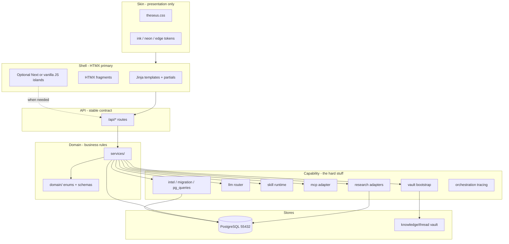
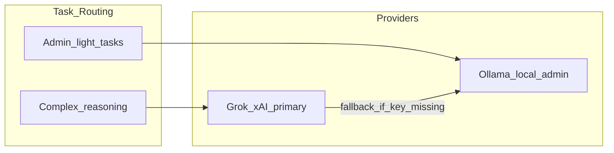

# Ariadne's Thread — Foundation Plan (v4)

> **Ariadne's Thread** — Global opportunity command center in `ariadne-capform`.  
> Single `python app.py` launcher · PostgreSQL-only · Grok/xAI primary reasoning ·  
> Web research (SearXNG/Crawl4AI first) · Review-gated everywhere · Theseus visual language.

**Last updated:** 2026-06-17 (foundation complete; Product Vision v2.2 — C&C doctrine + data composition)

---

## Current status (scaffold checkpoint)

We completed **Phase 0 scaffold** and diverted briefly into env alignment, git, and orchestration config placeholders. The table below tracks plan vs repo.

| Area | Status | Notes |
|------|--------|-------|
| Monorepo scaffold | ✅ Done | `backend/`, `frontend/`, `skills/`, `docs/reference/` |
| `python app.py` launcher | ✅ Done | Postgres, vault bootstrap, HTMX on `:9622`; Next retired (`--legacy-frontend` only) |
| `.env` / `config.py` | ✅ Done | Full categorized config including research, MCP, orchestration |
| Docker Compose | ✅ Done | Postgres **16** image on `:55432` (matches volume; PG18 needs pg_upgrade) + `research` profile |
| Reference corpus | ✅ Done | Briefing packet, call plan, risk register, Shipley, USAspending |
| Workflow DB models | 🟡 Partial | Opportunities, packet, actions, review; missing intel/research/capability tables |
| Alembic migrations | ❌ Not started | Still using `create_all()` |
| Intel migration (DuckDB→PG) | 🟡 In progress | Resumable via `scripts/run-intel-migration.ps1` (~64M rows, separate window) |
| `pg_queries` intel layer | ✅ Done | Core queries + portfolio intel signals |
| LLM router (Grok + Ollama) | ❌ Not started | Config only |
| Web research module | ❌ Not started | Config + docker profile only |
| Skill runtime (3 skills) | ❌ Not started | SKILL.md stubs exist |
| MCP manifests | 🟡 Partial | USAspending only; 7 more planned |
| Frontend command center | 🟡 Foundation shell | HTMX Command Center dashboard, Pulse (`/pulse`), sidebar nav, opp workspace; Phase 12b–12j in progress |
| Theseus visual language | ✅ Done | `frontend/styles/theseus.css` synced from proj-theseus |
| Orchestration (LangGraph) | 🟡 Placeholder | Env + tracing bootstrap; runtime deferred |
| Git | ✅ Done | Repo pushed; commit early/often |

**Resume here:** Foundation steps 1–11 ✅. Next: **Phase 12** (command center usefulness) in small vertical slices — see below. Intel migration continues in background.

---

## Product identity

- **Name:** Ariadne's Thread (short: **Thread**)
- **Python package:** `thread` in [`backend/src/thread/`](../backend/src/thread/)
- **Workspace:** `ariadne-capform`
- **Ports:** API `9622` · LangGraph Studio `9623` · UI `3000` · Postgres `55432`
- **Philosophy:** Global opportunity command center; Shipley-aligned capture; human-in-the-loop everywhere; knowledge compounds; focused modules

### Three product lanes (operator summary)

Thread exists to help you do three jobs end-to-end — tailored solo-operator, review-gated, not enterprise team CRM:

| Lane | What you need | Thread surfaces (build toward) |
|------|----------------|--------------------------------|
| **1. Opportunity identification** | Find and qualify pursuits before you invest capture | Portfolio Pulse, **Data Insights**, recompete radar, SAM monitor, track signal → opp |
| **2. Capture development** | MS-gated strategy, intel, customer engagement, gate decisions | Living Briefing Packet (slide deck), Actions, Research, Intel Context, vault, `datarepublican_intel`, MinerU ingest |
| **3. Winning proposals** | pWin artifacts: eval mapping, win themes, PTW, outline, compliant narrative | Activation band produce lane, Theseus solicitation merge, skills + Grok synthesis → handoff to humans |

Lanes overlap on one **opportunity record** — identification feeds capture; capture feeds proposal produce. Review gate sits across all three.

**Inspiration repos (patterns only — no code dependency):**

| Repo | Adopt | Do **not** copy |
|------|-------|-----------------|
| [ariadne-thread](https://github.com/BdM-15/ariadne-thread) | Living Briefing Packet, review gates, vault, research provider registry | Next.js as long-term shell |
| [capture-insights](https://github.com/BdM-15/capture-insights) | USAspending intel, Karpathy vault, skill runtime | Vite/React UI stack |
| [proj-theseus](https://github.com/BdM-15/proj-theseus) | **Skin only:** `theseus.css`, shell UX patterns; MCP manifest pattern | Graph/RAG/LightRAG plumbing |
| [1102 MCP tools](https://github.com/1102tools/federal-contracting-mcps) | Deterministic federal data | — |
| DataRepublican | Follow-the-money via `datarepublican_intel` skill | — |

---

## Non-negotiables

1. **Cloud-primary reasoning, self-hosted data** — Grok/xAI for capture/proposal/synthesis; Ollama for **admin offload only**. Execution data in PostgreSQL + Obsidian vault. Not “local-first AI.”
2. **Review-gated everywhere** — Intake → Candidate → Trusted; nothing auto-promotes.
3. **Full provenance** — evidence links, citations, MCP refs, web URLs, award_key lineage.
4. **Phase separation** — Phase 0–3 evergreen intel vs Phase 4–6 solicitation activation.
5. **Living Milestone Decision Briefing Packet** — slide-deck-shaped MS artifact; data elements from dictionary; `route_kind` drives fill (deterministic vs Grok/skills); living across MS gates and lifecycle; eventual approver export.
6. **Two-store knowledge** — Obsidian vault (synthesis) vs PostgreSQL (execution truth).
7. **PostgreSQL only** — single DB for workflow AND intel (DuckDB = one-time migration source only).
8. **Theseus visual language** — ink/neon dark theme from proj-theseus (presentation layer only).
9. **One command to run** — `python app.py` from root `.venv` (single Python process at steady state).
10. **Web research enrichment** — bounded, approval-gated; free/local providers first.
11. **Server-owned truth** — UI renders and commands; domain rules live in Python `services/`, never in the client.
12. **Command & control ≠ metrics dump** — Dashboard is for **visibility + efficient action** under limited time and resources; deep analytics belong on **Data Insights**, not vanity counters on `/`.

---

## Command & control doctrine (solo operator)

**Command Center (`/`) is not a BI dashboard.** It answers: *What needs my attention right now? What can I do in one click?* GovDash-style widgets are **action surfaces**, not report pages.

| Principle | Do | Don't |
|-----------|-----|-------|
| **Attention over volume** | Gate reviews, hot signals, pursuits by phase, migration health when blocking | Row counts, charts, or tables that only prove data exists |
| **Action over display** | Every widget links to a queue, workspace tab, or pre-filled tool run | Full-width metric cards with no next step |
| **Thin home, deep elsewhere** | Pulse = morning briefing; Insights = trends; workspace = capture work | Duplicate radar, analytics, or inbox on both `/` and `/pulse` |
| **AI as copilot** | Grok/skills draft, summarize, chain lookups; human approves via review gate | Auto-promote LLM output; bury actions behind chat-only UX |
| **Tool-fed UI** | Widgets/regions declare which capability feeds them (MCP, skill, PG intel, research) | Hand-rolled placeholders that look live but aren't wired |

**Widget acceptance test:** Can the operator **act** (review, track, open opp, run research, open lens) in ≤2 clicks without reading a paragraph? If not, it doesn't belong on Command Center.

**LLM/supporting role:** Thread should make capture **easier**, not busier — bounded research, suggested fills on `route_kind`, chained retrieval so the operator passes names/keys once and the platform gathers context. Orchestration (LangGraph / skill chains) serves **composition**, not autonomous busywork.

---

## Federal data composition (sources + chaining)

Thread uses **multiple federal data layers** with distinct jobs. Do not collapse them into one “intel number” on the dashboard.

| Source | Role | Primary surfaces | Notes |
|--------|------|------------------|-------|
| **USAspending (PG intel)** | Historical — trends, analytics, incumbent context, recompete radar, saved lenses | **Data Insights** `/insights`, Pulse radar, Insights drill-down | Migrated prime/subaward tables; not live SAM |
| **USAspending MCP** | On-demand queries, snapshots, supplemental pulls | Skills, workspace research, Insights actions | Same domain, different access pattern than PG analytics |
| **SAM.gov MCP** | Entity/opportunity detail — UEI, certs, solicitations | Pulse SAM strip (12i), competitive workspace, chain steps | Live supplement to historical spend |
| **eCFR / FPDS / other 1102 MCPs** | Deterministic reg/award lookups | Tools lane, skill chains, packet `route_kind` | Vendored under `tools/mcps/` |
| **Web research** | Enrichment after structured IDs/names exist | Research tab, capture_research | SearXNG/Crawl4AI first; review-gated |

### Retrieval chains (outputs → inputs)

Tool and MCP outputs are **composable**. One retrieval's `candidate` result becomes the next step's input — with full provenance for review.

**Example chain (target pattern):**

```
Recompete signal (USAspending PG / radar)
  → incumbent awardee name
    → SAM MCP (entity, UEI, business facts)
      → web research (positioning, news, customer context)
        → review gate → packet field / vault mirror
```

Same pattern for: `award_key` → prime award detail → agency/NAICS lens → saved insight profile → Pulse alert. Skills and future orchestration should **encode these chains** as named recipes, not one-off UI hacks.

**Implementation rule:** New dashboard/Pulse regions must document **feed capability** (which MCP/skill/query) and support **drill-down into chain** (e.g. signal row → open workspace Research with context pre-filled). Phase 12 widgets are scaffolding until wired; wire them before adding more counters.

---

## Architectural layers (first principles)

Ariadne is a **capability-first Python platform** with a **Theseus-skinned command center**. Skin, shell, API, domain, and capability are separate — never conflate theme with plumbing.

| Layer | Responsibility | Location (target) |
|-------|----------------|-------------------|
| **Skin** | Colors, typography, cards, collapsibles, topbar | `theseus.css` (synced from proj-theseus) |
| **Shell** | Pages, nav, HTMX partials, optional JS islands | `backend/src/thread/ui/` (target) |
| **API** | Stable HTTP contract for UI, scripts, automation | `backend/src/thread/api/` |
| **Domain** | Opportunities, packet, review enums, schemas | `backend/src/thread/domain/` + `services/` |
| **Capability** | Intel, LLM, skills, MCP, research, vault, migration | `backend/src/thread/{intel,llm,skills,mcp,research,bootstrap}/` |

**Shell decision (v4):** FastAPI serves **HTMX + Jinja templates** (Theseus delivery model). Transitional Next.js in `frontend/` validates flows against `/api/*` until HTMX port completes. **Next.js is not forbidden** — use for client-heavy surfaces (streaming chat, charts, drag-drop) as **embedded islands** when first principles require it, not as the default shell.



**Rules:**
- Routes stay thin → `services/` fat → models dumb.
- Long jobs resumable and out-of-band (intel migration pattern).
- Every LLM/skill/MCP/research output lands as `candidate` + provenance; promotion only via review gate.
- Enhance bottom-up (capability → domain → API → shell → skin). Swapping shell or skin must not require rewriting intel/LLM/skills.

---

## LLM strategy



| Task class | Provider | Examples |
|------------|----------|----------|
| **Reasoning** | Grok/xAI | Packet synthesis, capture profiles, research interpretation, route recommendations |
| **Admin** | Ollama (optional) | Vault lint, classification, draft scaffolding |
| **Embeddings** (future) | OpenAI `text-embedding-3-large` | Semantic vault search (config stub exists) |

**Module:** `backend/src/thread/llm/router.py` — `resolve_provider(task_kind)` routes reasoning to xAI when `XAI_API_KEY` is set.

---

## Web crawl research enrichment

Pattern from ariadne-thread `capture_research.py` — provider registry, bounded collection, review-gated findings.

### Provider priority

| Priority | Provider | Config |
|----------|----------|--------|
| 1 | SearXNG | `SEARXNG_BASE_URL` (`:8080`) |
| 2 | Crawl4AI | `CRAWL4AI_BASE_URL` (`:11235`) |
| 3 | SerpAPI | `SERPAPI_API_KEY` |
| 4 | Olostep | `OLOSTEP_API_KEY` |
| 5 | Firecrawl | `FIRECRAWL_API_KEY` |

### Module layout (to build)

```
backend/src/thread/research/
├── providers.py
├── capture_research.py
├── lenses.py
└── adapters/
    ├── searxng.py
    ├── crawl4ai.py
    ├── serpapi.py
    ├── olostep.py
    ├── firecrawl.py
    └── fake.py
```

**Run flow:** User triggers research → discovery → crawl → Grok interpretation → `candidate` findings → review gate → optional evidence + vault mirror.

---

## Orchestration (LangGraph — deferred runtime)

Route-first capture orchestration ships **before** LangGraph runtime adoption (per ariadne-thread PRD).

| Setting | Purpose |
|---------|---------|
| `LANGGRAPH_ENABLED` | Master switch (off until chain executor lands) |
| `THREAD_LANGGRAPH_STUDIO_AUTO_START` | Spawn `langgraph dev` from `app.py` when ready |
| `LANGGRAPH_STUDIO_PORT` | `9623` (Thread port family) |
| `LANGSMITH_*` / `LANGCHAIN_*` | Tracing for skill chains (`thread-capture-orchestration` project) |

**Module:** `backend/src/thread/orchestration/` — tracing bootstrap done; chain executor TBD.

---

## Architecture overview

```mermaid
flowchart TB
  subgraph launch [python app.py]
    Boot[Bootstrap + vault seed]
    PGUp[PostgreSQL docker]
    Warm[Warmup probes]
  end

  subgraph fastapi [FastAPI :9622]
    UIRoutes[UI routes - HTMX target]
    APIRoutes["/api/* REST"]
    subgraph capability_mod [Capability modules]
      IntelMod[Intel]
      LLMMod[LLM Router]
      SkillMod[Skills]
      ResearchMod[Research]
      MCPMod[MCP]
    end
    subgraph domain_mod [Domain services]
      OppSvc[Opportunities]
      ReviewSvc[Review Gate]
      PacketSvc[Packet]
    end
  end

  subgraph command_center [Command Center surfaces]
    Pulse[Portfolio Pulse]
    Workspace[Opportunity Workspace]
    PacketUI[Living Briefing Packet]
    ReviewUI[Review Queue]
    ResearchUI[Research + Skills]
    IslandUI[Optional client islands]
  end

  subgraph pg [(PostgreSQL :55432)]
    Workflow[workflow_tables]
    IntelTables[intel_tables]
    ResearchTables[research_tables]
  end

  Vault[(knowledge/thread)]

  launch --> fastapi
  launch --> PGUp
  PGUp --> pg
  UIRoutes --> command_center
  IslandUI -.-> APIRoutes
  command_center --> UIRoutes
  command_center --> APIRoutes
  APIRoutes --> domain_mod
  domain_mod --> capability_mod
  capability_mod --> pg
  capability_mod --> Vault
  Boot --> Vault
```

**Transitional:** `frontend/` (Next.js) currently calls `APIRoutes` directly on `:9622`; retire after HTMX shell reaches parity.

### Shipley phase model

| Band | Phases | Mode | Surfaces |
|------|--------|------|----------|
| **Evergreen** | 0–3 | `evergreen` | PG intel, web research, vault, capture profile |
| **Activation** | 4–6 | `activation` | Living Briefing Packet MS1–MS4, Action Matrix, Theseus merge stub |

---

## Single launcher: [`app.py`](../app.py)

```powershell
python app.py
```

**Target startup sequence:**

1. Load Settings from `.env`
2. PostgreSQL — `docker compose up` if needed
3. Alembic `upgrade head`
4. Intel migration if PG intel tables empty (`INTEL_MIGRATION_SOURCE` → capture-insights DuckDB)
5. Vault bootstrap if empty
6. Optional: `docker compose --profile research up`
7. Serve command center UI from FastAPI (HTMX + `theseus.css`) — **target**; transitional: optional Next.js on `:3000`
8. Warmup: vault, Grok probe, Ollama, MCP catalog, research providers, intel row count
9. Print URLs (API `:9622`, UI same origin when HTMX lands)

**CLI flags (target):** `--api-only`, `--no-warmup`, `--migrate-intel`, `--skip-docker`, `--no-research-providers`

---

## PostgreSQL storage

### A. Workflow tables
`opportunities`, `packet_field_definitions`, `packet_field_answers`, `action_matrix_items`, `evidence_items`, `review_records`, `capability_runs`, `extraction_bundles`, `mcp_invocations`

### B. Intel tables (migrated from capture-insights DuckDB)
`intel_usaspending_prime_awards`, `intel_usaspending_subawards`, `intel_entities`, `intel_relationships`, `intel_naics_summary_cache`

**Migration script:** `backend/scripts/migrate_intel_from_duckdb.py`  
**Queries:** `backend/src/thread/intel/pg_queries.py` (port from capture-insights `queries.py`)

### C. Research tables
`capture_research_runs`, `capture_research_sources`, `capture_research_findings`

### D. Graph export
`data/graph/edges.jsonl` (Neo4j-ready)

---

## Knowledge vault

**Local path:** `knowledge/thread/` (gitignored content)

**Seed from:**

- `capture-insights/data/knowledge/` — schema, `global_wiki`, **`domain_intel`** (capabilities + UEI/PP), `training/`, `education/`, `brain/` → `entities/`
- ariadne-thread vault directory conventions
- Reference docs in `docs/reference/` (commit-safe dictionaries)

**Bootstrap:** [`backend/src/thread/bootstrap/vault.py`](../backend/src/thread/bootstrap/vault.py) — idempotent; never overwrites existing wiki pages.

---

## Core domain model

### Opportunity
`lifecycle_state`, `current_milestone_gate` (MS1–MS4), `capture_phase_band`, urgency/freshness, `intel_provenance`

### Living Briefing Packet
8 canonical sections; ~20 seeded MS1-critical fields ([`packet_field_seed.py`](../backend/src/thread/domain/packet_field_seed.py)); `PacketFieldRouteKind` for UI route badges

### Review gate
All AI/skill/research outputs land as `candidate` + `pending_review`. Promotion via `POST /api/review/{id}/approve`.

### Provenance kinds
`award_key`, `mcp_tool`, `url`, `file`, `vault_page`, `web_research`, `manual`

---

## MVP scope

**Operator lanes:** Opportunity identification · Capture development · Winning proposals (see above).

**Platform pillars:**

1. **Command Center Shell** — Pulse, Data Insights, opportunity workspace, review queue
2. **Knowledge Layer** — Obsidian vault, MinerU ingest, `domain_intel`
3. **Developer Skills** — skill-creator, datarepublican_intel, mcp_federal_tools
4. **Data & Intel** — PG intel, 1102 MCPs, web research, MinerU utility
5. **Config & Stack** — FastAPI HTMX shell, PostgreSQL, Grok-primary reasoning

---

## API surface (target)

| Method | Path | Status |
|--------|------|--------|
| GET | `/api/health` | ✅ |
| GET | `/api/portfolio/pulse` | ✅ (intel signals + stats) |
| GET/POST | `/api/opportunities` | ✅ |
| GET/PATCH | `/api/opportunities/{id}/packet` | ✅ |
| GET/POST | `/api/opportunities/{id}/actions` | ✅ |
| GET | `/api/review/pending` | ✅ |
| POST | `/api/review/{id}/approve` | ✅ |
| GET | `/api/packet/definitions` | ✅ |
| GET | `/api/intel/health`, `/expiring`, `/snapshot`, `/migration-status` | ✅ |
| POST | `/api/research/*` | ❌ |
| GET/POST | `/api/skills/*` | ❌ |
| POST | `/api/intel/mcp/{server}/invoke` | ❌ |
| GET | `/api/knowledge/vault/*` | ❌ |

---

## Frontend / command center shell

**Skin:** `theseus.css` + Theseus shell patterns (topbar, `card-accent`, pills, `btn-hero-cyan`). Sync from proj-theseus; no local token forks.

**Shell (target):** FastAPI serves Jinja templates + HTMX partials from `backend/src/thread/ui/`. Server-owned forms, tables, review gates. Same handlers back `/api/*` and HTMX fragments.

**Archived:** `frontend/` Next.js 15 — no longer spawned by `app.py`. Use `python app.py --legacy-frontend` or `cd frontend && npm run dev` only for archaeology.

**Next.js / client islands (allowed when justified):** Streaming LLM output, interactive charts, drag-drop matrices, other client-heavy UX. Embed via iframe, separate route, or small bundled script — not whole-platform SPA by default.

### What exists today (foundation shell — not product MVP)

| Screen | Foundation | Product gap |
|--------|------------|-------------|
| Command Center (`/`) | Attention widgets, compact nav, pursuit rail — **not** analytics home | Widget row (12c–12h): reviews, phase band, hot signals, health strip, **quick actions**; anti-pattern: metrics dump |
| Portfolio Pulse (`/pulse`) | Morning briefing: radar + pursuits + rail actions | SAM strip (12i), intel inbox (12g), active pursuits (12d); USAspending historical signals, not deep analytics |
| Data Insights (`/insights`) | — | Trends, saved lenses, multi-facet USAspending analytics; incumbent/agency/NAICS combos |
| Opportunity workspace | Packet (raw keys), Actions, Review, Research tabs | Workspace templates (competitive / readiness); extra pills; slide-deck packet (Phase 14) |
| Sidebar nav | Command / Identify / Capture / **Tools** / Win / System + Lucide icons | Studio route (Phase 21) |
| Settings (`/settings`) | ✅ Read-only platform health | Editable keys deferred to Tools/MCP (12k) |
| MCP Servers (`/tools/mcp`) | ✅ Catalog + per-server guides/tooltips | Test connection, .env key editor (12k) |
| Agent Skills (`/tools/skills`) | ✅ Skill card grid from `skills/` | Run/install UX (Phase 20); **not** Theseus Skills Retrieval settings |

**Shell IA (Theseus pattern):** `topbar-vibrant` = brand + health (no route links). Left `sidebar-vibrant` = app lanes (Command / Identify / Capture / **Tools** / Win / System). Top `glass-section-bar` = **per-page** nav only. Main canvas = `panel-canvas` aurora.

**Settings vs Tools split:** Settings = platform health, migration, providers, orchestration flags. **Tools** = operator-facing catalogs (MCP Servers, Agent Skills) with guides — modeled on Theseus MCP settings + RFP Intelligence briefing guides (`settings-label-tip`, `tuning-guide-*`). Do **not** port Theseus Settings → Skills Retrieval panel (too complex).

**Target nav (product):** Dashboard, Pulse, Insights, Knowledge, Review · **MCP Servers, Agent Skills** · Studio (soon) · Settings.

**Solo operator model:** one user; technology produces **pWin artifacts** (BLUF, PTW, win themes, eval mapping) for external humans — not multi-user CRM, not post-award.

---

## Developer skills (stubs exist)

| Skill | Path | Purpose |
|-------|------|---------|
| skill-creator | `skills/skill-creator/` | Scaffold new skills |
| datarepublican_intel | `skills/datarepublican_intel/` | Award relationship queries |
| mcp_federal_tools | `skills/mcp_federal_tools/` | 1102 MCP adapter |

---

## Tests (target)

- `test_review_gates.py` — no auto-promote
- `test_intel_migration.py` — DuckDB→PG idempotent
- `test_llm_router.py` — reasoning→xAI, admin→Ollama
- `test_capture_research.py` — findings stay candidate
- `test_packet_field_seed.py` — ✅ exists
- `test_orchestration_config.py` — ✅ exists

---

## Non-goals (this foundation)

- Full multi-agent war room
- Complete Theseus extraction pipeline in-process
- Production auth / deployment
- Advanced graph visualizations
- Neo4j runtime
- Full Capability Studio
- LangGraph runtime (until route-first + thin skill chains proven)

---

## Extension path (post-foundation)

**Foundation (steps 1–11) is complete.** Product work proceeds in **small vertical slices** — one screen region per slice, wired to real APIs, with tests. No one-shot “rebuild the command center.”

### Product capability map (reuse, don’t rebuild)

| Capability | Source | Thread use | Phase |
|------------|--------|------------|-------|
| USAspending intel | capture-insights → PG | Data Insights, recompete, packet deterministic fields | Done / 17 |
| Data Insights | capture-insights intent | Multi-facet market deep dives — **not NAICS-defaulted** | 17 |
| Follow-the-money | DataRepublican + `datarepublican_intel` | Insights drill-down, incumbent, packet fields | 17, 20 |
| 1102 MCPs | federal-contracting-mcps | Deterministic award/agency fields | 20 |
| **MinerU** | document parser utility | Vault ingest, quick capture, PDF for DataRepublican, all uploads | 19 |
| **Theseus** | proj-theseus | Solicitation merge, activation produce (outline, compliance) | 21+ |
| Grok/xAI | cloud-primary | `model_synthesis` packet fields, vault polish, narratives | 20 |
| Ollama | admin offload | Summaries, lint — not capture-critical path | ongoing |

### GovDash inspiration (captured 2026-06)

Competitor review ([GovDash](https://www.govdash.com/) marketing + capture dashboard videos). **Adopt patterns, not enterprise CRM scope** — solo operator, review-gated, no team assignees / SharePoint / post-award.

| GovDash surface | Thread translation | Anti-patterns (skip) |
|-----------------|-------------------|----------------------|
| Discover saved profiles + alerts | **Saved lenses** on Data Insights (named facets) | 2M-opportunity freemium search engine |
| Capture dashboard widgets | Command Center widget row (solo) | Team-customizable widget builder |
| Gate reviews needing attention | Review queue + dashboard widget | Multi-reviewer color reviews |
| Opportunity card templates | Workspace templates (capture / competitive / readiness) | Per-team custom field CRM builder |
| Proposal Cloud | **Studio** lane (pWin artifacts) | Word add-in / compliance matrix product |
| Kanban / Gantt pipeline | Optional phase-band board (deferred) | Team task Gantt |

### Phase 12 — Command center shell (incremental)

Shell first, then region widgets. One slice per PR. Concrete targets below — do not drop during implementation.

| Slice | Scope | Done when |
|-------|--------|-----------|
| **12a** | Sidebar + stubs + Command Center shell | ✅ Dashboard `/`, Pulse `/pulse`, sidebar lanes, Theseus topbar |
| **12b** | Settings / health (read-only) | ✅ Platform accordion; links to Tools for MCP/skills inventory |
| **12k** | Tools — MCP ops | `/tools/mcp`: test connection, .env key save (Theseus settings-mcp pattern); guides already on page |
| **12l** | Tools — Agent Skills UX | `/tools/skills`: run from page, detail drawer — **not** settings-skills-retrieval |
| **12c** | Global review queue | ✅ `/review` human titles (`review_display`); approve works; **widget on Command Center**: pending count → `/review` |
| **12d** | Pulse — active pursuits | ✅ Lifecycle-filtered opps; urgency/gate pills; **Command Center widget**: `phase_band` breakdown; compact multi-column layout |
| **12e** | Intel / migration health | Settings + **Command Center widget**: migration %, `/api/intel/health`, vault bootstrap status |
| **12f** | Recompete radar v2 | ✅ **Saved lenses** seed (multi-NAICS); drop NAICS-only default in `portfolio.py`; **Command Center widget**: hot ≤6 mo |
| **12g** | Intel inbox | Recent candidates → review — **Pulse region** (morning briefing), not dashboard home |
| **12h** | Quick actions | ✅ **Command Center strip**: track signal, run research, insights, vault, review; hot-signal chip when ≤6 mo |
| **12i** | SAM monitor | **Pulse region**: new-opportunity strip (stub → live SAM adapter) |
| **12j** | Knowledge digest | **Pulse region**: `domain_intel` highlights |

#### Command Center dashboard (`/`) — widget row (solo GovDash pattern)

Not the morning briefing — that stays on **Portfolio Pulse** (`/pulse`). Not analytics — that stays on **Data Insights** (`/insights`). See **Command & control doctrine** above.

1. **Pending reviews** — count + link to `/review` (12c) ✅
2. **Active pursuits by phase band** — mini breakdown + drill to Pulse/opp (12d) ✅
3. **Recompete signals (hot ≤6 mo)** — count + link to Pulse radar; chain to incumbent/SAM when wired (12f) ✅
4. **Intel / migration health** — **blocking status only** (migration %, intel ready) — not award analytics (12e)
5. **Quick actions** — track signal, run research, open insights lens, vault shortcut (12h) ✅ — highest priority for C&C usefulness

**Anti-patterns on `/`:** prime award totals as hero metrics, full recompete tables, NAICS analytics, anything that belongs on Insights or Pulse body.

#### Portfolio Pulse (`/pulse`) — morning briefing only

- **Recompete radar** (primary — already foundation)
- **SAM / new-opportunity strip** (12i)
- **Intel inbox candidates** (12g)
- Active pursuits panel moves here or stays linked from dashboard widget (12d) — not duplicate full metric grid

#### Opportunity workspace — templates (no CRM bloat)

- **Default:** Capture — Packet, Actions, Research, Review tabs (current)
- **Future templates:** Competitive analysis (incumbent, PTW hints, eval mapping stubs); Proposal readiness (MS-critical %, due dates, pending reviews)
- **Pills:** keep milestone gate, phase band, intel signal; add `pending_review`, `days_to_due` when data exists

#### Studio (Win lane) — not Capture

GovDash Proposal Cloud maps here. Route `/studio` deferred to Phase 21.

- pWin artifacts: win themes, eval map, outline, compliance shred candidates
- **Theseus** merge = activation produce (solicitation merge), not general CRM

#### Data Insights — saved lenses (Discover pattern)

**Home for USAspending historical analytics** — trends, combos, incumbent spend patterns, agency/recipient/NAICS/PSC lenses. Saved profiles that improve over time → **named saved lenses** with facets (agency + NAICS + incumbent, PSC combos). Not profile spam. Phase 17 primary; seed UX in 12f. Insights actions may invoke MCP/skill chains; results stay `candidate` until review.

### Phase 14 — Living Briefing Packet (slide deck UX)

Central artifact — not “parallel afterthought.”

- 14a: Slide navigator (`reference_slide` from `packet_field_seed`)
- 14b: Field cards: label, question, `route_kind`, trust, suggested fill
- 14c: MS gate slide applicability
- 14d: Approval criteria slides 17–18
- 14e: Packet progression (% MS-critical, pending review)

### Phase 17 — Data Insights

`/insights` — agency, recipient, NAICS, PSC combos; **saved lenses** (named facet presets, GovDash Discover “profiles that match” pattern); drill-down; extend `datarepublican_intel` modes.

### Phase 19 — MinerU document utility

General parser — **not** solicitation-only. Parse API → vault wiki ingest (notes + Grok polish) → opp doc attach → DataRepublican PDF input. Optional 19e: solicitation → `ExtractionBundle` candidate fields.

### Phase 20 — Route-driven fill

`route_kind` → MCP / skill / research / Grok; data-needs panel for unanswered MS-critical fields.

### Phase 21 — Studio + pWin produce + Theseus

**Studio** (`/studio`, Win lane): eval ↔ win-theme map, outline, PTW, compliance shred candidates — artifacts for external humans. **Theseus** solicitation merge after MinerU stable (activation produce, not CRM).

**Rules (anti–scope-creep):** One slice per PR. No new backend unless UI needs it. pytest before commit. Prior repos = reference only — no UI tree ports.

### Deferred — knowledge & intelligence runtime (after MVP)

1. **Bid/no-bid fit service** — on track/evaluate opportunity: match USAspending/SAM/research signals against `global/domain_intel/capabilities/`; output `candidate` + provenance (not auto-promote).
2. **UEI / past-performance awareness** — crosswalk PG intel + `domain_intel/uei/` at opportunity scope so humans/LLM see claimable history without manual digest.
3. **Training example curation** — review-approved packet/research outputs → `training/examples/` → JSONL export for local SLM fine-tune (per `capture-llm-wiki.md` workflow).
4. **Thread-native research artifacts** — bounded raw scrape/crawl store (Thread approach; do **not** port capture-insights `copilot/` tree).

### Deferred — other post-foundation

5. **MinerU document utility** — general parse → vault wiki / candidates / DataRepublican PDF; optional ExtractionBundle
6. **Theseus** on `:9621` — solicitation merge (activation Ph 4–6), not general parsing
7. Full capture profile + stance/gap analysis
8. Semantic vault search (OpenAI embeddings)
9. Neo4j import from `edges.jsonl`
10. LangGraph chain executor when skill chains need state/checkpointing

---

## Implementation order

| # | Step | Status |
|---|------|--------|
| 1 | Scaffold + `app.py` + docker + `.env.example` | ✅ |
| 2 | Config + PG schema (workflow) + models | 🟡 |
| 3 | **Intel migration + `pg_queries`** | 🟡 **← run migration script** |
| 4 | Alembic migrations (replace `create_all`) | ✅ |
| 5 | Vault bootstrap (full seed) | ✅ |
| 6 | LLM router (Grok + Ollama) | ✅ |
| 7 | Research module + adapters + API | ✅ MVP |
| 8 | Domain services + review gates + tests | ✅ |
| 9 | Full API (skills, MCP, intel, capture-profile) | ✅ |
| 10 | HTMX command center shell + Research tab (retire transitional Next) | ✅ |
| 11 | E2E smoke + README verification | ✅ |
| 12+ | Product command center + workspace UX | ❌ Planned (incremental — Phase 12) |

---

## Immediate next actions

1. **Intel migration** — finish in separate window; verify `Complete: True` + indexes
2. **Phase 12e–12h** — remaining C&C widgets + **quick actions** strip (prioritize action over new metrics)
3. **Phase 12f** — saved lenses; hot-signal widget; remove NAICS-only default; wire chain entry from radar
4. **Phase 12i** — SAM strip on Pulse (live supplement; chain from incumbent/name)
5. **Phase 17 seed** — Data Insights stub → first saved lens + USAspending analytics drill-down

---

## Plan todos

- [x] Scaffold monorepo + docker-compose + `.env.example`
- [x] Root `app.py` launcher (partial)
- [x] Reference docs + packet field seeds
- [x] Orchestration env placeholders
- [x] Alembic workflow migrations (intel tables still via migration script)
- [ ] Intel migration from capture-insights DuckDB (in progress)
- [x] `pg_queries` intel layer
- [x] LLM router (Grok primary)
- [x] Vault seed — global_wiki, domain_intel, training scaffold
- [x] Research module + `/api/research/*` (SearXNG + Crawl4AI + fake; paid stubs)
- [x] Skill runtime + 8 MCP manifests
- [x] Theseus visual language (CSS + HTMX shell)
- [x] HTMX shell — Pulse, recompete radar, packet edit, review queue
- [x] HTMX Research tab + actions matrix
- [x] Retire transitional Next.js from launcher
- [x] E2E smoke test path
- [x] Phase 12a — sidebar + Command Center dashboard + Pulse `/pulse` + Studio nav label
- [x] Phase 12b — settings/health read-only page
- [x] Tools lane — `/tools/mcp` (guides) + `/tools/skills` (card grid); Settings slimmed
- [x] Phase 12c — global review queue + Command Center pending-reviews widget
- [x] Phase 12d — active pursuits + phase-band widget + compact dashboard/Pulse layout
- [x] Phase 12h — Command Center quick-actions strip
- [x] Phase 12f — saved lenses seed + hot recompete widget + multi-NAICS radar
- [ ] Phase 12e, 12g, 12i–12j — remaining widgets + Pulse regions
- [ ] Phase 12k–12l — MCP test/key editor; Agent Skills run UX