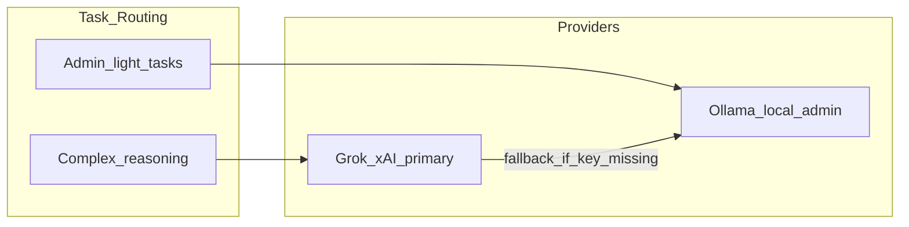

# Ariadne's Thread — Foundation Plan (v3)

> **Ariadne's Thread** — Shipley capture command center in `ariadne-capform`.  
> Single `python app.py` launcher · PostgreSQL-only · Grok/xAI primary reasoning ·  
> Web research (SearXNG/Crawl4AI first) · Review-gated everywhere · Theseus dark UI.

**Last updated:** 2026-06-17

---

## Current status (scaffold checkpoint)

We completed **Phase 0 scaffold** and diverted briefly into env alignment, git, and orchestration config placeholders. The table below tracks plan vs repo.

| Area | Status | Notes |
|------|--------|-------|
| Monorepo scaffold | ✅ Done | `backend/`, `frontend/`, `skills/`, `docs/reference/` |
| `python app.py` launcher | 🟡 Partial | Postgres, vault bootstrap, frontend spawn; no Alembic, no intel migration |
| `.env` / `config.py` | ✅ Done | Full categorized config including research, MCP, orchestration |
| Docker Compose | ✅ Done | Postgres `:55432` + `research` profile (SearXNG, Crawl4AI) |
| Reference corpus | ✅ Done | Briefing packet, call plan, risk register, Shipley, USAspending |
| Workflow DB models | 🟡 Partial | Opportunities, packet, actions, review; missing intel/research/capability tables |
| Alembic migrations | ❌ Not started | Still using `create_all()` |
| Intel migration (DuckDB→PG) | 🟡 Ready to run | `scripts/run-intel-migration.ps1` in separate window (~64M rows, resumable) |
| `pg_queries` intel layer | ✅ Done | Core queries + portfolio intel signals |
| LLM router (Grok + Ollama) | ❌ Not started | Config only |
| Web research module | ❌ Not started | Config + docker profile only |
| Skill runtime (3 skills) | ❌ Not started | SKILL.md stubs exist |
| MCP manifests | 🟡 Partial | USAspending only; 7 more planned |
| Frontend command center | 🟡 Partial | Pulse + basic opportunity page; no Research tab, no review UI |
| Orchestration (LangGraph) | 🟡 Placeholder | Env + tracing bootstrap; runtime deferred |
| Git | ✅ Done | Repo pushed; commit early/often |

**Resume here:** Run full intel migration, then step **3** E2E smoke.

---

## Product identity

- **Name:** Ariadne's Thread (short: **Thread**)
- **Python package:** `thread` in [`backend/src/thread/`](../backend/src/thread/)
- **Workspace:** `ariadne-capform`
- **Ports:** API `9622` · LangGraph Studio `9623` · UI `3000` · Postgres `55432`
- **Philosophy:** Shipley-aligned capture command center; human-in-the-loop everywhere; knowledge compounds; focused modules

**Inspiration repos (patterns only — no code dependency):**

| Repo | Adopt |
|------|-------|
| [ariadne-thread](https://github.com/BdM-15/ariadne-thread) | Living Briefing Packet, review gates, vault, research provider registry |
| [capture-insights](https://github.com/BdM-15/capture-insights) | USAspending intel, Karpathy vault, skill runtime |
| [proj-theseus](https://github.com/BdM-15/proj-theseus) | UI theme, MCP manifest pattern |
| [1102 MCP tools](https://github.com/1102tools/federal-contracting-mcps) | Deterministic federal data |
| DataRepublican | Follow-the-money via `datarepublican_intel` skill |

---

## Non-negotiables

1. **Cloud-primary reasoning, local data** — Grok/xAI for complex tasks; Ollama for admin/light tasks. Workflow data stays local in PostgreSQL + Obsidian vault.
2. **Review-gated everywhere** — Intake → Candidate → Trusted; nothing auto-promotes.
3. **Full provenance** — evidence links, citations, MCP refs, web URLs, award_key lineage.
4. **Phase separation** — Phase 0–3 evergreen intel vs Phase 4–6 solicitation activation.
5. **Living Milestone Decision Briefing Packet** — gate-scoped fields, Action Matrix, risks, evidence.
6. **Two-store knowledge** — Obsidian vault (synthesis) vs PostgreSQL (execution truth).
7. **PostgreSQL only** — single DB for workflow AND intel (DuckDB = one-time migration source only).
8. **Theseus visual language** — ink/neon dark theme from proj-theseus.
9. **One command to run** — `python app.py` from root `.venv`.
10. **Web research enrichment** — bounded, approval-gated; free/local providers first.

---

## LLM strategy



| Task class | Provider | Examples |
|------------|----------|----------|
| **Reasoning** | Grok/xAI | Packet synthesis, capture profiles, research interpretation, route recommendations |
| **Admin** | Ollama (optional) | Vault lint, classification, draft scaffolding |
| **Embeddings** (future) | OpenAI `text-embedding-3-large` | Semantic vault search (config stub exists) |

**Module:** `backend/src/thread/llm/router.py` — `resolve_provider(task_kind)` routes reasoning to xAI when `XAI_API_KEY` is set.

---

## Web crawl research enrichment

Pattern from ariadne-thread `capture_research.py` — provider registry, bounded collection, review-gated findings.

### Provider priority

| Priority | Provider | Config |
|----------|----------|--------|
| 1 | SearXNG | `SEARXNG_BASE_URL` (`:8080`) |
| 2 | Crawl4AI | `CRAWL4AI_BASE_URL` (`:11235`) |
| 3 | SerpAPI | `SERPAPI_API_KEY` |
| 4 | Olostep | `OLOSTEP_API_KEY` |
| 5 | Firecrawl | `FIRECRAWL_API_KEY` |

### Module layout (to build)

```
backend/src/thread/research/
├── providers.py
├── capture_research.py
├── lenses.py
└── adapters/
    ├── searxng.py
    ├── crawl4ai.py
    ├── serpapi.py
    ├── olostep.py
    ├── firecrawl.py
    └── fake.py
```

**Run flow:** User triggers research → discovery → crawl → Grok interpretation → `candidate` findings → review gate → optional evidence + vault mirror.

---

## Orchestration (LangGraph — deferred runtime)

Route-first capture orchestration ships **before** LangGraph runtime adoption (per ariadne-thread PRD).

| Setting | Purpose |
|---------|---------|
| `LANGGRAPH_ENABLED` | Master switch (off until chain executor lands) |
| `THREAD_LANGGRAPH_STUDIO_AUTO_START` | Spawn `langgraph dev` from `app.py` when ready |
| `LANGGRAPH_STUDIO_PORT` | `9623` (Thread port family) |
| `LANGSMITH_*` / `LANGCHAIN_*` | Tracing for skill chains (`thread-capture-orchestration` project) |

**Module:** `backend/src/thread/orchestration/` — tracing bootstrap done; chain executor TBD.

---

## Architecture overview

```mermaid
flowchart TB
  subgraph launch [python app.py]
    Boot[Bootstrap]
    Migrate[IntelMigration]
    Warm[Warmup]
  end

  subgraph ui [Next.js_CommandCenter]
    Pulse[PortfolioPulse]
    Workspace[OpportunityWorkspace]
    Packet[LivingBriefingPacket]
    ResearchUI[WebResearch]
    ReviewUI[ReviewGates]
  end

  subgraph api [FastAPI_9622]
    Routes[REST]
    LLMRouter[LLM_Router]
    Research[CaptureResearch]
    Intel[PG_IntelQueries]
    MCP[MCP_Adapter]
  end

  subgraph pg [(PostgreSQL_55432)]
    Workflow[workflow_tables]
    IntelTables[intel_tables]
    ResearchTables[research_tables]
  end

  launch --> api
  ui --> api
  api --> pg
```

### Shipley phase model

| Band | Phases | Mode | Surfaces |
|------|--------|------|----------|
| **Evergreen** | 0–3 | `evergreen` | PG intel, web research, vault, capture profile |
| **Activation** | 4–6 | `activation` | Living Briefing Packet MS1–MS4, Action Matrix, Theseus merge stub |

---

## Single launcher: [`app.py`](../app.py)

```powershell
python app.py
```

**Target startup sequence:**

1. Load Settings from `.env`
2. PostgreSQL — `docker compose up` if needed
3. Alembic `upgrade head`
4. Intel migration if PG intel tables empty (`INTEL_MIGRATION_SOURCE` → capture-insights DuckDB)
5. Vault bootstrap if empty
6. Optional: `docker compose --profile research up`
7. Spawn Next.js dev server
8. Warmup: vault, Grok probe, Ollama, MCP catalog, research providers, intel row count
9. Print URLs

**CLI flags (target):** `--api-only`, `--no-warmup`, `--migrate-intel`, `--skip-docker`, `--no-research-providers`

---

## PostgreSQL storage

### A. Workflow tables
`opportunities`, `packet_field_definitions`, `packet_field_answers`, `action_matrix_items`, `evidence_items`, `review_records`, `capability_runs`, `extraction_bundles`, `mcp_invocations`

### B. Intel tables (migrated from capture-insights DuckDB)
`intel_usaspending_prime_awards`, `intel_usaspending_subawards`, `intel_entities`, `intel_relationships`, `intel_naics_summary_cache`

**Migration script:** `backend/scripts/migrate_intel_from_duckdb.py`  
**Queries:** `backend/src/thread/intel/pg_queries.py` (port from capture-insights `queries.py`)

### C. Research tables
`capture_research_runs`, `capture_research_sources`, `capture_research_findings`

### D. Graph export
`data/graph/edges.jsonl` (Neo4j-ready)

---

## Knowledge vault

**Local path:** `knowledge/thread/` (gitignored content)

**Seed from:**

- `capture-insights/data/knowledge/` (schema + global wiki)
- ariadne-thread vault directory conventions
- Reference docs in `docs/reference/` (commit-safe dictionaries)

**Bootstrap:** [`backend/src/thread/bootstrap/vault.py`](../backend/src/thread/bootstrap/vault.py)

---

## Core domain model

### Opportunity
`lifecycle_state`, `current_milestone_gate` (MS1–MS4), `capture_phase_band`, urgency/freshness, `intel_provenance`

### Living Briefing Packet
8 canonical sections; ~20 seeded MS1-critical fields ([`packet_field_seed.py`](../backend/src/thread/domain/packet_field_seed.py)); `PacketFieldRouteKind` for UI route badges

### Review gate
All AI/skill/research outputs land as `candidate` + `pending_review`. Promotion via `POST /api/review/{id}/approve`.

### Provenance kinds
`award_key`, `mcp_tool`, `url`, `file`, `vault_page`, `web_research`, `manual`

---

## MVP scope (five pillars)

1. **Command Center Shell** — Portfolio Pulse, intel signals, opportunity workspace, packet, actions, review queue
2. **Knowledge Layer** — Obsidian vault, health/lint, mirror proposals
3. **Developer Skills** — skill-creator, datarepublican_intel, mcp_federal_tools
4. **Data & Intel** — PG intel (10yr awards), 1102 MCPs, web research, MinerU stub, capture profile DOCX stub
5. **Config & Stack** — FastAPI, Next.js 15, PostgreSQL 16, Docker profiles

---

## API surface (target)

| Method | Path | Status |
|--------|------|--------|
| GET | `/api/health` | ✅ |
| GET | `/api/portfolio/pulse` | ✅ (no intel signals yet) |
| GET/POST | `/api/opportunities` | ✅ |
| GET/PATCH | `/api/opportunities/{id}/packet` | ✅ |
| GET/POST | `/api/opportunities/{id}/actions` | ✅ |
| GET | `/api/review/pending` | ✅ |
| POST | `/api/review/{id}/approve` | ✅ |
| GET | `/api/packet/definitions` | ✅ |
| GET | `/api/intel/*` | ❌ |
| POST | `/api/research/*` | ❌ |
| GET/POST | `/api/skills/*` | ❌ |
| POST | `/api/intel/mcp/{server}/invoke` | ❌ |
| GET | `/api/knowledge/vault/*` | ❌ |

---

## Frontend (Theseus + shadcn)

**Target screens:** Pulse + Intel signals, opportunity workspace (Packet | Actions | Review | Research | Intel Context), skills panel, vault browser.

**Current:** Basic Pulse + opportunity detail page with Theseus tokens.

---

## Developer skills (stubs exist)

| Skill | Path | Purpose |
|-------|------|---------|
| skill-creator | `skills/skill-creator/` | Scaffold new skills |
| datarepublican_intel | `skills/datarepublican_intel/` | Award relationship queries |
| mcp_federal_tools | `skills/mcp_federal_tools/` | 1102 MCP adapter |

---

## Tests (target)

- `test_review_gates.py` — no auto-promote
- `test_intel_migration.py` — DuckDB→PG idempotent
- `test_llm_router.py` — reasoning→xAI, admin→Ollama
- `test_capture_research.py` — findings stay candidate
- `test_packet_field_seed.py` — ✅ exists
- `test_orchestration_config.py` — ✅ exists

---

## Non-goals (this foundation)

- Full multi-agent war room
- Complete Theseus extraction pipeline in-process
- Production auth / deployment
- Advanced graph visualizations
- Neo4j runtime
- Full Capability Studio
- LangGraph runtime (until route-first + thin skill chains proven)

---

## Extension path (post-foundation)

1. Document intake → MinerU → ExtractionBundle
2. Theseus adapter on `:9621` for Phase 4–6 solicitation merge
3. Full capture profile + stance/gap analysis
4. Semantic vault search (OpenAI embeddings)
5. Neo4j import from `edges.jsonl`
6. LangGraph chain executor when skill chains need state/checkpointing

---

## Implementation order

| # | Step | Status |
|---|------|--------|
| 1 | Scaffold + `app.py` + docker + `.env.example` | ✅ |
| 2 | Config + PG schema (workflow) + models | 🟡 |
| 3 | **Intel migration + `pg_queries`** | 🟡 **← run migration script** |
| 4 | Alembic migrations (replace `create_all`) | ❌ |
| 5 | Vault bootstrap (full seed) | 🟡 |
| 6 | LLM router (Grok + Ollama) | ❌ |
| 7 | Research module + adapters + API | ❌ |
| 8 | Domain services + review gates + tests | 🟡 |
| 9 | Full API (skills, MCP, intel, capture-profile) | ❌ |
| 10 | Next.js command center + Research tab | 🟡 |
| 11 | E2E smoke + README verification | ❌ |

---

## Immediate next actions

1. **Intel migration** — `migrate_intel_from_duckdb.py` + `intel/pg_queries.py` + intel tables; wire `INTEL_AUTO_MIGRATE_ON_START` in `app.py`
2. **Portfolio intel signals** — `/api/portfolio/pulse` returns recompete/expiring awards from PG
3. **E2E smoke** — `python app.py` → create opportunity from intel signal → edit packet field → approve review
4. **Alembic** — proper migrations for workflow + intel schema
5. **LLM router** — Grok packet field synthesis behind review gate

---

## Plan todos

- [x] Scaffold monorepo + docker-compose + `.env.example`
- [x] Root `app.py` launcher (partial)
- [x] Reference docs + packet field seeds
- [x] Orchestration env placeholders
- [ ] Alembic + full PG schema (workflow + intel + research)
- [ ] Intel migration from capture-insights DuckDB
- [ ] `pg_queries` intel layer
- [ ] LLM router (Grok primary)
- [ ] Research module + `/api/research/*`
- [ ] Skill runtime + 8 MCP manifests
- [ ] Frontend command center + Research tab
- [ ] E2E smoke test path