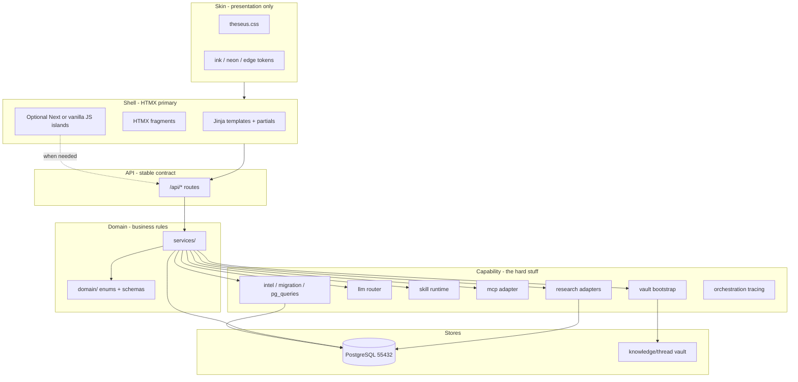
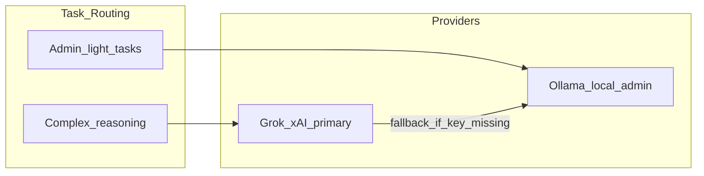

# Ariadne's Thread — Foundation Plan (v4)

> **Ariadne's Thread** — Global opportunity command center in `ariadne-capform`.  
> Single `python app.py` launcher · PostgreSQL-only · Grok/xAI primary reasoning ·  
> Web research (SearXNG/Crawl4AI first) · Review-gated everywhere · Theseus visual language.

**Last updated:** 2026-06-17

---

## Current status (scaffold checkpoint)

We completed **Phase 0 scaffold** and diverted briefly into env alignment, git, and orchestration config placeholders. The table below tracks plan vs repo.

| Area | Status | Notes |
|------|--------|-------|
| Monorepo scaffold | ✅ Done | `backend/`, `frontend/`, `skills/`, `docs/reference/` |
| `python app.py` launcher | 🟡 Partial | Postgres, vault bootstrap, frontend spawn; no Alembic, no intel migration |
| `.env` / `config.py` | ✅ Done | Full categorized config including research, MCP, orchestration |
| Docker Compose | ✅ Done | Postgres 18 image on `:55432` + `research` profile (SearXNG, Crawl4AI) |
| Reference corpus | ✅ Done | Briefing packet, call plan, risk register, Shipley, USAspending |
| Workflow DB models | 🟡 Partial | Opportunities, packet, actions, review; missing intel/research/capability tables |
| Alembic migrations | ❌ Not started | Still using `create_all()` |
| Intel migration (DuckDB→PG) | 🟡 In progress | Resumable via `scripts/run-intel-migration.ps1` (~64M rows, separate window) |
| `pg_queries` intel layer | ✅ Done | Core queries + portfolio intel signals |
| LLM router (Grok + Ollama) | ❌ Not started | Config only |
| Web research module | ❌ Not started | Config + docker profile only |
| Skill runtime (3 skills) | ❌ Not started | SKILL.md stubs exist |
| MCP manifests | 🟡 Partial | USAspending only; 7 more planned |
| Frontend command center | 🟡 HTMX shell live | FastAPI serves Pulse + packet; Next.js optional (`AUTOSTART_FRONTEND`) |
| Theseus visual language | ✅ Done | `frontend/styles/theseus.css` synced from proj-theseus |
| Orchestration (LangGraph) | 🟡 Placeholder | Env + tracing bootstrap; runtime deferred |
| Git | ✅ Done | Repo pushed; commit early/often |

**Resume here:** Finish intel migration (background), then **capability modules** (LLM router → skills → research), then **HTMX shell port** (step 10).

---

## Product identity

- **Name:** Ariadne's Thread (short: **Thread**)
- **Python package:** `thread` in [`backend/src/thread/`](../backend/src/thread/)
- **Workspace:** `ariadne-capform`
- **Ports:** API `9622` · LangGraph Studio `9623` · UI `3000` · Postgres `55432`
- **Philosophy:** Global opportunity command center; Shipley-aligned capture; human-in-the-loop everywhere; knowledge compounds; focused modules

**Inspiration repos (patterns only — no code dependency):**

| Repo | Adopt | Do **not** copy |
|------|-------|-----------------|
| [ariadne-thread](https://github.com/BdM-15/ariadne-thread) | Living Briefing Packet, review gates, vault, research provider registry | Next.js as long-term shell |
| [capture-insights](https://github.com/BdM-15/capture-insights) | USAspending intel, Karpathy vault, skill runtime | Vite/React UI stack |
| [proj-theseus](https://github.com/BdM-15/proj-theseus) | **Skin only:** `theseus.css`, shell UX patterns; MCP manifest pattern | Graph/RAG/LightRAG plumbing |
| [1102 MCP tools](https://github.com/1102tools/federal-contracting-mcps) | Deterministic federal data | — |
| DataRepublican | Follow-the-money via `datarepublican_intel` skill | — |

---

## Non-negotiables

1. **Cloud-primary reasoning, local data** — Grok/xAI for complex tasks; Ollama for admin/light tasks. Workflow data stays local in PostgreSQL + Obsidian vault.
2. **Review-gated everywhere** — Intake → Candidate → Trusted; nothing auto-promotes.
3. **Full provenance** — evidence links, citations, MCP refs, web URLs, award_key lineage.
4. **Phase separation** — Phase 0–3 evergreen intel vs Phase 4–6 solicitation activation.
5. **Living Milestone Decision Briefing Packet** — gate-scoped fields, Action Matrix, risks, evidence.
6. **Two-store knowledge** — Obsidian vault (synthesis) vs PostgreSQL (execution truth).
7. **PostgreSQL only** — single DB for workflow AND intel (DuckDB = one-time migration source only).
8. **Theseus visual language** — ink/neon dark theme from proj-theseus (presentation layer only).
9. **One command to run** — `python app.py` from root `.venv` (single Python process at steady state).
10. **Web research enrichment** — bounded, approval-gated; free/local providers first.
11. **Server-owned truth** — UI renders and commands; domain rules live in Python `services/`, never in the client.

---

## Architectural layers (first principles)

Ariadne is a **capability-first Python platform** with a **Theseus-skinned command center**. Skin, shell, API, domain, and capability are separate — never conflate theme with plumbing.

| Layer | Responsibility | Location (target) |
|-------|----------------|-------------------|
| **Skin** | Colors, typography, cards, collapsibles, topbar | `theseus.css` (synced from proj-theseus) |
| **Shell** | Pages, nav, HTMX partials, optional JS islands | `backend/src/thread/ui/` (target) |
| **API** | Stable HTTP contract for UI, scripts, automation | `backend/src/thread/api/` |
| **Domain** | Opportunities, packet, review enums, schemas | `backend/src/thread/domain/` + `services/` |
| **Capability** | Intel, LLM, skills, MCP, research, vault, migration | `backend/src/thread/{intel,llm,skills,mcp,research,bootstrap}/` |

**Shell decision (v4):** FastAPI serves **HTMX + Jinja templates** (Theseus delivery model). Transitional Next.js in `frontend/` validates flows against `/api/*` until HTMX port completes. **Next.js is not forbidden** — use for client-heavy surfaces (streaming chat, charts, drag-drop) as **embedded islands** when first principles require it, not as the default shell.



**Rules:**
- Routes stay thin → `services/` fat → models dumb.
- Long jobs resumable and out-of-band (intel migration pattern).
- Every LLM/skill/MCP/research output lands as `candidate` + provenance; promotion only via review gate.
- Enhance bottom-up (capability → domain → API → shell → skin). Swapping shell or skin must not require rewriting intel/LLM/skills.

---

## LLM strategy



| Task class | Provider | Examples |
|------------|----------|----------|
| **Reasoning** | Grok/xAI | Packet synthesis, capture profiles, research interpretation, route recommendations |
| **Admin** | Ollama (optional) | Vault lint, classification, draft scaffolding |
| **Embeddings** (future) | OpenAI `text-embedding-3-large` | Semantic vault search (config stub exists) |

**Module:** `backend/src/thread/llm/router.py` — `resolve_provider(task_kind)` routes reasoning to xAI when `XAI_API_KEY` is set.

---

## Web crawl research enrichment

Pattern from ariadne-thread `capture_research.py` — provider registry, bounded collection, review-gated findings.

### Provider priority

| Priority | Provider | Config |
|----------|----------|--------|
| 1 | SearXNG | `SEARXNG_BASE_URL` (`:8080`) |
| 2 | Crawl4AI | `CRAWL4AI_BASE_URL` (`:11235`) |
| 3 | SerpAPI | `SERPAPI_API_KEY` |
| 4 | Olostep | `OLOSTEP_API_KEY` |
| 5 | Firecrawl | `FIRECRAWL_API_KEY` |

### Module layout (to build)

```
backend/src/thread/research/
├── providers.py
├── capture_research.py
├── lenses.py
└── adapters/
    ├── searxng.py
    ├── crawl4ai.py
    ├── serpapi.py
    ├── olostep.py
    ├── firecrawl.py
    └── fake.py
```

**Run flow:** User triggers research → discovery → crawl → Grok interpretation → `candidate` findings → review gate → optional evidence + vault mirror.

---

## Orchestration (LangGraph — deferred runtime)

Route-first capture orchestration ships **before** LangGraph runtime adoption (per ariadne-thread PRD).

| Setting | Purpose |
|---------|---------|
| `LANGGRAPH_ENABLED` | Master switch (off until chain executor lands) |
| `THREAD_LANGGRAPH_STUDIO_AUTO_START` | Spawn `langgraph dev` from `app.py` when ready |
| `LANGGRAPH_STUDIO_PORT` | `9623` (Thread port family) |
| `LANGSMITH_*` / `LANGCHAIN_*` | Tracing for skill chains (`thread-capture-orchestration` project) |

**Module:** `backend/src/thread/orchestration/` — tracing bootstrap done; chain executor TBD.

---

## Architecture overview

```mermaid
flowchart TB
  subgraph launch [python app.py]
    Boot[Bootstrap + vault seed]
    PGUp[PostgreSQL docker]
    Warm[Warmup probes]
  end

  subgraph fastapi [FastAPI :9622]
    UIRoutes[UI routes - HTMX target]
    APIRoutes["/api/* REST"]
    subgraph capability_mod [Capability modules]
      IntelMod[Intel]
      LLMMod[LLM Router]
      SkillMod[Skills]
      ResearchMod[Research]
      MCPMod[MCP]
    end
    subgraph domain_mod [Domain services]
      OppSvc[Opportunities]
      ReviewSvc[Review Gate]
      PacketSvc[Packet]
    end
  end

  subgraph command_center [Command Center surfaces]
    Pulse[Portfolio Pulse]
    Workspace[Opportunity Workspace]
    PacketUI[Living Briefing Packet]
    ReviewUI[Review Queue]
    ResearchUI[Research + Skills]
    IslandUI[Optional client islands]
  end

  subgraph pg [(PostgreSQL :55432)]
    Workflow[workflow_tables]
    IntelTables[intel_tables]
    ResearchTables[research_tables]
  end

  Vault[(knowledge/thread)]

  launch --> fastapi
  launch --> PGUp
  PGUp --> pg
  UIRoutes --> command_center
  IslandUI -.-> APIRoutes
  command_center --> UIRoutes
  command_center --> APIRoutes
  APIRoutes --> domain_mod
  domain_mod --> capability_mod
  capability_mod --> pg
  capability_mod --> Vault
  Boot --> Vault
```

**Transitional:** `frontend/` (Next.js) currently calls `APIRoutes` directly on `:9622`; retire after HTMX shell reaches parity.

### Shipley phase model

| Band | Phases | Mode | Surfaces |
|------|--------|------|----------|
| **Evergreen** | 0–3 | `evergreen` | PG intel, web research, vault, capture profile |
| **Activation** | 4–6 | `activation` | Living Briefing Packet MS1–MS4, Action Matrix, Theseus merge stub |

---

## Single launcher: [`app.py`](../app.py)

```powershell
python app.py
```

**Target startup sequence:**

1. Load Settings from `.env`
2. PostgreSQL — `docker compose up` if needed
3. Alembic `upgrade head`
4. Intel migration if PG intel tables empty (`INTEL_MIGRATION_SOURCE` → capture-insights DuckDB)
5. Vault bootstrap if empty
6. Optional: `docker compose --profile research up`
7. Serve command center UI from FastAPI (HTMX + `theseus.css`) — **target**; transitional: optional Next.js on `:3000`
8. Warmup: vault, Grok probe, Ollama, MCP catalog, research providers, intel row count
9. Print URLs (API `:9622`, UI same origin when HTMX lands)

**CLI flags (target):** `--api-only`, `--no-warmup`, `--migrate-intel`, `--skip-docker`, `--no-research-providers`

---

## PostgreSQL storage

### A. Workflow tables
`opportunities`, `packet_field_definitions`, `packet_field_answers`, `action_matrix_items`, `evidence_items`, `review_records`, `capability_runs`, `extraction_bundles`, `mcp_invocations`

### B. Intel tables (migrated from capture-insights DuckDB)
`intel_usaspending_prime_awards`, `intel_usaspending_subawards`, `intel_entities`, `intel_relationships`, `intel_naics_summary_cache`

**Migration script:** `backend/scripts/migrate_intel_from_duckdb.py`  
**Queries:** `backend/src/thread/intel/pg_queries.py` (port from capture-insights `queries.py`)

### C. Research tables
`capture_research_runs`, `capture_research_sources`, `capture_research_findings`

### D. Graph export
`data/graph/edges.jsonl` (Neo4j-ready)

---

## Knowledge vault

**Local path:** `knowledge/thread/` (gitignored content)

**Seed from:**

- `capture-insights/data/knowledge/` (schema + global wiki)
- ariadne-thread vault directory conventions
- Reference docs in `docs/reference/` (commit-safe dictionaries)

**Bootstrap:** [`backend/src/thread/bootstrap/vault.py`](../backend/src/thread/bootstrap/vault.py)

---

## Core domain model

### Opportunity
`lifecycle_state`, `current_milestone_gate` (MS1–MS4), `capture_phase_band`, urgency/freshness, `intel_provenance`

### Living Briefing Packet
8 canonical sections; ~20 seeded MS1-critical fields ([`packet_field_seed.py`](../backend/src/thread/domain/packet_field_seed.py)); `PacketFieldRouteKind` for UI route badges

### Review gate
All AI/skill/research outputs land as `candidate` + `pending_review`. Promotion via `POST /api/review/{id}/approve`.

### Provenance kinds
`award_key`, `mcp_tool`, `url`, `file`, `vault_page`, `web_research`, `manual`

---

## MVP scope (five pillars)

1. **Command Center Shell** — Portfolio Pulse, intel signals, opportunity workspace, packet, actions, review queue
2. **Knowledge Layer** — Obsidian vault, health/lint, mirror proposals
3. **Developer Skills** — skill-creator, datarepublican_intel, mcp_federal_tools
4. **Data & Intel** — PG intel (10yr awards), 1102 MCPs, web research, MinerU stub, capture profile DOCX stub
5. **Config & Stack** — FastAPI, HTMX shell (Theseus skin), PostgreSQL 18, Docker profiles; Next islands when justified

---

## API surface (target)

| Method | Path | Status |
|--------|------|--------|
| GET | `/api/health` | ✅ |
| GET | `/api/portfolio/pulse` | ✅ (intel signals + stats) |
| GET/POST | `/api/opportunities` | ✅ |
| GET/PATCH | `/api/opportunities/{id}/packet` | ✅ |
| GET/POST | `/api/opportunities/{id}/actions` | ✅ |
| GET | `/api/review/pending` | ✅ |
| POST | `/api/review/{id}/approve` | ✅ |
| GET | `/api/packet/definitions` | ✅ |
| GET | `/api/intel/health`, `/expiring`, `/snapshot`, `/migration-status` | ✅ |
| POST | `/api/research/*` | ❌ |
| GET/POST | `/api/skills/*` | ❌ |
| POST | `/api/intel/mcp/{server}/invoke` | ❌ |
| GET | `/api/knowledge/vault/*` | ❌ |

---

## Frontend / command center shell

**Skin:** `theseus.css` + Theseus shell patterns (topbar, `card-accent`, pills, `btn-hero-cyan`). Sync from proj-theseus; no local token forks.

**Shell (target):** FastAPI serves Jinja templates + HTMX partials from `backend/src/thread/ui/`. Server-owned forms, tables, review gates. Same handlers back `/api/*` and HTMX fragments.

**Transitional:** `frontend/` Next.js 15 — Pulse, opportunity workspace, Theseus theme applied. Keeps API contract honest until HTMX port done. **Not the long-term shell.**

**Next.js / client islands (allowed when justified):** Streaming LLM output, interactive charts, drag-drop matrices, other client-heavy UX. Embed via iframe, separate route, or small bundled script — not whole-platform SPA by default.

**Target screens:** Portfolio Pulse + intel signals · opportunity workspace (Packet | Actions | Review | Research | Intel Context) · skills panel · vault browser.

---

## Developer skills (stubs exist)

| Skill | Path | Purpose |
|-------|------|---------|
| skill-creator | `skills/skill-creator/` | Scaffold new skills |
| datarepublican_intel | `skills/datarepublican_intel/` | Award relationship queries |
| mcp_federal_tools | `skills/mcp_federal_tools/` | 1102 MCP adapter |

---

## Tests (target)

- `test_review_gates.py` — no auto-promote
- `test_intel_migration.py` — DuckDB→PG idempotent
- `test_llm_router.py` — reasoning→xAI, admin→Ollama
- `test_capture_research.py` — findings stay candidate
- `test_packet_field_seed.py` — ✅ exists
- `test_orchestration_config.py` — ✅ exists

---

## Non-goals (this foundation)

- Full multi-agent war room
- Complete Theseus extraction pipeline in-process
- Production auth / deployment
- Advanced graph visualizations
- Neo4j runtime
- Full Capability Studio
- LangGraph runtime (until route-first + thin skill chains proven)

---

## Extension path (post-foundation)

1. Document intake → MinerU → ExtractionBundle
2. Theseus adapter on `:9621` for Phase 4–6 solicitation merge
3. Full capture profile + stance/gap analysis
4. Semantic vault search (OpenAI embeddings)
5. Neo4j import from `edges.jsonl`
6. LangGraph chain executor when skill chains need state/checkpointing

---

## Implementation order

| # | Step | Status |
|---|------|--------|
| 1 | Scaffold + `app.py` + docker + `.env.example` | ✅ |
| 2 | Config + PG schema (workflow) + models | 🟡 |
| 3 | **Intel migration + `pg_queries`** | 🟡 **← run migration script** |
| 4 | Alembic migrations (replace `create_all`) | ❌ |
| 5 | Vault bootstrap (full seed) | 🟡 |
| 6 | LLM router (Grok + Ollama) | ❌ |
| 7 | Research module + adapters + API | ❌ |
| 8 | Domain services + review gates + tests | 🟡 |
| 9 | Full API (skills, MCP, intel, capture-profile) | ❌ |
| 10 | HTMX command center shell + Research tab (retire transitional Next) | 🟡 Pulse + packet live |
| 11 | E2E smoke + README verification | ❌ |

---

## Immediate next actions

1. **Intel migration** — finish in separate window; verify `Complete: True` + indexes
2. **Capability: LLM router** — `backend/src/thread/llm/router.py`; Grok behind review gate
3. **Capability: skills + research** — runtime + adapters; all outputs `candidate`
4. **E2E smoke** — track signal → packet edit → review approve (API-first)
5. **Alembic** — replace `create_all()` for workflow + intel schema
6. **HTMX shell port** — Pulse + workspace partials; drop Node from `app.py` when parity reached

---

## Plan todos

- [x] Scaffold monorepo + docker-compose + `.env.example`
- [x] Root `app.py` launcher (partial)
- [x] Reference docs + packet field seeds
- [x] Orchestration env placeholders
- [ ] Alembic + full PG schema (workflow + intel + research)
- [ ] Intel migration from capture-insights DuckDB (in progress)
- [x] `pg_queries` intel layer
- [ ] LLM router (Grok primary)
- [ ] Research module + `/api/research/*`
- [ ] Skill runtime + 8 MCP manifests
- [x] Theseus visual language (CSS + transitional Next shell)
- [x] HTMX shell — Pulse, recompete radar, packet edit, review queue
- [ ] HTMX Research tab + actions matrix
- [ ] Retire transitional Next.js from launcher
- [ ] E2E smoke test path